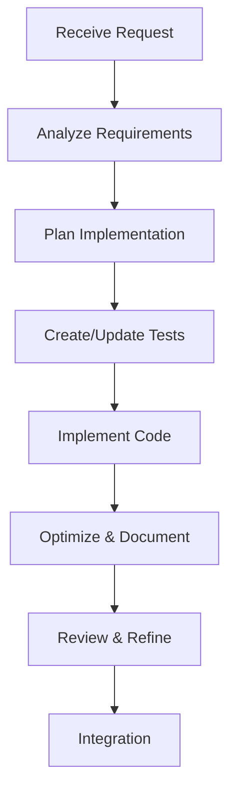

# Development Request Implementation Checklist

## 1. Initial Request Analysis

- [ ] Break down request into atomic tasks
- [ ] Identify core requirements vs optional features
- [ ] Check existing codebase for similar patterns
- [ ] List potential dependencies and constraints

## 2. Code Organization Check

- [ ] Determine appropriate module location
- [ ] Verify single responsibility principle
- [ ] Plan interface boundaries
- [ ] Identify shared resources needed

## 3. Implementation Strategy

- [ ] Choose appropriate design patterns
- [ ] Plan component structure
- [ ] Define clear interfaces
- [ ] Consider optimization points

## 4. Development Process

- [ ] Write/update tests first
- [ ] Implement core functionality
- [ ] Document code and APIs
- [ ] Optimize for performance
- [ ] Review for best practices

## 5. Context Optimization

- [ ] Use focused, minimal components
- [ ] Remove unnecessary boilerplate
- [ ] Optimize imports and dependencies
- [ ] Clear, concise documentation

## 6. Code Review Preparation

- [ ] Self-review checklist:
  - [ ] Code follows established patterns
  - [ ] Tests are comprehensive
  - [ ] Documentation is clear
  - [ ] No unnecessary complexity
  - [ ] Optimized for maintainability

## 7. Integration Points

- [ ] Verify integration with existing systems
- [ ] Check for breaking changes
- [ ] Update relevant documentation
- [ ] Consider deployment impact

## Quick Decision Guide

### When to Create New Module

- Feature doesn't fit existing modules
- High likelihood of reuse
- Clear separation of concerns needed

### When to Extend Existing Module

- Similar functionality exists
- Strong coupling with existing features
- Shared state or resources needed

### When to Use Shared Resources

- Multiple modules need same functionality
- Performance optimization required
- Consistent behavior needed across app

### When to Create Utility Functions

- Operation used in multiple places
- Pure function with no side effects
- Complex but reusable logic

## Best Practices Reminder

1. Code Implementation

   ```
   - Write self-documenting code
   - Keep functions small and focused
   - Use clear naming conventions
   - Implement error handling
   ```

2. Resource Management

   ```
   - Optimize imports
   - Clean up unused resources
   - Use lazy loading when appropriate
   - Implement proper disposal
   ```

3. Testing Strategy
   ```
   - Unit tests for core logic
   - Integration tests for workflows
   - Edge case coverage
   - Performance benchmarks
   ```

## Context Windows Optimization

For each development request:

1. **Code Sharing**

   - Share only relevant portions
   - Remove unused imports
   - Keep essential comments only

2. **Documentation**

   - Focus on "why" not "what"
   - Document edge cases
   - Keep API docs current

3. **Communication**
   - Use precise technical terms
   - Reference existing patterns
   - Focus on key requirements

## Implementation Flow



## Daily Implementation Habits

1. Before Starting

   - Review existing solutions
   - Check design patterns
   - Plan test cases

2. During Development

   - Write tests first
   - Commit frequently
   - Document as you go

3. Before Completion
   - Run all tests
   - Check optimization
   - Review documentation
   - Clean up code

## Request Completion Checklist

- [ ] All tests passing
- [ ] Documentation updated
- [ ] Code optimized
- [ ] No unnecessary complexity
- [ ] Follows established patterns
- [ ] Ready for review

Remember: This checklist should be applied to every development request, regardless of size, to maintain consistency and quality across the codebase.
