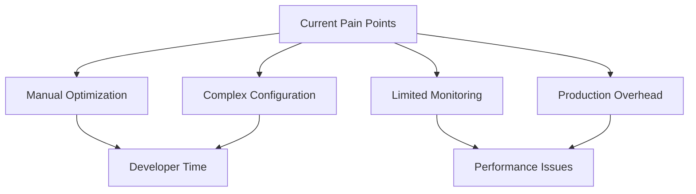
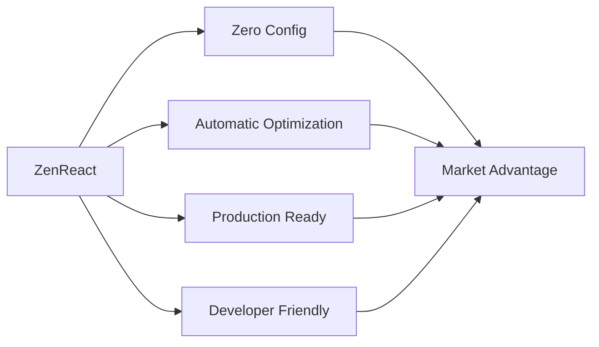

# React Optimization Market Analysis

## Market Overview

### Popular Solutions

#### 1. React.memo

**Market Position:**

- Built into React
- Most widely used optimization tool
- Zero additional bundle size

**Limitations:**

- Manual implementation required
- No automatic optimization
- Limited to shallow comparison
- No performance metrics

#### 2. Reselect

**Market Position:**

- Popular for Redux applications
- Strong community adoption
- Proven performance benefits

**Limitations:**

- Redux-specific
- Manual selector creation
- No automatic memoization
- Complex debugging

#### 3. React-Query/SWR

**Market Position:**

- Leaders in data fetching
- Built-in caching
- Automatic optimization

**Limitations:**

- Limited to server state
- Network-focused
- Not for UI optimization
- Additional bundle size

#### 4. Use-Memo-One

**Market Position:**

- Lightweight alternative to useMemo
- Smaller bundle size
- Simple API

**Limitations:**

- Manual implementation
- Limited feature set
- No automation
- Basic memoization only

## Market Gaps

### 1. Automation

- Most solutions require manual implementation
- No intelligent optimization detection
- No automatic performance fixes
- Limited guidance on optimization

### 2. Holistic Optimization

- Solutions focus on single aspects
- No unified optimization approach
- Fragmented tooling ecosystem
- Complex integration requirements

### 3. Developer Experience

- High learning curve
- Manual configuration needed
- Complex debugging process
- Limited documentation

### 4. Production Readiness

- Many tools are dev-only
- Performance overhead in production
- Limited production monitoring
- No real-world optimization

## Opportunity Analysis

### 1. Market Need

- Growing React applications
- Increasing performance demands
- Developer productivity focus
- Production optimization requirements

### 2. Pain Points

### 3. Target Segments

#### Primary

- Enterprise React applications
- High-traffic web applications
- Performance-critical systems
- Large development teams

#### Secondary

- Medium-sized applications
- Growing startups
- E-commerce platforms
- Content-heavy sites

## Competition Analysis

### 1. Direct Competitors

#### Performance Optimization Libraries

- React-Fast-Compare
- React-Tracked
- Re-Reselect

**Market Share:**

- Fragmented market
- No dominant solution
- Mixed adoption rates

#### Strengths:

- Established user base
- Proven in production
- Community support
- Documentation available

#### Weaknesses:

- Manual implementation
- Limited features
- Complex setup
- Poor developer experience

### 2. Indirect Competitors

#### Development Tools

- Chrome DevTools
- React Developer Tools
- Performance monitoring services

**Impact:**

- Complementary tools
- Different focus areas
- Integration potential

## ZenReact Positioning

### 1. Unique Value Proposition

### 2. Key Differentiators

#### Automation

- Automatic optimization detection
- Smart performance fixes
- Intelligent memoization
- Self-tuning capabilities

#### Integration

- Zero configuration required
- Drop-in optimization
- Framework agnostic
- Minimal setup

#### Monitoring

- Production performance tracking
- Real-time optimization
- Minimal overhead
- Actionable insights

#### Developer Experience

- Clear documentation
- Intuitive API
- Helpful error messages
- Visual optimization tools

## Market Strategy

### 1. Entry Strategy

#### Phase 1: Core Optimization

- Basic optimization utilities
- Zero configuration setup
- Essential monitoring
- Key documentation

#### Phase 2: Advanced Features

- Automatic optimization
- Performance dashboard
- Integration tools
- Extended monitoring

#### Phase 3: Enterprise Features

- Custom optimization rules
- Team collaboration
- Advanced analytics
- Priority support

### 2. Growth Strategy

#### Community Building

- Open source core
- Developer documentation
- Example applications
- Video tutorials

#### Enterprise Focus

- Premium features
- Service level agreements
- Custom integration support
- Priority bug fixes

### 3. Pricing Strategy

#### Community Edition

- Core optimization features
- Basic monitoring
- Community support
- MIT license

#### Enterprise Edition

- Advanced optimization
- Custom rules engine
- Priority support
- Team features

## Implementation Recommendations

### 1. Priority Features

1. Zero-config optimization
2. Automatic performance fixes
3. Production monitoring
4. Developer tools

### 2. Technical Focus

1. Bundle size optimization
2. Runtime performance
3. Memory management
4. Network optimization

### 3. Development Phases

1. Core optimization utilities
2. Monitoring system
3. Automation features
4. Enterprise capabilities

## Success Metrics

### 1. Technical Metrics

- Bundle size reduction
- Performance improvement
- Memory optimization
- CPU usage reduction

### 2. Business Metrics

- User adoption rate
- Enterprise customers
- Community growth
- Documentation usage

## Risk Analysis

### 1. Technical Risks

- Performance overhead
- Framework changes
- Integration challenges
- Scalability issues

### 2. Market Risks

- Competition response
- Market saturation
- Pricing pressure
- Adoption barriers

## Conclusion

The React optimization market presents a significant opportunity for ZenReact. While existing solutions address specific optimization needs, there's a clear gap for an automated, production-ready optimization solution with excellent developer experience.

### Key Success Factors

1. Focus on automation and zero-config
2. Maintain minimal performance overhead
3. Provide clear value proposition
4. Build strong community presence

### Next Steps

1. Refine core optimization features
2. Develop automatic optimization detection
3. Build basic monitoring system
4. Create comprehensive documentation

This analysis suggests proceeding with ZenReact development while focusing on key differentiators: automation, zero configuration, and excellent developer experience. The market gap and growing need for React optimization tools indicate strong potential for success.
