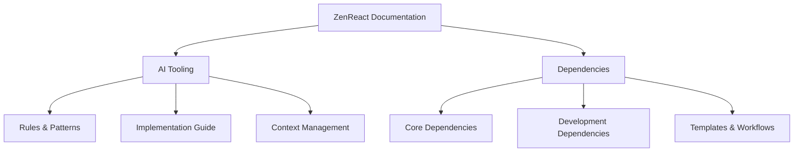

# ZenReact Documentation

## Overview

Welcome to the ZenReact documentation. This documentation is organized into two main sections:

- AI Tooling: Guidelines and patterns for AI-assisted development
- Dependencies: Project dependencies and their implementation guides

## Documentation Structure

## AI Tooling Documentation

The AI Tooling section covers ZenReact's AI assistant tooling system, which uses a rules-based approach for consistent, high-quality development assistance. Key components include:

- [Rules and Patterns](./ai-tooling/RULES_AND_PATTERNS.md) - Core development rules and patterns
- [Implementation Guide](./ai-tooling/IMPLEMENTATION.md) - System architecture and workflows
- [Context Management](./ai-tooling/CONTEXT.md) - Project context and knowledge maintenance

For a comprehensive overview, start with the [AI Tooling README](./ai-tooling/README.md).

## Dependencies Documentation

The Dependencies section details project dependencies, version requirements, and implementation guides:

View the complete list in the [Dependencies Overview](./dependencies/DEPENDENCIES.md).

### Implementation Guides

- [Browser Compatibility](./dependencies/BROWSER_CHECK_STEPS.md)
- [Update Workflow](./dependencies/UPDATE_WORKFLOW.md)
- [Update Examples](./dependencies/UPDATE_EXAMPLE.md)

### Templates & Workflows

- [Dependency Template](./dependencies/_template.md)
- [Dependency Update Workflow](./dependencies/UPDATE_WORKFLOW.md)

### Popular Dependencies

- [React](./dependencies/react.md)
- [TailwindCSS](./dependencies/tailwindcss.md)
- [Zustand](./dependencies/zustand.md)
- [DaisyUI](./dependencies/daisyui.md)
