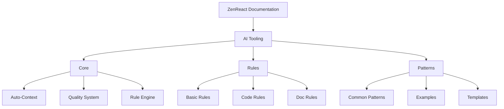

# ZenReact Documentation

## Overview

Welcome to the ZenReact documentation. This documentation covers our AI Tooling system that provides guidelines and patterns for AI-assisted development.

## Documentation Structure

## AI Tooling Documentation

The AI Tooling section uses a rules-based approach for consistent, high-quality development assistance. Key components include:

### Core Components

- [Auto-Context](./ai-tooling/core/AUTO_CONTEXT.md) - Automatic context loading and management
- [Quality System](./ai-tooling/core/QUALITY_SYSTEM.md) - Quality assurance through rule-based guidelines
- [Rule Engine](./ai-tooling/core/RULE_ENGINE.md) - Core rules implementation system

### Rules System

- [Basic Rules](./ai-tooling/rules/BASIC_RULES.md) - Core development rules
- [Code Rules](./ai-tooling/rules/CODE_RULES.md) - Code-specific guidelines
- [Doc Rules](./ai-tooling/rules/DOC_RULES.md) - Documentation standards

### Pattern System

- [Common Patterns](./ai-tooling/patterns/COMMON_PATTERNS.md) - Reusable implementation patterns
- [Examples](./ai-tooling/patterns/EXAMPLES.md) - Implementation examples
- [Templates](./ai-tooling/patterns/TEMPLATES.md) - Reusable templates

For system architecture details, see [System Architecture](./ai-tooling/SYSTEM_ARCHITECTURE.md).

For implementation status and roadmap, see [Implementation Status](./ai-tooling/IMPLEMENTATION_STATUS.md).
