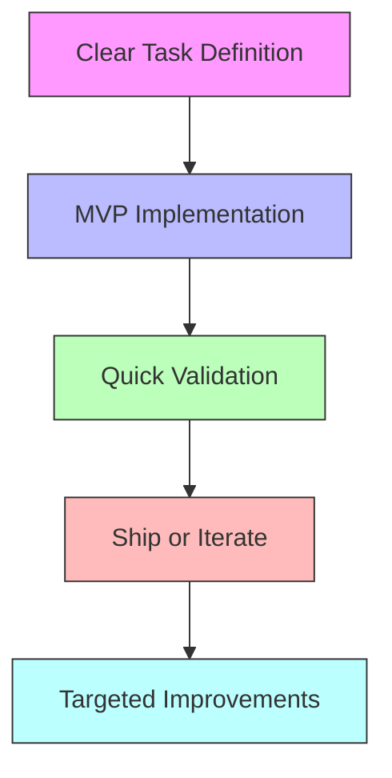

# Preventing AI Assistant Development Loops

## Problem Statement

Developers often get stuck in loops when working with AI coding assistants due to:

1. Unclear requirements
2. Lack of incremental progress
3. Over-optimization too early
4. Poor context management
5. Missing success criteria

## Solution Framework

## Anti-Loop Guidelines

### 1. Start with Clear Boundaries

- Define clear acceptance criteria
- Set scope limitations upfront
- Identify "good enough" thresholds
- List explicit non-goals

### 2. Implement in Chunks

- Break features into 15-30 minute tasks
- Focus on one capability at a time
- Commit working code frequently
- Validate each chunk independently

### 3. Progress Indicators

- Use concrete milestones
- Track binary success metrics
- Implement basic testing early
- Document completion criteria

### 4. Context Management

- Keep relevant code in view
- Remove obsolete context
- Focus on current task scope
- Reset context after milestones

### 5. Decision Framework

When to stop iterating:

- Core functionality works
- Basic error handling exists
- Simple tests pass
- Documentation exists
- Performance is acceptable

## Quick Reference

### Stop Signs ⛔️

- Cycling through similar solutions
- Premature optimization
- Perfect pattern seeking
- Endless refinements
- Feature creep

### Green Flags ✅

- Working core features
- Basic error handling
- Simple, readable code
- Clear documentation
- Testable implementation

## Implementation Strategy

1. First Pass

   - Core functionality only
   - Basic error handling
   - Minimum viable tests
   - Simple documentation

2. Validation

   - Test core features
   - Verify requirements
   - Check error cases
   - Confirm readability

3. Ship or Iterate
   - Deploy if requirements met
   - Target specific improvements
   - Set iteration limits
   - Track progress

## Best Practices

1. Time Boxing

   - Set task time limits
   - Use pomodoro technique
   - Take regular breaks
   - Rotate between tasks

2. Scope Control

   - Start minimal
   - Add features later
   - Resist perfectionism
   - Ship early, ship often

3. Progress Tracking
   - Use checklists
   - Track completions
   - Document decisions
   - Measure improvements

## Quick Decision Checklist

- [ ] Core functionality works
- [ ] Basic errors handled
- [ ] Simple tests exist
- [ ] Code is readable
- [ ] Documentation exists
- [ ] Performance acceptable

When all checks pass: SHIP IT

## Remember

1. Working > Perfect
2. Simple > Complex
3. Now > Later
4. Done > Perfect
5. Iteration > Perfection

This framework helps break the loop pattern by providing clear progress indicators and completion criteria, preventing endless optimization cycles.
