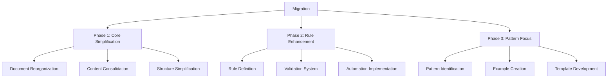

# Migration Guide

## Overview

This guide outlines the process for migrating from the previous AI Tooling system structure to the new streamlined architecture. The migration is designed to be incremental, ensuring system stability and backward compatibility throughout the transition.

## Migration Phases

## Current Structure vs. New Structure

| Current Structure | New Structure | Migration Action |
|-------------------|---------------|------------------|
| AI_SYSTEM.md | SYSTEM_ARCHITECTURE.md | Reorganize and enhance |
| context.md | core/AUTO_CONTEXT.md | Refocus on automation |
| rules-and-patterns.md | rules/* and patterns/* | Split and categorize |
| implementation.md | core/RULE_ENGINE.md | Refocus on validation |
| status.md | (Removed) | Content merged into relevant docs |
| learnings.md | (Removed) | Content merged into relevant docs |
| examples.md | patterns/EXAMPLES.md | Reorganize and enhance |
| patterns/* | patterns/COMMON_PATTERNS.md | Consolidate and standardize |
| examples/* | patterns/EXAMPLES.md | Consolidate and enhance |

## Phase 1: Core Simplification

### Document Reorganization

1. **Create New Structure**
   - Create the new directory structure
   - Set up placeholder files for all new documents
   - Establish cross-linking between documents

2. **Map Content**
   - Identify content in existing documents
   - Map content to new document structure
   - Identify overlapping or redundant content

3. **Migrate Core Content**
   - Move content to appropriate new documents
   - Update references and links
   - Ensure backward compatibility

### Content Consolidation

1. **Identify Redundancies**
   - Review all existing documents for redundant information
   - Mark sections for consolidation
   - Create consolidation plan

2. **Merge Content**
   - Combine related information from multiple sources
   - Eliminate duplications
   - Ensure comprehensive coverage

3. **Streamline Information**
   - Remove human-centric explanations
   - Focus on AI-relevant information
   - Ensure concise, actionable content

### Structure Simplification

1. **Establish Clear Hierarchy**
   - Define clear document hierarchy
   - Ensure logical organization
   - Create consistent navigation

2. **Standardize Format**
   - Apply consistent formatting across all documents
   - Use standard sections and headings
   - Implement consistent examples

3. **Optimize for AI**
   - Structure content for AI consumption
   - Use pattern-based organization
   - Include machine-readable formats

## Phase 2: Rule Enhancement

### Rule Definition

1. **Identify Core Rules**
   - Review existing rules and patterns
   - Identify fundamental rules
   - Categorize rules (Basic, Code, Doc)

2. **Define Rule Structure**
   - Create standard rule format
   - Include validation criteria
   - Add examples for each rule

3. **Document Rules**
   - Create comprehensive rule documentation
   - Include usage guidance
   - Provide implementation examples

### Validation System

1. **Design Validation Process**
   - Define how rules are validated
   - Establish validation criteria
   - Create validation workflow

2. **Implement Validation Logic**
   - Develop validation algorithms
   - Create rule checking mechanisms
   - Establish feedback system

3. **Test Validation System**
   - Validate against existing implementations
   - Refine validation logic
   - Ensure accurate rule checking

### Automation Implementation

1. **Automate Rule Application**
   - Implement automatic rule selection
   - Create context-aware rule application
   - Develop rule prioritization

2. **Automate Validation**
   - Implement automatic validation
   - Create real-time feedback
   - Develop correction suggestions

3. **Integrate with Core System**
   - Connect with Auto-Context system
   - Integrate with Quality System
   - Establish cross-component communication

## Phase 3: Pattern Focus

### Pattern Identification

1. **Identify Key Patterns**
   - Review existing implementations
   - Identify common patterns
   - Categorize patterns

2. **Define Pattern Structure**
   - Create standard pattern format
   - Include usage context
   - Add implementation guidance

3. **Document Patterns**
   - Create comprehensive pattern documentation
   - Include usage examples
   - Provide adaptation guidance

### Example Creation

1. **Develop Example Implementations**
   - Create examples for each pattern
   - Ensure comprehensive coverage
   - Include edge cases

2. **Document Examples**
   - Create clear example documentation
   - Include usage context
   - Provide customization guidance

3. **Test Examples**
   - Validate examples against rules
   - Ensure quality standards
   - Verify usability

### Template Development

1. **Create Reusable Templates**
   - Develop templates for common implementations
   - Ensure flexibility and adaptability
   - Include customization points

2. **Document Templates**
   - Create template documentation
   - Include usage guidance
   - Provide customization examples

3. **Test Templates**
   - Validate templates against rules
   - Ensure quality standards
   - Verify usability

## Backward Compatibility

To ensure backward compatibility during migration:

1. **Maintain Old Structure**
   - Keep old structure during transition
   - Update old documents to reference new structure
   - Gradually phase out old structure

2. **Create Redirects**
   - Add references in old documents to new locations
   - Create symbolic links where appropriate
   - Provide migration notices

3. **Update References**
   - Identify all references to old structure
   - Update references to point to new structure
   - Verify all links work correctly

## Migration Checklist

### Phase 1: Core Simplification

- [ ] Create new directory structure
- [ ] Create SYSTEM_ARCHITECTURE.md
- [ ] Create AUTO_CONTEXT.md
- [ ] Create RULE_ENGINE.md
- [ ] Create QUALITY_SYSTEM.md
- [ ] Map content from old to new structure
- [ ] Migrate core content
- [ ] Consolidate redundant information
- [ ] Streamline information for AI consumption
- [ ] Establish clear document hierarchy
- [ ] Standardize document format
- [ ] Optimize content for AI consumption

### Phase 2: Rule Enhancement

- [ ] Create BASIC_RULES.md
- [ ] Create CODE_RULES.md
- [ ] Create DOC_RULES.md
- [ ] Define rule structure and format
- [ ] Document rules with examples
- [ ] Design validation process
- [ ] Implement validation logic
- [ ] Test validation system
- [ ] Automate rule application
- [ ] Automate validation
- [ ] Integrate with core system

### Phase 3: Pattern Focus

- [ ] Create COMMON_PATTERNS.md
- [ ] Create EXAMPLES.md
- [ ] Create TEMPLATES.md
- [ ] Identify and document key patterns
- [ ] Create example implementations
- [ ] Document examples with usage context
- [ ] Test examples against rules
- [ ] Create reusable templates
- [ ] Document templates with customization guidance
- [ ] Test templates against rules

## Conclusion

This migration guide provides a structured approach to transitioning from the previous AI Tooling system to the new streamlined architecture. By following the phased approach and ensuring backward compatibility, the migration can be completed with minimal disruption while significantly improving the system's effectiveness, maintainability, and scalability. 