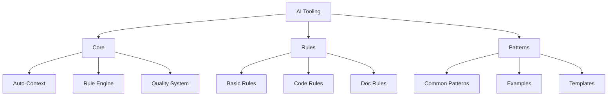

# AI Tooling System

## Overview

The AI Tooling system optimizes AI assistant usage while reducing complexity and improving maintainability. It provides a streamlined architecture focused on automation, consistency, and quality.

## System Structure

## Core Components

The Core components provide the foundation for the AI Tooling system:

- [**Auto-Context**](./core/AUTO_CONTEXT.md): Automatically identifies and loads relevant context without manual specification
- [**Rule Engine**](./core/RULE_ENGINE.md): Validates implementations against defined rules automatically
- [**Quality System**](./core/QUALITY_SYSTEM.md): Ensures all AI-generated code meets quality standards

## Rules System

The Rules system defines standards for implementation:

- [**Basic Rules**](./rules/BASIC_RULES.md): Fundamental rules that apply to all aspects of the system
- [**Code Rules**](./rules/CODE_RULES.md): Rules specific to code implementation
- [**Doc Rules**](./rules/DOC_RULES.md): Rules for documentation

## Pattern System

The Pattern system provides reusable implementation approaches:

- [**Common Patterns**](./patterns/COMMON_PATTERNS.md): Frequently used implementation patterns
- [**Examples**](./patterns/EXAMPLES.md): Concrete examples of pattern implementations
- [**Templates**](./patterns/TEMPLATES.md): Reusable templates for common implementations

## System Architecture

For a comprehensive overview of the system architecture, see the [System Architecture](./SYSTEM_ARCHITECTURE.md) document.

## Implementation Phases

The AI Tooling system is being implemented in phases:

1. **Phase 1: Core Simplification** (Current)
   - Merge overlapping documentation
   - Remove redundancies
   - Create clear hierarchy
   - Streamline navigation

2. **Phase 2: Rule Enhancement** (Next)
   - Define core rules
   - Create validation system
   - Implement auto-checks
   - Add quick reference

3. **Phase 3: Pattern Focus** (Future)
   - Identify key patterns
   - Create pattern library
   - Add working examples
   - Build pattern index

## Benefits

### For AI Assistant

- Clearer guidance through simplified structure
- Faster pattern matching with organized pattern system
- More consistent output through standardized rules
- Better automation with Auto-Context system

### For System

- Reduced complexity through clear separation of concerns
- Easier maintenance with modular architecture
- Better scalability with template-based approach
- Clearer evolution path through defined phases

## Automation Focus

The system prioritizes automation to reduce manual intervention:

- **Automated Context Loading**: Context is loaded automatically based on task
- **Automated Rule Validation**: Rules are checked automatically
- **Automated Pattern Matching**: Patterns are suggested based on context
- **Automated Quality Checks**: Quality is verified automatically

## AI-Optimized Documentation

All documentation is optimized for AI consumption:

- **Clear Structure**: Hierarchical organization for easy navigation
- **Concise Format**: Direct, actionable information without verbosity
- **Pattern-Based**: Organized around recognizable patterns
- **Example-Rich**: Abundant examples for pattern recognition 