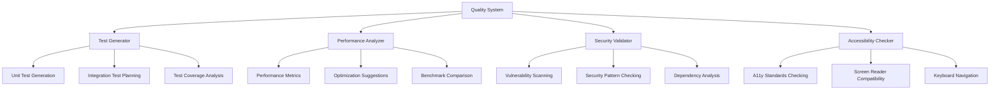

# Quality System

## Overview

The Quality System ensures all AI-generated code meets established quality standards through automated testing, performance optimization, security validation, and accessibility compliance. It provides a comprehensive quality assurance framework that operates automatically.

## Key Components



## Functionality

### Test Generator

Automatically suggests appropriate tests for implementations:

```json
{
  "operation": "generate_tests",
  "inputs": {
    "implementation": "...",
    "component_type": "functional",
    "dependencies": [...],
    "test_framework": "jest"
  },
  "outputs": {
    "tests": [
      {
        "test_type": "unit",
        "test_name": "renders without crashing",
        "test_code": "...",
        "coverage_targets": ["rendering"]
      },
      {
        "test_type": "unit",
        "test_name": "handles props correctly",
        "test_code": "...",
        "coverage_targets": ["props"]
      }
    ],
    "coverage_analysis": {
      "coverage_percentage": 85,
      "uncovered_areas": ["error handling"]
    }
  }
}
```

### Performance Analyzer

Ensures code follows performance best practices:

```json
{
  "operation": "analyze_performance",
  "inputs": {
    "implementation": "...",
    "component_type": "functional",
    "performance_targets": ["rendering", "state_updates"]
  },
  "outputs": {
    "performance_analysis": {
      "issues": [
        {
          "issue_type": "unnecessary_rerenders",
          "severity": "medium",
          "location": {
            "line": 25,
            "column": 3
          },
          "description": "Component rerenders when props haven't changed",
          "suggestion": "Wrap component with React.memo to prevent unnecessary rerenders",
          "example": "export default React.memo(UserProfile);"
        }
      ],
      "optimizations": [
        {
          "optimization_type": "memoization",
          "description": "Memoize expensive calculation",
          "location": {
            "line": 15,
            "column": 5
          },
          "suggestion": "Use useMemo for expensive calculation",
          "example": "const sortedItems = useMemo(() => items.sort(), [items]);"
        }
      ]
    }
  }
}
```

### Security Validator

Checks for common security issues:

```json
{
  "operation": "validate_security",
  "inputs": {
    "implementation": "...",
    "security_targets": ["xss", "data_exposure", "dependency_vulnerabilities"]
  },
  "outputs": {
    "security_analysis": {
      "vulnerabilities": [
        {
          "vulnerability_type": "xss",
          "severity": "high",
          "location": {
            "line": 42,
            "column": 10
          },
          "description": "Potential XSS vulnerability with dangerouslySetInnerHTML",
          "suggestion": "Sanitize HTML before rendering or use alternative approach",
          "example": "import DOMPurify from 'dompurify'; const sanitizedHtml = DOMPurify.sanitize(html);"
        }
      ],
      "secure_patterns": [
        {
          "pattern_type": "input_validation",
          "description": "Proper input validation implemented",
          "location": {
            "line": 30,
            "column": 5
          }
        }
      ]
    }
  }
}
```

### Accessibility Checker

Verifies accessibility standards are met:

```json
{
  "operation": "check_accessibility",
  "inputs": {
    "implementation": "...",
    "a11y_standards": ["wcag2.1", "aria"]
  },
  "outputs": {
    "accessibility_analysis": {
      "issues": [
        {
          "issue_type": "missing_alt",
          "severity": "high",
          "location": {
            "line": 55,
            "column": 7
          },
          "description": "Image missing alt attribute",
          "suggestion": "Add descriptive alt text to image",
          "example": ""
        }
      ],
      "compliant_patterns": [
        {
          "pattern_type": "keyboard_navigation",
          "description": "Proper keyboard navigation implemented",
          "location": {
            "line": 70,
            "column": 3
          }
        }
      ]
    }
  }
}
```

## Implementation

### Automated Quality Checks

The Quality System automatically performs checks:

1. **During Development**: Real-time quality feedback
2. **Before Completion**: Comprehensive quality assessment
3. **On Implementation Changes**: Re-evaluation when implementation changes
4. **On Standard Updates**: Re-validation when standards are updated

### Quality Improvement

Quality is improved through:

1. **Suggestion Implementation**: Applying quality improvement suggestions
2. **Pattern Adoption**: Using recommended quality patterns
3. **Standard Compliance**: Ensuring compliance with updated standards
4. **Continuous Monitoring**: Ongoing quality assessment

### Quality Reporting

Quality is reported through:

1. **Issue Summaries**: Concise summaries of quality issues
2. **Prioritized Recommendations**: Recommendations prioritized by impact
3. **Example Solutions**: Concrete examples of quality improvements
4. **Compliance Status**: Clear indication of standard compliance

## Benefits

1. **Higher Code Quality**: Ensures all implementations meet quality standards
2. **Reduced Technical Debt**: Prevents quality issues before they're introduced
3. **Consistent Standards**: Applies quality standards uniformly
4. **Automated Improvement**: Provides automated quality improvement guidance

## Example Usage

```
Task: "Create a new component for user profile display"

Quality System:
1. Generates appropriate unit tests for the component
2. Identifies potential performance issue with unnecessary rerenders
3. Suggests memoization for expensive calculation
4. Flags missing alt text on profile image
5. Provides concrete examples for all improvements
6. Validates implementation after improvements
```

## Integration Points

- **Auto-Context**: Uses context to inform quality expectations
- **Rule Engine**: Applies quality-related rules
- **Pattern System**: Recommends quality-focused patterns

## Quality Metrics

The system tracks:

1. **Test Coverage**: Percentage of code covered by tests
2. **Performance Score**: Assessment of implementation performance
3. **Security Rating**: Evaluation of security compliance
4. **Accessibility Compliance**: Conformance to accessibility standards 