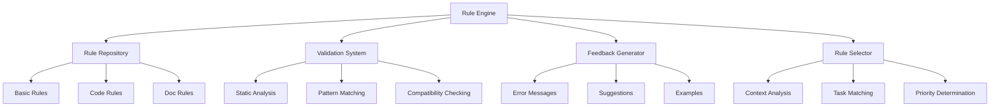

# Rule Engine

## Overview

The Rule Engine automatically validates implementations against defined rules, ensuring consistency, quality, and compatibility across the codebase. It provides immediate feedback on rule violations and guides AI assistants toward compliant implementations.

## Key Components



## Functionality

### Rule Repository

Stores and organizes all system rules:

```json
{
  "rule_category": "code",
  "rule_id": "component_structure",
  "rule_name": "Component Structure",
  "description": "Defines the standard structure for React components",
  "priority": "high",
  "validation_pattern": {
    "required_elements": ["imports", "component_declaration", "prop_types", "exports"],
    "structure_pattern": "..."
  },
  "examples": [
    {
      "name": "Basic Component",
      "code": "..."
    }
  ],
  "related_rules": ["naming_convention", "prop_types"]
}
```

### Validation System

Checks implementations against applicable rules:

```json
{
  "operation": "validate_implementation",
  "inputs": {
    "implementation": "...",
    "applicable_rules": ["component_structure", "naming_convention"],
    "context": {...}
  },
  "outputs": {
    "validation_results": [
      {
        "rule_id": "component_structure",
        "status": "passed",
        "details": "Component structure follows standard pattern"
      },
      {
        "rule_id": "naming_convention",
        "status": "failed",
        "details": "Component name should be PascalCase",
        "suggestion": "Rename 'userProfile' to 'UserProfile'"
      }
    ]
  }
}
```

### Feedback Generator

Provides actionable feedback on rule violations:

```json
{
  "operation": "generate_feedback",
  "inputs": {
    "validation_results": [...],
    "implementation": "...",
    "context": {...}
  },
  "outputs": {
    "feedback": [
      {
        "type": "error",
        "rule_id": "naming_convention",
        "message": "Component name should be PascalCase",
        "location": {
          "line": 5,
          "column": 16
        },
        "suggestion": "Rename 'userProfile' to 'UserProfile'",
        "example": "const UserProfile = () => { ... }"
      }
    ]
  }
}
```

### Rule Selector

Automatically selects applicable rules based on context:

```json
{
  "operation": "select_rules",
  "inputs": {
    "task": "Implement a new React component",
    "context": {
      "file_type": "tsx",
      "component_type": "functional",
      "project_patterns": [...]
    }
  },
  "outputs": {
    "selected_rules": [
      {
        "rule_id": "component_structure",
        "priority": "high"
      },
      {
        "rule_id": "naming_convention",
        "priority": "high"
      },
      {
        "rule_id": "prop_types",
        "priority": "medium"
      }
    ]
  }
}
```

## Implementation

### Automatic Validation

The Rule Engine automatically validates:

1. **During Implementation**: Real-time validation as code is generated
2. **Before Completion**: Final validation before implementation is finalized
3. **On Context Change**: Re-validation when context changes
4. **On Rule Updates**: Re-validation when rules are updated

### Rule Application

Rules are applied through:

1. **Context-Based Selection**: Selecting relevant rules based on context
2. **Priority-Based Application**: Applying high-priority rules first
3. **Conflict Resolution**: Resolving conflicts between competing rules
4. **Exception Handling**: Managing rule exceptions when necessary

### Feedback Integration

Feedback is integrated through:

1. **Inline Suggestions**: Providing suggestions within the implementation
2. **Example References**: Linking to relevant examples
3. **Rule Explanations**: Explaining the rationale behind rules
4. **Correction Guidance**: Guiding through correction process

## Benefits

1. **Consistent Implementations**: Ensures all implementations follow defined standards
2. **Reduced Errors**: Catches issues before they're introduced into the codebase
3. **Faster Development**: Provides immediate guidance on correct implementations
4. **Better Quality**: Enforces quality standards automatically

## Example Usage

```
Task: "Create a new component for user profile display"

Rule Engine:
1. Selects applicable rules (component_structure, naming_convention, prop_types)
2. Validates implementation against selected rules
3. Identifies naming convention violation
4. Provides feedback with correction suggestion
5. Re-validates after correction
6. Confirms compliance with all rules
```

## Integration Points

- **Auto-Context**: Receives context information for rule selection
- **Pattern System**: Uses patterns to inform rule application
- **Quality System**: Feeds validation results into quality assessment

## Automation Metrics

The system tracks:

1. **Validation Accuracy**: How accurately rules are applied
2. **Feedback Effectiveness**: How effectively feedback leads to corrections
3. **Rule Coverage**: What percentage of the codebase is covered by rules
4. **Compliance Rate**: How often implementations comply with rules on first attempt 