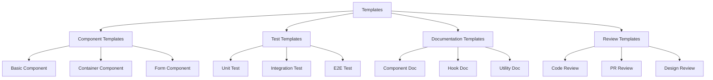

# Templates

## Overview

Templates provide reusable starting points for common implementations, ensuring consistency and reducing development time. These templates can be customized and extended to meet specific requirements while maintaining project standards.

## Template Categories



## Component Templates

### Basic Component Template

```tsx
// Template for a basic React component
import React from 'react';
import './ComponentName.css';

// Define component props
interface ComponentNameProps {
  /** Prop description */
  propOne: string;
  /** Prop description */
  propTwo?: number;
  /** Prop description */
  propThree?: boolean;
  /** Prop description */
  onAction?: (value: string) => void;
}

/**
 * ComponentName component description
 */
export const ComponentName: React.FC<ComponentNameProps> = ({
  propOne,
  propTwo = 0,
  propThree = false,
  onAction
}) => {
  // Local state (if needed)
  const [localState, setLocalState] = React.useState<string>('');

  // Event handlers
  const handleClick = () => {
    if (onAction) {
      onAction(propOne);
    }
  };

  // Render helpers (if needed)
  const renderContent = () => {
    return (
      <div className="component-name__content">
        {propOne}
        {propTwo > 0 && <span>{propTwo}</span>}
      </div>
    );
  };

  // Main render
  return (
    <div 
      className={`component-name ${propThree ? 'component-name--active' : ''}`}
      data-testid="component-name"
    >
      <h2 className="component-name__title">Component Title</h2>
      {renderContent()}
      <button 
        className="component-name__button"
        onClick={handleClick}
        aria-label="Action button"
      >
        Action
      </button>
    </div>
  );
};

export default ComponentName;
```

### Container Component Template

```tsx
// Template for a container component with data fetching
import React, { useState, useEffect, useCallback } from 'react';
import { fetchData, updateData } from '../api/dataApi';
import { DataType } from '../types';
import ErrorBoundary from '../common/ErrorBoundary';
import LoadingSpinner from '../common/LoadingSpinner';
import ErrorMessage from '../common/ErrorMessage';
import PresentationalComponent from './PresentationalComponent';

// Define component props
interface ContainerComponentProps {
  /** ID for fetching data */
  id: string;
  /** Whether data is editable */
  editable?: boolean;
  /** Callback when data is updated */
  onDataUpdated?: (data: DataType) => void;
}

/**
 * Container component that fetches and manages data
 */
export const ContainerComponent: React.FC<ContainerComponentProps> = ({
  id,
  editable = false,
  onDataUpdated
}) => {
  // State management
  const [data, setData] = useState<DataType | null>(null);
  const [loading, setLoading] = useState<boolean>(true);
  const [error, setError] = useState<Error | null>(null);
  const [isUpdating, setIsUpdating] = useState<boolean>(false);

  // Fetch data
  useEffect(() => {
    const loadData = async () => {
      setLoading(true);
      setError(null);
      
      try {
        const result = await fetchData(id);
        setData(result);
      } catch (err) {
        setError(err instanceof Error ? err : new Error('Failed to fetch data'));
        setData(null);
      } finally {
        setLoading(false);
      }
    };
    
    loadData();
  }, [id]);

  // Handle data updates
  const handleUpdateData = useCallback(async (updatedData: DataType) => {
    if (!editable) return;
    
    setIsUpdating(true);
    try {
      const result = await updateData(id, updatedData);
      setData(result);
      if (onDataUpdated) {
        onDataUpdated(result);
      }
    } catch (err) {
      setError(err instanceof Error ? err : new Error('Failed to update data'));
    } finally {
      setIsUpdating(false);
    }
  }, [id, editable, onDataUpdated]);

  // Render loading state
  if (loading) {
    return <LoadingSpinner label="Loading data" />;
  }

  // Render error state
  if (error) {
    return <ErrorMessage message={error.message} />;
  }

  // Render when no data found
  if (!data) {
    return <div>Data not found</div>;
  }

  // Render presentational component with error boundary
  return (
    <ErrorBoundary>
      <PresentationalComponent 
        data={data}
        editable={editable}
        onUpdate={handleUpdateData}
        isUpdating={isUpdating}
      />
    </ErrorBoundary>
  );
};

export default ContainerComponent;
```

## Test Templates

### Unit Test Template

```tsx
// Template for a React component unit test
import React from 'react';
import { render, screen, fireEvent, waitFor } from '@testing-library/react';
import userEvent from '@testing-library/user-event';
import ComponentName from './ComponentName';

// Mock dependencies
jest.mock('../api/dataApi', () => ({
  fetchData: jest.fn(),
  updateData: jest.fn()
}));

describe('ComponentName', () => {
  // Define default props
  const defaultProps = {
    propOne: 'test',
    propTwo: 10,
    onAction: jest.fn()
  };

  // Reset mocks before each test
  beforeEach(() => {
    jest.clearAllMocks();
  });

  // Test rendering
  test('renders correctly with default props', () => {
    render(<ComponentName {...defaultProps} />);
    
    // Assert component renders
    expect(screen.getByTestId('component-name')).toBeInTheDocument();
    expect(screen.getByText('test')).toBeInTheDocument();
    expect(screen.getByText('10')).toBeInTheDocument();
  });

  // Test conditional rendering
  test('conditionally renders elements based on props', () => {
    // With propTwo = 0
    const { rerender } = render(
      <ComponentName {...defaultProps} propTwo={0} />
    );
    
    expect(screen.queryByText('0')).not.toBeInTheDocument();
    
    // With propTwo > 0
    rerender(<ComponentName {...defaultProps} propTwo={5} />);
    
    expect(screen.getByText('5')).toBeInTheDocument();
  });

  // Test class application
  test('applies the correct CSS classes', () => {
    const { rerender } = render(<ComponentName {...defaultProps} />);
    
    expect(screen.getByTestId('component-name')).toHaveClass('component-name');
    expect(screen.getByTestId('component-name')).not.toHaveClass('component-name--active');
    
    rerender(<ComponentName {...defaultProps} propThree={true} />);
    
    expect(screen.getByTestId('component-name')).toHaveClass('component-name--active');
  });

  // Test event handling
  test('calls onAction when button is clicked', () => {
    render(<ComponentName {...defaultProps} />);
    
    const button = screen.getByRole('button', { name: /action/i });
    fireEvent.click(button);
    
    expect(defaultProps.onAction).toHaveBeenCalledTimes(1);
    expect(defaultProps.onAction).toHaveBeenCalledWith('test');
  });

  // Test async behavior (if applicable)
  test('handles async operations correctly', async () => {
    // Mock async function
    const mockAsyncFunction = jest.fn().mockResolvedValue({ success: true });
    
    render(
      <ComponentName 
        {...defaultProps} 
        asyncFunction={mockAsyncFunction} 
      />
    );
    
    // Trigger async operation
    const button = screen.getByRole('button', { name: /action/i });
    fireEvent.click(button);
    
    // Assert loading state (if applicable)
    expect(screen.getByText('Loading...')).toBeInTheDocument();
    
    // Wait for operation to complete
    await waitFor(() => {
      expect(screen.queryByText('Loading...')).not.toBeInTheDocument();
    });
    
    // Assert final state
    expect(screen.getByText('Success')).toBeInTheDocument();
    expect(mockAsyncFunction).toHaveBeenCalledTimes(1);
  });
});
```

## Documentation Templates

### Component Documentation Template

```markdown
# ComponentName

## Overview

Brief description of the component, its purpose, and when to use it.

## Props

| Prop | Type | Required | Default | Description |
|------|------|----------|---------|-------------|
| propOne | string | Yes | - | Description of propOne |
| propTwo | number | No | 0 | Description of propTwo |
| propThree | boolean | No | false | Description of propThree |
| onAction | (value: string) => void | No | undefined | Callback when action occurs |

## Usage

### Basic Usage

```tsx
import { ComponentName } from './components/ComponentName';

const MyComponent = () => {
  return (
    <ComponentName
      propOne="value"
      propTwo={10}
    />
  );
};
```

### With All Props

```tsx
import { ComponentName } from './components/ComponentName';

const MyComponent = () => {
  const handleAction = (value) => {
    console.log('Action triggered with:', value);
  };

  return (
    <ComponentName
      propOne="value"
      propTwo={10}
      propThree={true}
      onAction={handleAction}
    />
  );
};
```

## Behavior

Describe the component's behavior, including:

- How it responds to user interactions
- State changes
- Side effects
- Error handling

## Accessibility

Detail accessibility features:

- Keyboard navigation
- Screen reader support
- ARIA attributes
- Focus management

## CSS Customization

List CSS classes that can be customized:

- `.component-name`: The main container
- `.component-name--active`: Applied when propThree is true
- `.component-name__title`: The component title
- `.component-name__content`: The content container
- `.component-name__button`: The action button

## Notes

Additional information, such as:

- Performance considerations
- Browser compatibility
- Known issues
- Future improvements
```

## Review Templates

### Code Review Template

```markdown
# Code Review: [Component/Feature Name]

## Overview

Brief description of the code being reviewed.

## Functionality

- [ ] Implements all required features
- [ ] Handles edge cases appropriately
- [ ] Includes proper error handling
- [ ] Functions as expected in all scenarios

## Code Quality

- [ ] Follows project coding standards
- [ ] Uses appropriate patterns and practices
- [ ] Is well-organized and maintainable
- [ ] Has no unnecessary complexity
- [ ] Includes appropriate comments

## Testing

- [ ] Has comprehensive unit tests
- [ ] Includes integration tests where appropriate
- [ ] Tests cover edge cases and error scenarios
- [ ] All tests pass

## Performance

- [ ] Optimizes rendering (for UI components)
- [ ] Avoids unnecessary computations
- [ ] Handles large data sets efficiently
- [ ] Uses memoization where appropriate

## Accessibility

- [ ] Follows accessibility best practices
- [ ] Includes appropriate ARIA attributes
- [ ] Supports keyboard navigation
- [ ] Works with screen readers

## Security

- [ ] Validates user input
- [ ] Handles sensitive data appropriately
- [ ] Prevents common security vulnerabilities
- [ ] Follows security best practices

## Documentation

- [ ] Includes comprehensive documentation
- [ ] Documents props/parameters
- [ ] Provides usage examples
- [ ] Explains complex logic

## Feedback

### Strengths

- List strengths of the implementation

### Areas for Improvement

- List areas that could be improved

### Questions

- List any questions about the implementation

## Conclusion

Overall assessment and recommendation (approve, request changes, etc.).
```

## Implementation

### Template Usage

Templates are used by:

1. **Starting Point**: As a starting point for new implementations
2. **Reference**: As a reference for structure and organization
3. **Consistency**: To ensure consistent implementation approaches
4. **Efficiency**: To speed up development process

### Template Customization

Templates can be customized through:

1. **Adaptation**: Modifying templates for specific needs
2. **Extension**: Adding functionality to templates
3. **Simplification**: Removing unnecessary parts for simpler use cases
4. **Combination**: Combining multiple templates

## Benefits

1. **Consistency**: Ensures consistent implementation approaches
2. **Efficiency**: Speeds up development with ready-to-use starting points
3. **Quality**: Promotes high-quality implementations
4. **Onboarding**: Simplifies onboarding for new team members

## Integration Points

- **Auto-Context**: Uses templates to suggest implementations
- **Rule Engine**: Validates implementations against template patterns
- **Quality System**: Uses templates as quality benchmarks

## Template Metrics

The system tracks:

1. **Template Usage**: How often templates are used
2. **Template Effectiveness**: How well templates guide implementations
3. **Template Customizations**: How templates are customized
4. **Template Coverage**: What percentage of common implementations have templates 