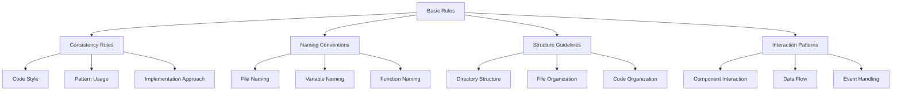

# Basic Rules

## Overview

Basic Rules define fundamental principles that apply to all aspects of the system. These rules ensure consistency, maintainability, and quality across the entire codebase regardless of specific implementation details.

## Rule Categories



## Consistency Rules

### Code Style

```json
{
  "rule_id": "code_style",
  "rule_name": "Code Style",
  "description": "Ensures consistent code formatting and style",
  "priority": "high",
  "validation_criteria": [
    "Consistent indentation (2 spaces)",
    "Semicolons at end of statements",
    "Single quotes for strings",
    "No trailing commas in function arguments",
    "Trailing commas in object and array literals"
  ],
  "examples": {
    "correct": [
      "const user = {\n  name: 'John',\n  age: 30,\n};"
    ],
    "incorrect": [
      "const user = {\n    name: \"John\",\n    age: 30\n};"
    ]
  }
}
```

### Pattern Usage

```json
{
  "rule_id": "pattern_usage",
  "rule_name": "Pattern Usage",
  "description": "Ensures consistent use of established patterns",
  "priority": "high",
  "validation_criteria": [
    "Use established patterns for common tasks",
    "Follow pattern structure exactly",
    "Include all required pattern elements",
    "Document pattern variations"
  ],
  "examples": {
    "correct": [
      "// Using established data fetching pattern\nconst { data, loading, error } = useFetch('/api/users');"
    ],
    "incorrect": [
      "// Custom implementation instead of using established pattern\nconst [data, setData] = useState(null);\nconst [loading, setLoading] = useState(true);\nconst [error, setError] = useState(null);\n\nuseEffect(() => {\n  fetch('/api/users')\n    .then(res => res.json())\n    .then(data => {\n      setData(data);\n      setLoading(false);\n    })\n    .catch(err => {\n      setError(err);\n      setLoading(false);\n    });\n}, []);"
    ]
  }
}
```

## Naming Conventions

### File Naming

```json
{
  "rule_id": "file_naming",
  "rule_name": "File Naming",
  "description": "Defines standards for file naming",
  "priority": "high",
  "validation_criteria": [
    "React components use PascalCase (UserProfile.tsx)",
    "Utility files use camelCase (formatDate.ts)",
    "Test files append .test or .spec (UserProfile.test.tsx)",
    "Constants files use UPPER_SNAKE_CASE (API_ENDPOINTS.ts)",
    "File names reflect content purpose"
  ],
  "examples": {
    "correct": [
      "UserProfile.tsx",
      "formatDate.ts",
      "UserProfile.test.tsx",
      "API_ENDPOINTS.ts"
    ],
    "incorrect": [
      "userprofile.tsx",
      "FormatDate.ts",
      "UserProfileTest.tsx",
      "apiEndpoints.ts"
    ]
  }
}
```

### Variable Naming

```json
{
  "rule_id": "variable_naming",
  "rule_name": "Variable Naming",
  "description": "Defines standards for variable naming",
  "priority": "high",
  "validation_criteria": [
    "Use camelCase for variables and function parameters",
    "Use PascalCase for classes and React components",
    "Use UPPER_SNAKE_CASE for constants",
    "Boolean variables should have prefix 'is', 'has', or 'should'",
    "Array variables should be plural nouns"
  ],
  "examples": {
    "correct": [
      "const userName = 'John';",
      "const isActive = true;",
      "const API_KEY = 'abc123';",
      "const users = ['John', 'Jane'];"
    ],
    "incorrect": [
      "const UserName = 'John';",
      "const active = true;",
      "const apiKey = 'abc123';",
      "const user = ['John', 'Jane'];"
    ]
  }
}
```

## Structure Guidelines

### Directory Structure

```json
{
  "rule_id": "directory_structure",
  "rule_name": "Directory Structure",
  "description": "Defines standards for directory organization",
  "priority": "high",
  "validation_criteria": [
    "Group files by feature rather than type",
    "Keep related files close to each other",
    "Maintain consistent nesting depth",
    "Use index files for directory exports",
    "Separate implementation from tests"
  ],
  "examples": {
    "correct": [
      "features/\n  user/\n    components/\n      UserProfile.tsx\n      UserSettings.tsx\n    hooks/\n      useUser.ts\n    api/\n      userApi.ts\n    tests/\n      UserProfile.test.tsx"
    ],
    "incorrect": [
      "components/\n  UserProfile.tsx\n  UserSettings.tsx\nhooks/\n  useUser.ts\napi/\n  userApi.ts\ntests/\n  UserProfile.test.tsx"
    ]
  }
}
```

## Interaction Patterns

### Component Interaction

```json
{
  "rule_id": "component_interaction",
  "rule_name": "Component Interaction",
  "description": "Defines standards for component interaction",
  "priority": "high",
  "validation_criteria": [
    "Use props for parent-to-child communication",
    "Use callbacks for child-to-parent communication",
    "Use context for deeply nested component communication",
    "Use state management for complex application state",
    "Document component dependencies"
  ],
  "examples": {
    "correct": [
      "// Parent to child\n<UserProfile user={user} />\n\n// Child to parent\n<UserForm onSubmit={handleSubmit} />\n\n// Deeply nested\n<UserContext.Provider value={user}>\n  <App />\n</UserContext.Provider>"
    ],
    "incorrect": [
      "// Using global variables\nwindow.user = user;\n<UserProfile />\n\n// Direct DOM manipulation\n<UserForm ref={formRef} />\n// Later: formRef.current.submit();"
    ]
  }
}
```

## Implementation

### Rule Application

Basic rules are applied:

1. **Automatically**: Through the Rule Engine
2. **Consistently**: Across all implementations
3. **Proactively**: During development rather than after
4. **Contextually**: With awareness of implementation context

### Rule Validation

Rules are validated through:

1. **Static Analysis**: Checking code against rule definitions
2. **Pattern Matching**: Comparing implementations to established patterns
3. **Contextual Evaluation**: Considering implementation context
4. **Example Comparison**: Comparing with correct and incorrect examples

## Benefits

1. **Consistency**: Ensures consistent approach across the codebase
2. **Maintainability**: Makes code easier to understand and maintain
3. **Onboarding**: Simplifies onboarding for new team members
4. **Quality**: Establishes foundation for high-quality implementations

## Example Usage

```
Task: "Create a new component for user profile display"

Basic Rules Application:
1. File named UserProfile.tsx (file_naming rule)
2. Component named UserProfile (variable_naming rule)
3. Placed in features/user/components directory (directory_structure rule)
4. Receives user data via props (component_interaction rule)
5. Follows established component pattern (pattern_usage rule)
```

## Integration Points

- **Auto-Context**: Provides context for rule application
- **Rule Engine**: Enforces basic rules
- **Quality System**: Uses basic rules as foundation for quality

## Rule Metrics

The system tracks:

1. **Rule Compliance**: How often implementations comply with basic rules
2. **Common Violations**: Most frequently violated rules
3. **Rule Effectiveness**: How rules contribute to codebase quality
4. **Rule Evolution**: How rules evolve over time 