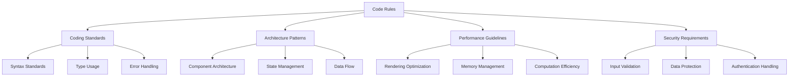

# Code Rules

## Overview

Code Rules define standards specific to code implementation, ensuring consistent, maintainable, and high-quality code across the project. These rules cover coding standards, architecture patterns, performance guidelines, and security requirements.

## Rule Categories



## Coding Standards

### Syntax Standards

```json
{
  "rule_id": "syntax_standards",
  "rule_name": "Syntax Standards",
  "description": "Defines standards for code syntax",
  "priority": "high",
  "validation_criteria": [
    "Use modern JavaScript/TypeScript syntax",
    "Prefer arrow functions for functional components",
    "Use destructuring for props and state",
    "Use optional chaining and nullish coalescing",
    "Use template literals for string interpolation"
  ],
  "examples": {
    "correct": [
      "// Arrow function with destructuring\nconst UserProfile = ({ user, isActive }) => {\n  const { name, email } = user;\n  const displayName = name ?? 'Anonymous';\n  return <div>{`User: ${displayName}`}</div>;\n};"
    ],
    "incorrect": [
      "// Old syntax\nfunction UserProfile(props) {\n  var name = props.user ? props.user.name : 'Anonymous';\n  return <div>User: ' + name + '</div>;\n};"
    ]
  }
}
```

### Type Usage

```json
{
  "rule_id": "type_usage",
  "rule_name": "Type Usage",
  "description": "Defines standards for TypeScript type usage",
  "priority": "high",
  "validation_criteria": [
    "Define explicit types for all variables, parameters, and return values",
    "Use interfaces for object shapes",
    "Use type aliases for complex types",
    "Avoid 'any' type except when absolutely necessary",
    "Use generics for reusable components and functions"
  ],
  "examples": {
    "correct": [
      "// Proper type usage\ninterface User {\n  id: string;\n  name: string;\n  email: string;\n  isActive: boolean;\n}\n\ntype UserListProps = {\n  users: User[];\n  onSelect: (user: User) => void;\n};\n\nconst UserList: React.FC<UserListProps> = ({ users, onSelect }) => {\n  // Implementation\n};"
    ],
    "incorrect": [
      "// Poor type usage\nconst UserList = (props) => {\n  // Implementation using any\n  const handleSelect = (user: any) => {\n    props.onSelect(user);\n  };\n};"
    ]
  }
}
```

## Architecture Patterns

### Component Architecture

```json
{
  "rule_id": "component_architecture",
  "rule_name": "Component Architecture",
  "description": "Defines standards for React component architecture",
  "priority": "high",
  "validation_criteria": [
    "Use functional components with hooks",
    "Keep components focused on a single responsibility",
    "Extract complex logic into custom hooks",
    "Separate container and presentational components",
    "Use composition over inheritance"
  ],
  "examples": {
    "correct": [
      "// Presentational component\nconst UserProfile: React.FC<UserProfileProps> = ({ user, onEdit }) => {\n  return (\n    <div>\n      <h2>{user.name}</h2>\n      <p>{user.email}</p>\n      <Button onClick={onEdit}>Edit</Button>\n    </div>\n  );\n};\n\n// Container component\nconst UserProfileContainer: React.FC<{ userId: string }> = ({ userId }) => {\n  const { user, loading, error } = useUser(userId);\n  const handleEdit = () => { /* implementation */ };\n  \n  if (loading) return <Loading />;\n  if (error) return <Error message={error.message} />;\n  \n  return <UserProfile user={user} onEdit={handleEdit} />;\n};"
    ],
    "incorrect": [
      "// Mixing concerns\nconst UserProfile: React.FC<{ userId: string }> = ({ userId }) => {\n  const [user, setUser] = useState(null);\n  const [loading, setLoading] = useState(true);\n  const [error, setError] = useState(null);\n  \n  useEffect(() => {\n    fetch(`/api/users/${userId}`)\n      .then(res => res.json())\n      .then(data => {\n        setUser(data);\n        setLoading(false);\n      })\n      .catch(err => {\n        setError(err);\n        setLoading(false);\n      });\n  }, [userId]);\n  \n  const handleEdit = () => { /* implementation */ };\n  \n  if (loading) return <div>Loading...</div>;\n  if (error) return <div>Error: {error.message}</div>;\n  \n  return (\n    <div>\n      <h2>{user.name}</h2>\n      <p>{user.email}</p>\n      <button onClick={handleEdit}>Edit</button>\n    </div>\n  );\n};"
    ]
  }
}
```

## Performance Guidelines

### Rendering Optimization

```json
{
  "rule_id": "rendering_optimization",
  "rule_name": "Rendering Optimization",
  "description": "Defines standards for optimizing React rendering",
  "priority": "high",
  "validation_criteria": [
    "Use React.memo for pure functional components",
    "Use useMemo for expensive calculations",
    "Use useCallback for functions passed as props",
    "Avoid unnecessary re-renders",
    "Implement virtualization for long lists"
  ],
  "examples": {
    "correct": [
      "// Optimized rendering\nconst UserList: React.FC<UserListProps> = React.memo(({ users, onSelect }) => {\n  const sortedUsers = useMemo(() => {\n    return [...users].sort((a, b) => a.name.localeCompare(b.name));\n  }, [users]);\n  \n  const handleSelect = useCallback((user: User) => {\n    onSelect(user);\n  }, [onSelect]);\n  \n  return (\n    <div>\n      {sortedUsers.map(user => (\n        <UserItem \n          key={user.id} \n          user={user} \n          onSelect={handleSelect} \n        />\n      ))}\n    </div>\n  );\n});"
    ],
    "incorrect": [
      "// Unoptimized rendering\nconst UserList: React.FC<UserListProps> = ({ users, onSelect }) => {\n  // Expensive calculation on every render\n  const sortedUsers = [...users].sort((a, b) => a.name.localeCompare(b.name));\n  \n  // New function created on every render\n  const handleSelect = (user: User) => {\n    onSelect(user);\n  };\n  \n  return (\n    <div>\n      {sortedUsers.map(user => (\n        <UserItem \n          key={user.id} \n          user={user} \n          onSelect={handleSelect} \n        />\n      ))}\n    </div>\n  );\n};"
    ]
  }
}
```

## Security Requirements

### Input Validation

```json
{
  "rule_id": "input_validation",
  "rule_name": "Input Validation",
  "description": "Defines standards for validating user input",
  "priority": "high",
  "validation_criteria": [
    "Validate all user input on both client and server",
    "Use type checking for input validation",
    "Sanitize HTML content before rendering",
    "Validate file uploads for type and size",
    "Implement rate limiting for form submissions"
  ],
  "examples": {
    "correct": [
      "// Proper input validation\nimport { z } from 'zod';\nimport DOMPurify from 'dompurify';\n\nconst userSchema = z.object({\n  name: z.string().min(2).max(100),\n  email: z.string().email(),\n  age: z.number().int().positive().optional()\n});\n\nconst UserForm: React.FC<UserFormProps> = ({ onSubmit }) => {\n  const handleSubmit = (data: unknown) => {\n    try {\n      const validatedData = userSchema.parse(data);\n      // Sanitize any HTML content\n      if (validatedData.bio) {\n        validatedData.bio = DOMPurify.sanitize(validatedData.bio);\n      }\n      onSubmit(validatedData);\n    } catch (error) {\n      // Handle validation errors\n    }\n  };\n};"
    ],
    "incorrect": [
      "// Missing input validation\nconst UserForm: React.FC<UserFormProps> = ({ onSubmit }) => {\n  const handleSubmit = (data: any) => {\n    // No validation\n    onSubmit(data);\n  };\n  \n  return (\n    <div dangerouslySetInnerHTML={{ __html: data.bio }} />\n  );\n};"
    ]
  }
}
```

## Implementation

### Rule Application

Code rules are applied:

1. **During Development**: As code is being written
2. **In Code Reviews**: During automated and manual reviews
3. **In CI/CD Pipeline**: As part of automated checks
4. **In Refactoring**: When improving existing code

### Rule Validation

Rules are validated through:

1. **Static Analysis**: Using TypeScript and ESLint
2. **Pattern Recognition**: Comparing against established patterns
3. **Performance Testing**: Measuring against performance benchmarks
4. **Security Scanning**: Checking for security vulnerabilities

## Benefits

1. **Code Quality**: Ensures high-quality, consistent code
2. **Maintainability**: Makes code easier to maintain and extend
3. **Performance**: Ensures optimal performance
4. **Security**: Prevents common security issues

## Example Usage

```
Task: "Create a new component for user profile display"

Code Rules Application:
1. Uses functional component with hooks (component_architecture rule)
2. Implements proper TypeScript types (type_usage rule)
3. Optimizes rendering with React.memo and useMemo (rendering_optimization rule)
4. Validates and sanitizes user input (input_validation rule)
5. Uses modern syntax with destructuring and optional chaining (syntax_standards rule)
```

## Integration Points

- **Auto-Context**: Uses context to select appropriate code rules
- **Rule Engine**: Enforces code rules
- **Quality System**: Uses code rules for quality assessment

## Rule Metrics

The system tracks:

1. **Rule Compliance**: How often implementations comply with code rules
2. **Performance Impact**: How rules affect application performance
3. **Security Impact**: How rules affect application security
4. **Maintainability Score**: How rules affect code maintainability 