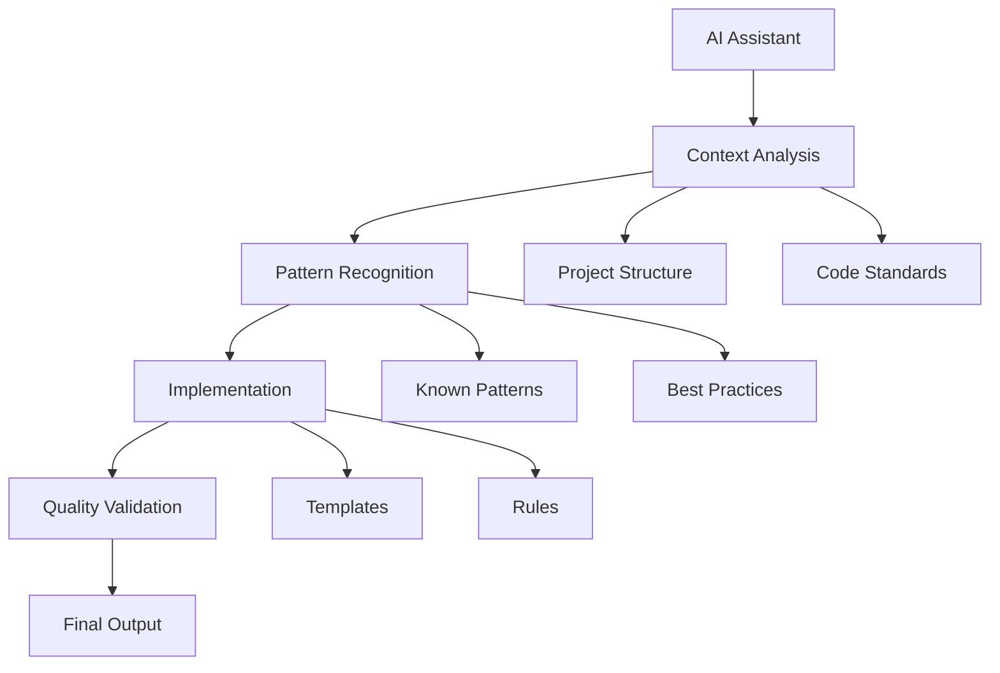

# AI Tooling System

## How It Works

### 1. Context Management

The system helps AI assistants understand project context through:

- Directory structure analysis
- File content examination
- Pattern recognition
- Previous decisions tracking

The AI assistant automatically:

- Analyzes project structure
- Identifies relevant files
- Understands coding patterns
- Maintains context across conversations

### 2. Rules Engine

Built-in rules help AI assistants:

- Follow project standards
- Use consistent patterns
- Maintain code quality
- Apply best practices

The rules are:

- Self-enforcing
- Context-aware
- Pattern-based
- Quality-focused

### 3. Implementation Support

The system provides:

- Template selection
- Pattern matching
- Code generation guidance
- Quality validation

AI assistants can:

- Choose appropriate patterns
- Generate consistent code
- Validate implementations
- Maintain standards

## Current Capabilities

1. **Auto-Context Understanding**

   - Project structure analysis
   - Code pattern recognition
   - Dependency tracking
   - Standard identification

2. **Self-Guided Implementation**

   - Pattern selection
   - Template application
   - Quality validation
   - Consistency checking

3. **Quality Maintenance**
   - Standard enforcement
   - Pattern compliance
   - Best practice application
   - Error prevention

## How AI Uses The System

1. **Context Phase**

   ```
   Project Structure → Pattern Recognition → Context Building
   ```

   AI automatically builds understanding of the project

2. **Implementation Phase**

   ```
   Pattern Selection → Template Application → Quality Validation
   ```

   AI self-guides through implementation

3. **Validation Phase**
   ```
   Standard Check → Quality Review → Pattern Compliance
   ```
   AI self-validates work

## System Benefits

1. **Consistency**

   - AI maintains consistent patterns
   - Standards are automatically applied
   - Implementation follows rules
   - Quality is built-in

2. **Efficiency**

   - AI works independently
   - Patterns are pre-defined
   - Rules are self-enforcing
   - Context is maintained

3. **Quality**
   - Standards are automatic
   - Validation is built-in
   - Patterns ensure quality
   - Rules prevent errors

## Example Flow



That's it - this is how the system helps AI assistants work effectively by themselves.
