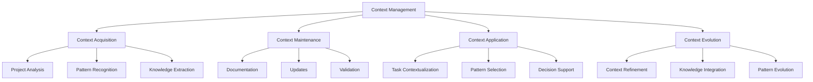

# Context Management for AI Tooling

## Overview

Effective context management is essential for AI-assisted development. This guide outlines how to establish, maintain, and utilize project context to maximize the effectiveness of ZenReact's AI tooling system.

## What is Context?

In AI-assisted development, context refers to the comprehensive understanding of:

1. **Project Structure** - Codebase organization, architecture, and dependencies
2. **Development Patterns** - Established coding patterns, conventions, and standards
3. **Business Requirements** - Functional and non-functional requirements
4. **Historical Decisions** - Past choices, trade-offs, and their rationales
5. **Current State** - Active development areas, known issues, and planned changes

## Context Management Framework

## Context Acquisition

### Project Analysis

1. **Codebase Exploration**
   - Review directory structure
   - Identify key components
   - Map dependencies
   - Document architecture

2. **Documentation Review**
   - Read existing documentation
   - Extract architectural decisions
   - Identify business requirements
   - Note technical constraints

3. **Pattern Identification**
   - Recognize coding patterns
   - Document naming conventions
   - Identify testing approaches
   - Map state management patterns

### Knowledge Extraction

1. **Key Concepts**
   - Domain terminology
   - Business entities
   - System boundaries
   - Integration points

2. **Technical Decisions**
   - Technology choices
   - Architecture decisions
   - Performance considerations
   - Security requirements

3. **Development Practices**
   - Code review process
   - Testing strategy
   - Documentation standards
   - Deployment workflow

## Context Maintenance

### Documentation

1. **Context Documentation**
   - Create context maps
   - Document key patterns
   - Maintain decision records
   - Update as project evolves

2. **Knowledge Base**
   - Organize by domain areas
   - Link related concepts
   - Provide examples
   - Include rationales

3. **Pattern Library**
   - Document recurring patterns
   - Provide usage guidelines
   - Include examples
   - Note constraints

### Updates

1. **Regular Reviews**
   - Schedule context reviews
   - Update after major changes
   - Validate accuracy
   - Refine as needed

2. **Change Tracking**
   - Document significant changes
   - Update affected areas
   - Maintain history
   - Communicate updates

3. **Validation**
   - Verify context accuracy
   - Test against current code
   - Resolve inconsistencies
   - Update as needed

## Context Application

### Task Contextualization

1. **Requirement Analysis**
   - Map requirements to context
   - Identify relevant patterns
   - Determine constraints
   - Plan implementation

2. **Pattern Selection**
   - Choose appropriate patterns
   - Apply context-specific rules
   - Consider project standards
   - Adapt as needed

3. **Implementation Guidance**
   - Provide context-aware guidance
   - Reference relevant patterns
   - Apply project standards
   - Ensure consistency

### Decision Support

1. **Trade-off Analysis**
   - Evaluate options based on context
   - Consider historical decisions
   - Apply project constraints
   - Document rationale

2. **Impact Assessment**
   - Evaluate change impact
   - Identify affected areas
   - Consider dependencies
   - Plan mitigation

3. **Quality Assurance**
   - Apply context-specific standards
   - Ensure pattern compliance
   - Validate against requirements
   - Maintain consistency

## Context Evolution

### Refinement Process

1. **Feedback Integration**
   - Collect implementation feedback
   - Identify context gaps
   - Document new insights
   - Update context accordingly

2. **Pattern Evolution**
   - Refine existing patterns
   - Document new patterns
   - Deprecate outdated patterns
   - Communicate changes

3. **Knowledge Integration**
   - Incorporate new knowledge
   - Update existing documentation
   - Resolve contradictions
   - Maintain consistency

## Best Practices

### Context Depth vs. Breadth

- **Depth**: Detailed understanding of specific areas
  - Core components
  - Critical workflows
  - Complex patterns
  - Business logic

- **Breadth**: General understanding of the entire system
  - Overall architecture
  - Component relationships
  - Integration points
  - Cross-cutting concerns

### Context Prioritization

1. **Critical Context**
   - Core business logic
   - Security requirements
   - Performance constraints
   - Data integrity rules

2. **Important Context**
   - UI/UX patterns
   - Error handling
   - Logging standards
   - Testing approaches

3. **Helpful Context**
   - Code style preferences
   - Documentation formats
   - Naming conventions
   - Development workflows

### Context Sharing

1. **Documentation**
   - Maintain central documentation
   - Use consistent formats
   - Link related information
   - Keep updated

2. **Knowledge Transfer**
   - Regular knowledge sharing
   - Pair programming
   - Code reviews
   - Documentation reviews

3. **Onboarding**
   - Context-focused onboarding
   - Guided exploration
   - Pattern introduction
   - Progressive complexity

## Context Management Tools

### Documentation Tools

- Pattern templates
- Decision records
- Context maps
- Knowledge base

### Analysis Tools

- Code analysis
- Dependency mapping
- Pattern recognition
- Impact assessment

### Maintenance Tools

- Documentation reviews
- Context validation
- Update tracking
- Consistency checking

## Common Challenges

| Challenge | Solution |
|-----------|----------|
| Outdated context | Regular reviews and updates |
| Incomplete understanding | Systematic exploration and documentation |
| Conflicting patterns | Pattern reconciliation and standardization |
| Knowledge silos | Shared documentation and knowledge transfer |
| Context overload | Prioritization and progressive disclosure |

## Integration with Patterns

- [Progress Tracking](./patterns/PROGRESS_TRACKING.md) - Incorporate context in progress assessment
- [Complexity Assessment](./patterns/COMPLEXITY_ASSESSMENT.md) - Use context to evaluate complexity
- [Task Prioritization](./patterns/TASK_PRIORITIZATION.md) - Context-aware prioritization
- [Documentation Templates](./patterns/DOCUMENTATION_TEMPLATES.md) - Context documentation
- [Testing Templates](./patterns/TESTING_TEMPLATES.md) - Context-aware testing
- [Review Templates](./patterns/REVIEW_TEMPLATES.md) - Context validation in reviews

## Success Metrics

- Context completeness
- Context accuracy
- Context utilization
- Implementation consistency
- Knowledge sharing effectiveness

## Resources

- [Rules and Patterns](./RULES_AND_PATTERNS.md)
- [Implementation Guide](./IMPLEMENTATION.md)
- [Implementation Status](./STATUS.md)
- [Pattern Templates](./patterns/README.md)
- [Documentation Learnings](./LEARNINGS.md)

---

Last Updated: 2025-03-15
