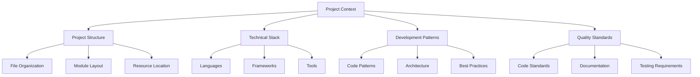

# Project Context Management Guidelines

## Table of Contents

1. [Overview](#overview)
2. [Context Hierarchy](#context-hierarchy)
3. [Context Analysis](#context-analysis)
4. [Pattern Recognition](#pattern-recognition)
5. [Context Maintenance](#context-maintenance)
6. [Project Understanding](#project-understanding)
7. [Best Practices](#best-practices)

## Overview

This document outlines how AI agents should gather, maintain, and utilize project context for effective assistance. These guidelines ensure consistent understanding and operation across different interactions.

## Context Hierarchy



## Context Analysis

### Initial Project Scan

```yaml
initial_scan:
  steps:
    - Review project structure
    - Identify key configuration files
    - Analyze dependencies
    - Document tech stack

  key_indicators:
    - File organization patterns
    - Naming conventions
    - Configuration approaches
    - Development tooling
```

### Technology Assessment

```yaml
tech_stack:
  primary_elements:
    - Programming languages
    - Frameworks and libraries
    - Build tools
    - Testing frameworks

  evaluation_points:
    - Version compatibility
    - Integration patterns
    - Performance requirements
    - Security considerations
```

## Pattern Recognition

### Code Patterns

```yaml
pattern_analysis:
  code_patterns:
    - Architectural approaches
    - Design patterns
    - Error handling
    - State management

  documentation_patterns:
    - Comment styles
    - Documentation format
    - API documentation
    - Usage examples
```

### Architecture Analysis

```yaml
architecture_analysis:
  components:
    - Core modules
    - Service layers
    - Data flow
    - Integration points

  considerations:
    - Scalability
    - Maintainability
    - Performance
    - Security
```

## Context Maintenance

### Dynamic Updates

```yaml
context_updates:
  triggers:
    - File changes
    - Dependency updates
    - Configuration changes
    - New patterns introduced

  update_process:
    - Identify changes
    - Analyze impact
    - Update context
    - Adjust recommendations
```

### Knowledge Base

```yaml
knowledge_base:
  categories:
    - Common solutions
    - Best practices
    - Error resolutions
    - Performance optimizations

  maintenance:
    - Regular updates
    - Pattern validation
    - Consistency checks
    - Relevance assessment
```

## Project Understanding

### Code Standards

```yaml
code_standards:
  style_guide:
    - Formatting rules
    - Naming conventions
    - Documentation requirements
    - Code organization

  quality_metrics:
    - Complexity
    - Coverage
    - Performance
    - Maintainability
```

### Solution Design

```yaml
solution_design:
  steps: 1. Analyze requirements
    2. Match patterns
    3. Consider context
    4. Generate solution
    5. Validate output

  validation:
    - Pattern compliance
    - Style consistency
    - Performance impact
    - Integration fit
```

## Context Application

### Code Generation

```typescript
// Example of context-aware code generation
interface GenerationContext {
  projectStyle: StyleGuide;
  patterns: CodePatterns;
  standards: QualityStandards;
  dependencies: ProjectDependencies;
}

function generateComponent(context: GenerationContext, requirements: Requirements): Component {
  // Apply context-aware generation rules
  // Follow project patterns
  // Ensure consistency
}
```

### Documentation Generation

```markdown
# Component Documentation Template

## Overview

[Context-aware description]

## Implementation Details

- Style: [Match project standards]
- Patterns: [Use established patterns]
- Integration: [Consider project context]

## Usage Guidelines

\`\`\`typescript
// Example following project patterns
\`\`\`
```

## Best Practices

### Context Usage

```yaml
context_usage:
  principles:
    - Start with context
    - Apply consistently
    - Validate output
    - Document decisions

  application:
    - Consider full context
    - Follow patterns
    - Maintain standards
    - Ensure clarity
```

### Maintenance Guidelines

```yaml
context_maintenance:
  activities:
    - Regular updates
    - Pattern validation
    - Documentation review
    - Standard assessment

  objectives:
    - Keep current
    - Maintain quality
    - Ensure relevance
    - Support evolution
```

## Quality Assurance

### Consistency Validation

```yaml
consistency_validation:
  checkpoints:
    - Pattern adherence
    - Style compliance
    - Documentation standards
    - Integration approach

  validation_process:
    - Compare with existing code
    - Check style guidelines
    - Validate patterns
    - Verify documentation
```

### Impact Analysis

```yaml
impact_analysis:
  areas:
    - Code base impact
    - Performance effects
    - Maintenance implications
    - Integration consequences

  assessment:
    - Analyze changes
    - Evaluate risks
    - Consider alternatives
    - Provide recommendations
```

## Continuous Improvement

### Pattern Evolution

```yaml
pattern_evolution:
  monitoring:
    - Usage patterns
    - Effectiveness
    - Pain points
    - Improvement areas

  adaptation:
    - Update patterns
    - Refine guidelines
    - Enhance documentation
    - Optimize processes
```

This approach enables effective:

1. Project comprehension
2. Pattern application
3. Quality maintenance
4. Continuous improvement
5. Consistent assistance

For implementation details, see [Implementation Guide](./IMPLEMENTATION.md).
For rules and patterns, refer to [Rules and Patterns](./RULES_AND_PATTERNS.md).
