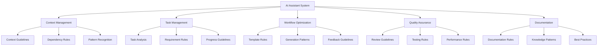

# AI Assistant Implementation Guide

## Overview

This guide outlines the implementation approach for ZenReact's AI assistant tooling system. It covers architecture, workflows, and practical guidelines for effective AI assistance.

## Table of Contents

1. [Architecture](#architecture)
2. [Implementation Phases](#implementation-phases)
3. [Workflow Patterns](#workflow-patterns)
4. [Quality Assurance](#quality-assurance)
5. [Continuous Improvement](#continuous-improvement)

## Architecture



## Implementation Phases

### Phase 1: Foundation (Week 1)

- Establish Context Management

  - Project analysis patterns
  - Dependency tracking
  - Configuration management

- Define Task Management

  - Task breakdown procedures
  - Progress tracking
  - Complexity assessment

- Create Initial Templates
  - Code generation
  - Documentation
  - Testing

### Phase 2: Core Rules (Week 2)

- Develop Generation Patterns

  - Component templates
  - Test structures
  - Documentation formats

- Define Review Guidelines

  - Code review process
  - Quality metrics
  - Performance standards

- Create Testing Rules
  - Test coverage
  - Integration testing
  - Performance testing

### Phase 3: Optimization (Week 3)

- Add Performance Rules

  - Optimization patterns
  - Bottleneck identification
  - Performance metrics

- Implement Feedback Patterns

  - Issue tracking
  - Pattern refinement
  - Template improvement

- Enhance Templates
  - Advanced patterns
  - Edge cases
  - Error handling

### Phase 4: Documentation (Week 4)

- Documentation Rules

  - API documentation
  - Usage guidelines
  - Maintenance notes

- Knowledge Management

  - Pattern documentation
  - Decision records
  - Best practices

- Integration Guidelines
  - System integration
  - Workflow integration
  - Tool integration

## Workflow Patterns

### Task Processing

```yaml
task_workflow:
  steps: 1. Context Analysis
    2. Task Breakdown
    3. Pattern Selection
    4. Implementation
    5. Validation

  checkpoints:
    - Requirements met
    - Patterns applied
    - Tests included
    - Documentation complete
```

### Quality Control

```yaml
quality_workflow:
  reviews:
    - Code standards
    - Performance metrics
    - Test coverage
    - Documentation quality

  validations:
    - Functionality
    - Integration
    - Performance
    - Security
```

## Quality Assurance

### Review Guidelines

```yaml
review_process:
  code_review:
    - Style compliance
    - Pattern adherence
    - Error handling
    - Performance impact

  documentation_review:
    - Completeness
    - Clarity
    - Examples
    - Updates
```

### Testing Strategy

```yaml
testing_strategy:
  levels:
    - Unit testing
    - Integration testing
    - Performance testing
    - Security testing

  coverage:
    - Core functionality
    - Edge cases
    - Error scenarios
    - Integration points
```

## Continuous Improvement

### Feedback Integration

```yaml
feedback_process:
  sources:
    - Usage patterns
    - Error reports
    - Performance metrics
    - User feedback

  applications:
    - Pattern updates
    - Template improvements
    - Rule refinements
    - Documentation updates
```

### Evolution Strategy

```yaml
evolution_strategy:
  areas:
    - Pattern effectiveness
    - Template completeness
    - Rule clarity
    - Documentation quality

  improvements:
    - Regular reviews
    - Pattern updates
    - Documentation updates
    - Process refinements
```

## Success Metrics

### Key Indicators

```yaml
success_metrics:
  quality:
    - Code quality scores
    - Test coverage
    - Documentation completeness
    - Pattern adherence

  efficiency:
    - Implementation speed
    - Pattern reuse
    - Error reduction
    - Maintenance effort
```

### Monitoring

```yaml
monitoring:
  areas:
    - Pattern usage
    - Error rates
    - Performance metrics
    - User satisfaction

  actions:
    - Track metrics
    - Analyze trends
    - Identify improvements
    - Implement updates
```

## Next Steps

1. Begin Phase 1 implementation
2. Establish feedback mechanisms
3. Monitor success metrics
4. Regular pattern reviews
5. Continuous improvement

For detailed rules and patterns, see [Rules and Patterns](./RULES_AND_PATTERNS.md).
For context management guidelines, refer to [Context Management](./CONTEXT.md).
