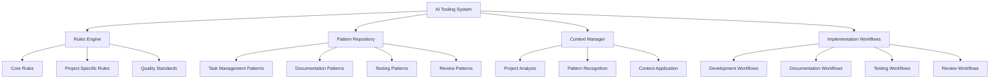

# AI Tooling Implementation Guide

## Overview

This guide outlines the implementation approach for ZenReact's AI assistant tooling system. Our system uses a rules-based approach rather than complex program implementations, focusing on clear guidelines and patterns that enable AI agents to provide effective development support.

## System Architecture

## Implementation Phases

Our implementation follows a phased approach to ensure systematic development and integration:

### Phase 1: Foundation (Completed)

- ✅ Core rules and patterns definition
- ✅ Documentation structure establishment
- ✅ Task management patterns
- ✅ Pattern templates creation
- ✅ Progress tracking mechanisms

### Phase 2: Integration (In Progress)

- 🔄 Component development patterns
- 🔄 State management patterns
- 🔄 API integration patterns
- 🔄 Error handling patterns
- 🔄 Performance optimization patterns

### Phase 3: Advanced Features (Planned)

- ⏳ Automated testing patterns
- ⏳ Code review automation
- ⏳ Documentation generation
- ⏳ Pattern recommendation system
- ⏳ Continuous improvement framework

### Phase 4: Optimization (Planned)

- ⏳ Pattern effectiveness metrics
- ⏳ System performance analysis
- ⏳ User experience refinement
- ⏳ Advanced context management
- ⏳ Cross-project pattern sharing

## Workflow Optimization

### Development Workflow

1. **Project Analysis**
   - Review project requirements
   - Identify applicable patterns
   - Assess complexity using [Complexity Assessment](./patterns/COMPLEXITY_ASSESSMENT.md)

2. **Task Planning**
   - Apply [Task Prioritization](./patterns/TASK_PRIORITIZATION.md) patterns
   - Break down complex tasks
   - Establish progress tracking using [Progress Tracking](./patterns/PROGRESS_TRACKING.md)

3. **Implementation**
   - Apply relevant code patterns
   - Follow project-specific rules
   - Maintain documentation using [Documentation Templates](./patterns/DOCUMENTATION_TEMPLATES.md)

4. **Testing**
   - Implement tests using [Testing Templates](./patterns/TESTING_TEMPLATES.md)
   - Validate against requirements
   - Ensure code quality standards

5. **Review**
   - Conduct reviews using [Review Templates](./patterns/REVIEW_TEMPLATES.md)
   - Apply feedback
   - Document learnings

### Documentation Workflow

1. **Analysis**
   - Identify documentation needs
   - Select appropriate templates
   - Plan documentation structure

2. **Creation**
   - Apply documentation patterns
   - Follow standardized formats
   - Include necessary details

3. **Review**
   - Validate accuracy
   - Ensure completeness
   - Check for clarity

4. **Integration**
   - Link to related documentation
   - Update indexes
   - Maintain consistency

## Best Practices

### Pattern Selection

- Choose patterns based on task requirements
- Consider project context
- Adapt patterns when necessary
- Document pattern variations

### Context Management

- Maintain comprehensive project context
- Update context as project evolves
- Share context across team members
- Document context dependencies

### Quality Assurance

- Apply quality standards consistently
- Validate against requirements
- Document quality metrics
- Conduct regular reviews

### Continuous Improvement

- Collect pattern effectiveness data
- Refine patterns based on feedback
- Document pattern evolution
- Share improvements across projects

## Integration with Other Systems

### Version Control

- Document pattern versions
- Track pattern changes
- Link patterns to code versions
- Maintain pattern history

### Project Management

- Align patterns with project methodologies
- Integrate with task tracking
- Support sprint planning
- Facilitate retrospectives

### Knowledge Management

- Organize patterns in knowledge base
- Provide pattern search capabilities
- Enable pattern sharing
- Support pattern learning

## Troubleshooting

### Common Issues

| Issue | Solution |
|-------|----------|
| Pattern mismatch | Review project context and select more appropriate patterns |
| Incomplete implementation | Check pattern requirements and ensure all steps are followed |
| Quality issues | Apply relevant quality standards and review templates |
| Documentation gaps | Use documentation templates to ensure comprehensive coverage |
| Context confusion | Update and clarify project context documentation |

### Escalation Process

1. Identify issue specifics
2. Consult relevant pattern documentation
3. Apply troubleshooting patterns
4. Document resolution for future reference

## Success Metrics

- Implementation completeness
- Documentation coverage
- Pattern effectiveness
- Quality improvements
- Development efficiency

## Resources

- [Rules and Patterns](./RULES_AND_PATTERNS.md)
- [Context Management](./CONTEXT.md)
- [Implementation Status](./STATUS.md)
- [Pattern Templates](./patterns/README.md)
- [Documentation Learnings](./LEARNINGS.md)

---

Last Updated: 2025-03-15
