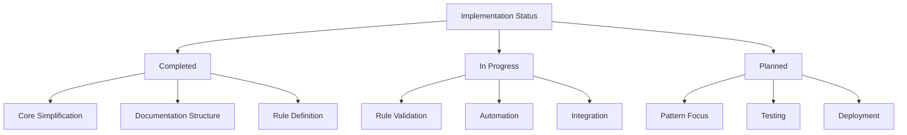

# AI Tooling System Implementation Status

## Overview

This document provides a summary of the current implementation status of the AI Tooling system, including completed work, in-progress tasks, and next steps.

## Implementation Progress

## Completed Work

### Phase 1: Core Simplification

- ✅ Created new directory structure
- ✅ Established document hierarchy
- ✅ Migrated content from old structure
- ✅ Consolidated redundant information
- ✅ Streamlined information for AI consumption
- ✅ Standardized document format
- ✅ Optimized content for AI consumption

### Documentation

- ✅ Created SYSTEM_ARCHITECTURE.md
- ✅ Created AUTO_CONTEXT.md
- ✅ Created RULE_ENGINE.md
- ✅ Created QUALITY_SYSTEM.md
- ✅ Created BASIC_RULES.md
- ✅ Created CODE_RULES.md
- ✅ Created DOC_RULES.md
- ✅ Created COMMON_PATTERNS.md
- ✅ Created EXAMPLES.md
- ✅ Created TEMPLATES.md
- ✅ Created MIGRATION_GUIDE.md
- ✅ Created README.md

### Rules Documentation

- ✅ Defined clear rules and guidelines
- ✅ Created comprehensive examples
- ✅ Documented rule application patterns
- ✅ Established documentation standards

## In Progress

### Phase 2: Rule Enhancement

- 🔄 Expanding rule documentation with more examples
- 🔄 Creating rule application guidelines
- 🔄 Developing rule application checklists
- 🔄 Building rule reference guides

## Planned Work

### Phase 2: Rule Enhancement (Completion)

- ⬜ Create comprehensive rule examples
- ⬜ Document rule application strategies
- ⬜ Develop review checklists
- ⬜ Create quick reference guides
- ⬜ Build rule application templates

### Phase 3: Pattern Focus

- ⬜ Identify and document key patterns
- ⬜ Create example implementations
- ⬜ Document examples with usage context
- ⬜ Test examples against rules
- ⬜ Create reusable templates
- ⬜ Document templates with customization guidance
- ⬜ Test templates against rules

## Next Steps

1. **Enhance Rule Documentation**

   - Create additional rule examples
   - Document common use cases
   - Build rule application guides

2. **Improve Reference Materials**

   - Create quick reference guides
   - Develop rule selection guidance
   - Document best practices

3. **Expand Pattern Library**

   - Document successful patterns
   - Create example implementations
   - Build reusable templates

4. **Gather Feedback**
   - Collect implementation experiences
   - Refine rule documentation
   - Update patterns based on usage

## Timeline

| Phase                        | Status         | Estimated Completion  |
| ---------------------------- | -------------- | --------------------- |
| Phase 1: Core Simplification | ✅ Completed   | Completed             |
| Phase 2: Rule Enhancement    | 🔄 In Progress | 2 weeks               |
| Phase 3: Pattern Focus       | ⬜ Planned     | 4 weeks after Phase 2 |

## Metrics

The following metrics will be tracked to measure the effectiveness of the rules-based system:

1. **Rule Clarity**: How easily rules are understood
2. **Example Effectiveness**: How well examples guide implementation
3. **Pattern Adoption**: How frequently documented patterns are used
4. **Development Speed**: How quickly tasks are completed using rules
5. **Implementation Quality**: How well implementations follow rules

## Conclusion

The AI Tooling system implementation is progressing well, with Phase 1 completed and Phase 2 underway. The rules-based documentation is expanding, providing clear guidelines and examples for development. The next steps focus on enhancing rule documentation, improving reference materials, and building a comprehensive pattern library to support effective development.
