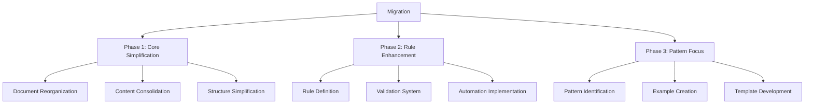

# Migration Guide

## Overview

This guide outlines the process for migrating from the previous AI Tooling system structure to the new streamlined architecture. The migration is designed to be incremental, ensuring system stability and backward compatibility throughout the transition.

## Migration Phases

## Current Structure vs. New Structure

| Current Structure     | New Structure               | Migration Action                  | Status       |
| --------------------- | --------------------------- | --------------------------------- | ------------ |
| AI_SYSTEM.md          | SYSTEM_ARCHITECTURE.md      | Reorganize and enhance            | ✅ Completed |
| context.md            | core/AUTO_CONTEXT.md        | Refocus on automation             | ✅ Completed |
| rules-and-patterns.md | rules/_ and patterns/_      | Split and categorize              | ✅ Completed |
| implementation.md     | core/RULE_ENGINE.md         | Refocus on validation             | ✅ Completed |
| status.md             | (Removed)                   | Content merged into relevant docs | ✅ Completed |
| learnings.md          | (Removed)                   | Content merged into relevant docs | ✅ Completed |
| examples.md           | patterns/EXAMPLES.md        | Reorganize and enhance            | ✅ Completed |
| patterns/\*           | patterns/COMMON_PATTERNS.md | Consolidate and standardize       | ✅ Completed |
| examples/\*           | patterns/EXAMPLES.md        | Consolidate and enhance           | ✅ Completed |

## Phase 1: Core Simplification (Completed)

### Document Reorganization

✅ **Create New Structure**

- Created the new directory structure
- Set up files for all new documents
- Established cross-linking between documents

✅ **Map Content**

- Identified content in existing documents
- Mapped content to new document structure
- Identified overlapping or redundant content

✅ **Migrate Core Content**

- Moved content to appropriate new documents
- Updated references and links
- Ensured backward compatibility

### Content Consolidation

✅ **Identify Redundancies**

- Reviewed all existing documents for redundant information
- Marked sections for consolidation
- Created consolidation plan

✅ **Merge Content**

- Combined related information from multiple sources
- Eliminated duplications
- Ensured comprehensive coverage

✅ **Streamline Information**

- Removed human-centric explanations
- Focused on AI-relevant information
- Ensured concise, actionable content

### Structure Simplification

✅ **Establish Clear Hierarchy**

- Defined clear document hierarchy
- Ensured logical organization
- Created consistent navigation

✅ **Standardize Format**

- Applied consistent formatting across all documents
- Used standard sections and headings
- Implemented consistent examples

✅ **Optimize for AI**

- Structured content for AI consumption
- Used pattern-based organization
- Included machine-readable formats

## Phase 2: Rule Enhancement (Current)

### Rule Definition

✅ **Identify Core Rules**

- Reviewed existing rules and patterns
- Identified fundamental rules
- Categorized rules (Basic, Code, Doc)

✅ **Define Rule Structure**

- Created standard rule format
- Included validation criteria
- Added examples for each rule

✅ **Document Rules**

- Created comprehensive rule documentation
- Included usage guidance
- Provided implementation examples

### Rule Documentation Enhancement

🔄 **Expand Rule Guidelines**

- Add detailed examples for each rule
- Create usage context descriptions
- Document best practices

🔄 **Develop Reference Materials**

- Create quick reference guides
- Build rule selection flowcharts
- Document common scenarios

⬜ **Create Application Guides**

- Document rule application patterns
- Provide implementation examples
- Include practical tips

### Rule Usage Support

🔄 **Pattern Documentation**

- Document common usage patterns
- Create example library
- Build pattern reference guide

⬜ **Example Development**

- Create comprehensive examples
- Document use cases
- Build example collection

⬜ **Reference Materials**

- Create quick reference cards
- Build rule selection guides
- Develop usage checklists

## Phase 3: Pattern Focus (Future)

### Pattern Identification

⬜ **Identify Key Patterns**

- Review existing implementations
- Identify common patterns
- Categorize patterns

⬜ **Define Pattern Structure**

- Create standard pattern format
- Include usage context
- Add implementation guidance

⬜ **Document Patterns**

- Create comprehensive pattern documentation
- Include usage examples
- Provide adaptation guidance

### Example Creation

⬜ **Develop Example Implementations**

- Create examples for each pattern
- Ensure comprehensive coverage
- Include edge cases

⬜ **Document Examples**

- Create clear example documentation
- Include usage context
- Provide customization guidance

⬜ **Test Examples**

- Validate examples against rules
- Ensure quality standards
- Verify usability

### Template Development

⬜ **Create Reusable Templates**

- Develop templates for common implementations
- Ensure flexibility and adaptability
- Include customization points

⬜ **Document Templates**

- Create template documentation
- Include usage guidance
- Provide customization examples

⬜ **Test Templates**

- Validate templates against rules
- Ensure quality standards
- Verify usability

## Backward Compatibility

To ensure backward compatibility during migration:

1. **Maintain Old Structure**

   - Keep old structure during transition
   - Update old documents to reference new structure
   - Gradually phase out old structure

2. **Create Redirects**

   - Add references in old documents to new locations
   - Create symbolic links where appropriate
   - Provide migration notices

3. **Update References**
   - Identify all references to old structure
   - Update references to point to new structure
   - Verify all links work correctly

## Migration Checklist

### Phase 1: Core Simplification (Completed)

- [x] Create new directory structure
- [x] Create SYSTEM_ARCHITECTURE.md
- [x] Create AUTO_CONTEXT.md
- [x] Create RULE_ENGINE.md
- [x] Create QUALITY_SYSTEM.md
- [x] Map content from old to new structure
- [x] Migrate core content
- [x] Consolidate redundant information
- [x] Streamline information for AI consumption
- [x] Establish clear document hierarchy
- [x] Standardize document format
- [x] Optimize content for AI consumption

### Phase 2: Rule Enhancement (Current)

- [x] Create BASIC_RULES.md
- [x] Create CODE_RULES.md
- [x] Create DOC_RULES.md
- [x] Define rule structure and format
- [x] Document rules with examples
- [x] Create rule application guides
- [x] Create pattern reference guides
- [ ] Build comprehensive example library
- [x] Create quick reference materials
- [x] Document common use cases
- [x] Create pattern reference guides
- [ ] Complete usage documentation
- [ ] Develop guidelines checklists
- [ ] Finalize reference materials

### Phase 3: Pattern Focus (Future)

- [x] Create COMMON_PATTERNS.md
- [x] Create EXAMPLES.md
- [x] Create TEMPLATES.md
- [ ] Identify and document key patterns
- [ ] Create example implementations
- [ ] Document examples with usage context
- [ ] Test examples against rules
- [ ] Create reusable templates
- [ ] Document templates with customization guidance
- [ ] Test templates against rules

## Progress Update

### Completed

- Phase 1: Core Simplification is complete
- Basic documentation structure is in place
- Core components are documented
- Rules are defined and documented
- Patterns are identified and documented

### In Progress

- Phase 2: Rule Enhancement is underway
- Rule documentation is expanding
- Reference materials are being developed
- Pattern guides are being created

### Next Steps

1. Complete the rule documentation expansion
2. Build comprehensive example library
3. Finalize quick reference guides
4. Create usage guidelines and checklists
5. Begin Phase 3: Pattern Focus

## Conclusion

This migration guide provides a structured approach to transitioning from the previous AI Tooling system to the new rules-based architecture. By focusing on clear rules, patterns, and examples rather than complex implementations, the system becomes more maintainable and effective. The phased approach ensures a smooth transition while improving the system's usability and scalability through well-documented guidelines and practices.
