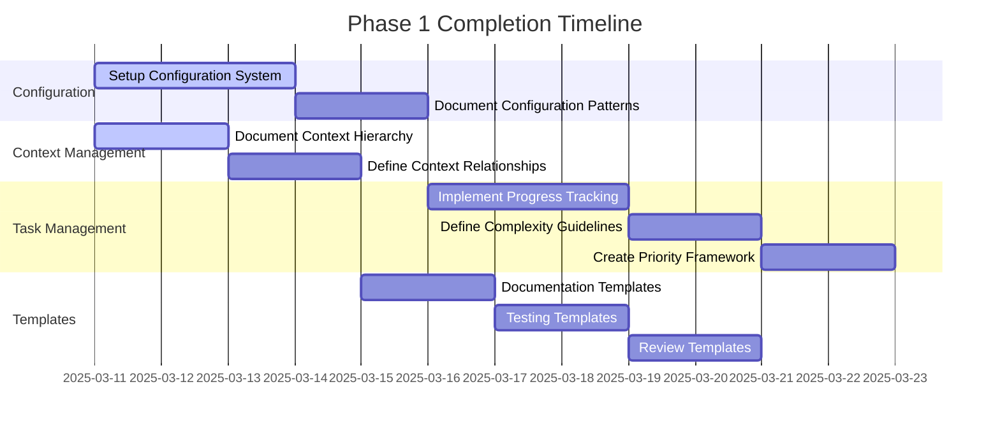

# Phase 1 Completion Plan

## Timeline Overview

## Detailed Implementation Steps

### 1. Configuration Management System (Days 1-3)

#### Objectives

- Establish consistent configuration patterns
- Enable flexible project customization
- Ensure validation and type safety

#### Implementation Steps

1. Define Configuration Rules

   - Document allowable configuration patterns
   - Establish naming conventions
   - Create pattern guidelines

2. Create Validation Guidelines

   - Define validation rules
   - Document error patterns
   - Establish quality standards

3. Document Pattern Templates

   - Create pattern examples
   - Define usage guidelines
   - Document best practices

4. Establish Rule Documentation
   - Create rule templates
   - Document example scenarios
   - Define maintenance procedures

### 2. Context Pattern Documentation (Days 1-2)

#### Objectives

- Define context relationship patterns
- Establish information flow rules
- Create maintainable pattern structure

#### Implementation Steps

1. Document Context Level Patterns

   - Project-level rules
   - Component pattern guidelines
   - Feature context templates
   - Implementation patterns

2. Define Relationship Rules

   - Parent-child pattern rules
   - Peer relationship guidelines
   - Cross-cutting pattern templates

3. Create Pattern Visualization

   - Pattern diagram templates
   - Flow representation rules
   - Relationship mapping guidelines

4. Define Evolution Guidelines
   - Pattern update rules
   - Version tracking templates
   - Migration pattern guides

### 3. Progress Tracking Guidelines (Days 4-6)

#### Objectives

- Define clear progress tracking rules
- Establish measurement patterns
- Create feedback guideline templates

#### Implementation Steps

1. Document Tracking Patterns

   - Define progress indicators
   - Establish quality checkpoints
   - Create measurement guidelines
   - Document time tracking rules

2. Create Assessment Templates

   - Status review patterns
   - Milestone evaluation rules
   - Issue identification guidelines

3. Define Reporting Rules

   - Progress documentation patterns
   - Update frequency guidelines
   - Communication templates

4. Establish Review Guidelines
   - Pattern review cycles
   - Assessment procedures
   - Feedback templates

### 4. Task Management Patterns (Days 7-10)

#### Objectives

- Document complexity assessment patterns
- Define prioritization guidelines
- Establish task handling rules

#### Implementation Steps

1. Document Complexity Patterns

   - Pattern recognition rules
   - Integration guidelines
   - Dependency analysis patterns
   - Testing requirement templates

2. Define Priority Guidelines

   - Value assessment patterns
   - Dependency analysis rules
   - Resource allocation guidelines
   - Risk evaluation patterns

3. Create Task Classification Rules

   - Pattern categorization
   - Complexity assessment guides
   - Resource mapping guidelines
   - Timeline estimation patterns

4. Establish Process Guidelines
   - Assessment patterns
   - Review templates
   - Pattern evolution rules

### 5. Pattern Templates (Days 5-10)

#### Objectives

- Create pattern documentation templates
- Ensure rule consistency
- Enable rapid pattern adoption

#### Implementation Steps

1. Documentation Pattern Templates

   - API pattern guidelines
   - Component pattern rules
   - Rule documentation templates
   - Pattern usage examples

2. Testing Pattern Templates

   - Test pattern guidelines
   - Integration test patterns
   - Performance test rules
   - Security test templates

3. Review Pattern Templates
   - Code review patterns
   - Design review guidelines
   - Performance review rules
   - Security review templates

## Success Metrics

### Configuration Pattern Documentation

- [ ] Pattern guidelines documented
- [ ] Validation rule patterns defined
- [ ] Default pattern templates created
- [ ] Pattern evolution rules documented

### Context Pattern Guidelines

- [ ] Context level patterns defined
- [ ] Relationship patterns documented
- [ ] Pattern evolution rules established
- [ ] Integration pattern guidelines created

### Progress Tracking Patterns

- [ ] Tracking pattern guidelines defined
- [ ] Assessment templates documented
- [ ] Reporting pattern rules created
- [ ] Review procedures templated

### Task Management Guidelines

- [ ] Complexity assessment patterns defined
- [ ] Priority decision rules documented
- [ ] Task categorization patterns created
- [ ] Assessment pattern guidelines documented

### Pattern Templates

- [ ] Documentation pattern templates completed
- [ ] Testing pattern templates defined
- [ ] Review pattern templates established
- [ ] Pattern usage guidelines documented

## Risk Mitigation

### Identified Risks

1. Timeline constraints
2. Resource availability
3. Integration challenges
4. Knowledge gaps

### Mitigation Strategies

1. Regular progress reviews
2. Clear documentation
3. Early testing
4. Knowledge sharing sessions

## Next Steps

1. Begin documenting configuration patterns and guidelines
2. Start context hierarchy pattern documentation in parallel
3. Prepare pattern templates for progress tracking
4. Establish pattern review cycles
5. Plan Phase 2 pattern evolution

## Notes

- All timelines are estimates and may be adjusted based on progress
- Dependencies between tasks have been considered in the schedule
- Regular reviews will help identify and address any blockers early
- Documentation should be updated continuously throughout implementation
