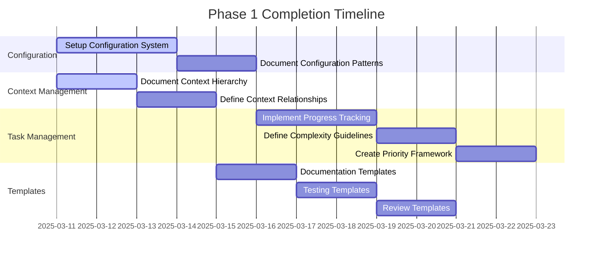

# Phase 1 Completion Plan

## Timeline Overview

## Detailed Implementation Steps

### 1. Configuration Management System (Days 1-3)

#### Objectives

- Establish consistent configuration patterns
- Enable flexible project customization
- Ensure validation and type safety

#### Implementation Steps

1. Create base configuration schema

   - Define required fields
   - Establish type definitions
   - Document validation rules

2. Implement validation system

   - Create validation functions
   - Define error handling
   - Add type guards

3. Define default configurations

   - Set baseline values
   - Document override patterns
   - Create migration guides

4. Document configuration system
   - Write technical specifications
   - Create usage examples
   - Define update procedures

### 2. Context Hierarchy Documentation (Days 1-2)

#### Objectives

- Define clear context relationships
- Establish information flow
- Create maintainable structure

#### Implementation Steps

1. Define context levels

   - Project level
   - Component level
   - Feature level
   - Implementation level

2. Document relationships

   - Parent-child connections
   - Peer relationships
   - Cross-cutting concerns

3. Create hierarchy diagrams

   - Visual representations
   - Flow charts
   - Relationship maps

4. Establish update patterns
   - Change procedures
   - Version control
   - Migration guides

### 3. Progress Tracking System (Days 4-6)

#### Objectives

- Enable clear progress visualization
- Establish measurable metrics
- Create actionable insights

#### Implementation Steps

1. Define tracking metrics

   - Completion percentages
   - Quality indicators
   - Performance metrics
   - Time tracking

2. Create progress templates

   - Status reports
   - Milestone tracking
   - Blocker identification

3. Implement reporting system

   - Automated tracking
   - Manual updates
   - Integration points

4. Document procedures
   - Update frequency
   - Review process
   - Escalation paths

### 4. Task Management Framework (Days 7-10)

#### Objectives

- Establish clear complexity metrics
- Create prioritization system
- Enable efficient task handling

#### Implementation Steps

1. Establish complexity metrics

   - Technical factors
   - Integration points
   - Dependencies
   - Testing requirements

2. Create prioritization rules

   - Business value
   - Technical dependencies
   - Resource availability
   - Risk factors

3. Define task categories

   - Implementation types
   - Complexity levels
   - Resource requirements
   - Timeline factors

4. Document procedures
   - Assessment guides
   - Review processes
   - Update patterns

### 5. Template Development (Days 5-10)

#### Objectives

- Create comprehensive templates
- Ensure consistency
- Enable rapid implementation

#### Implementation Steps

1. Documentation templates

   - API documentation
   - Component documentation
   - Implementation guides
   - Usage examples

2. Testing templates

   - Unit tests
   - Integration tests
   - Performance tests
   - Security tests

3. Review templates
   - Code review
   - Design review
   - Performance review
   - Security review

## Success Metrics

### Configuration Management

- [ ] Complete schema documentation
- [ ] Validation rules implemented
- [ ] Default configurations established
- [ ] Update procedures documented

### Context Management

- [ ] Hierarchy levels defined
- [ ] Relationships documented
- [ ] Update patterns established
- [ ] Integration guidelines created

### Progress Tracking

- [ ] Tracking metrics defined
- [ ] Templates completed
- [ ] Reporting system implemented
- [ ] Procedures documented

### Task Management

- [ ] Complexity metrics established
- [ ] Prioritization rules defined
- [ ] Task categories created
- [ ] Assessment procedures documented

### Templates

- [ ] Documentation templates completed
- [ ] Testing templates completed
- [ ] Review templates completed
- [ ] Usage guidelines documented

## Risk Mitigation

### Identified Risks

1. Timeline constraints
2. Resource availability
3. Integration challenges
4. Knowledge gaps

### Mitigation Strategies

1. Regular progress reviews
2. Clear documentation
3. Early testing
4. Knowledge sharing sessions

## Next Steps

1. Begin Configuration Management System implementation
2. Start Context Hierarchy documentation in parallel
3. Prepare for Progress Tracking System development
4. Schedule daily status updates
5. Plan Phase 2 transition

## Notes

- All timelines are estimates and may be adjusted based on progress
- Dependencies between tasks have been considered in the schedule
- Regular reviews will help identify and address any blockers early
- Documentation should be updated continuously throughout implementation
