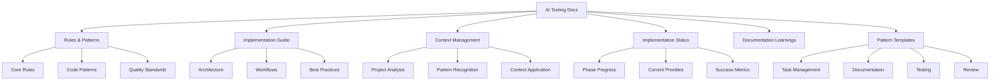

# AI Assistant Tooling Documentation

## Overview

This documentation covers ZenReact's AI assistant tooling system, which uses a rules-based approach for consistent, high-quality development assistance. Instead of complex program implementations, we define clear guidelines and patterns that enable AI agents to provide effective support.

## Documentation Structure

### Key Documents

- [Rules and Patterns](./rules-and-patterns.md)

  - Core development rules
  - Code generation patterns
  - Documentation templates
  - Quality assurance guidelines

- [Implementation Guide](./implementation.md)

  - System architecture
  - Implementation phases
  - Workflow optimization
  - Integration patterns

- [Context Management](./context.md)

  - Project context guidelines
  - Pattern recognition
  - Knowledge maintenance
  - Best practices

- [Implementation Status](./status.md)

  - Phase progress tracking
  - Current priorities
  - Success metrics
  - Recent updates

- [Pattern Templates](./patterns/README.md)

  - [Progress Tracking](./patterns/task-progress.md) - Task progress measurement and reporting
  - [Complexity Assessment](./patterns/task-complexity.md) - Task complexity evaluation
  - [Task Prioritization](./patterns/task-priority.md) - Task sequencing and prioritization
  - [Documentation Templates](./patterns/template-docs.md) - Standardized documentation formats
  - [Testing Templates](./patterns/template-testing.md) - Comprehensive testing patterns
  - [Review Templates](./patterns/template-review.md) - Effective review processes

- [Implementation Examples](./examples/index.md)

  - [Components](./examples/component.md) - Reusable component patterns
  - [State Management](./examples/state.md) - Data flow patterns
  - [Testing](./examples/testing.md) - Test implementation patterns
  - [Implementation Patterns](./examples/pattern.md) - Core development patterns

- [Documentation Learnings](./learnings.md)
  - Structure optimization insights
  - Context management strategies
  - Documentation best practices
  - Future improvement plans

## Core Benefits

1. **Consistency**

   - Standard patterns
   - Unified approaches
   - Quality metrics
   - Clear guidelines

2. **Efficiency**

   - Immediate application
   - No setup required
   - Quick solutions
   - Pattern reuse

3. **Adaptability**

   - Easy updates
   - Pattern evolution
   - Context awareness
   - Dynamic improvements

4. **Quality**
   - Built-in standards
   - Review processes
   - Best practices
   - Continuous validation

## Quick Start

1. Review the [Rules and Patterns](./rules-and-patterns.md) for core guidelines
2. Understand the [Implementation](./implementation.md) approach
3. Follow [Context](./context.md) guidelines for project understanding
4. Apply [Pattern Templates](./patterns/README.md) for specific tasks
5. Contribute improvements based on usage

## Maintenance

The documentation should be:

- Regularly reviewed
- Updated with new patterns
- Refined based on feedback
- Kept current with best practices

## Contributing

To improve this documentation:

1. Follow existing patterns
2. Maintain clear structure
3. Include relevant examples
4. Update related documents
5. Test all references

---

Last Updated: 2025-03-15
