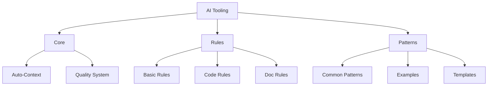

# AI Tooling System

## Overview

The AI Tooling system uses a rules-based approach for consistent, high-quality development assistance. Instead of complex program implementations, we define clear guidelines and patterns that enable AI agents to provide effective support. This streamlined architecture reduces complexity while ensuring consistency and quality.

## System Structure

## Core Components

The Core components provide the foundation for the AI Tooling system:

- [**Auto-Context**](./core/AUTO_CONTEXT.md): Automatically identifies and loads relevant context without manual specification
- [**Quality System**](./core/QUALITY_SYSTEM.md): Ensures all AI-generated content meets defined standards through rule-based guidelines

## Rules System

The Rules system defines standards for implementation:

- [**Basic Rules**](./rules/BASIC_RULES.md): Fundamental rules that apply to all aspects of the system
- [**Code Rules**](./rules/CODE_RULES.md): Rules specific to code implementation
- [**Doc Rules**](./rules/DOC_RULES.md): Rules for documentation

## Pattern System

The Pattern system provides reusable implementation approaches:

- [**Common Patterns**](./patterns/COMMON_PATTERNS.md): Frequently used implementation patterns
- [**Examples**](./patterns/EXAMPLES.md): Concrete examples of pattern implementations
- [**Templates**](./patterns/TEMPLATES.md): Reusable templates for common implementations

## Implementation Guides

The following guides provide detailed instructions for using the AI Tooling system:

- [**Rule Application Guide**](./guides/RULE_APPLICATION.md): How to effectively apply rules in development

## Reference Materials

The AI Tooling system includes reference materials to support rule-based development:

- **Rule Quick Reference**: Easy-to-follow rule guidelines
- **Pattern Examples**: Practical examples of rule application

## System Architecture

For a comprehensive overview of the system architecture, see the [System Architecture](./SYSTEM_ARCHITECTURE.md) document.

## Migration Guide

For information on migrating from the previous AI Tooling system to the new structure, see the [Migration Guide](./MIGRATION_GUIDE.md).

## Implementation Status

For the current implementation status, including completed work, in-progress tasks, and next steps, see the [Implementation Status](./IMPLEMENTATION_STATUS.md) document.

## Implementation Phases

The AI Tooling system is being implemented in phases:

1. **Phase 1: Core Simplification** (Completed)

   - Merge overlapping documentation
   - Remove redundancies
   - Create clear hierarchy
   - Streamline navigation

2. **Phase 2: Rule Enhancement** (Current)

   - Define core rules
   - Create validation system
   - Implement auto-checks
   - Add quick reference

3. **Phase 3: Pattern Focus** (Future)
   - Identify key patterns
   - Create pattern library
   - Add working examples
   - Build pattern index

## Benefits

### For AI Assistant

- Clear, rule-based guidance instead of complex programming
- Direct pattern matching through defined rules and examples
- Consistent output by following standardized rules
- Simplified context understanding through rule-based patterns

### For System

- Eliminated complexity by using rules instead of programs
- Easier maintenance through clear rule definitions
- Simple validation using rule-based checks
- Predictable evolution by extending rule sets

## Automation Focus

The system prioritizes automation to reduce manual intervention:

- **Automated Context Loading**: Context is loaded automatically based on task
- **Automated Rule Validation**: Rules are checked automatically
- **Automated Pattern Matching**: Patterns are suggested based on context
- **Automated Quality Checks**: Quality is verified automatically

## AI-Optimized Documentation

All documentation is optimized for AI consumption:

- **Clear Structure**: Hierarchical organization for easy navigation
- **Concise Format**: Direct, actionable information without verbosity
- **Pattern-Based**: Organized around recognizable patterns
- **Example-Rich**: Abundant examples for pattern recognition

## Next Steps

To complete the implementation of the AI Tooling system:

1. Complete Phase 2: Rule Enhancement

   - Implement validation automation
   - Integrate with CI/CD pipelines
   - Create rule quick reference

2. Begin Phase 3: Pattern Focus
   - Identify and document key patterns
   - Create example implementations
   - Develop reusable templates
