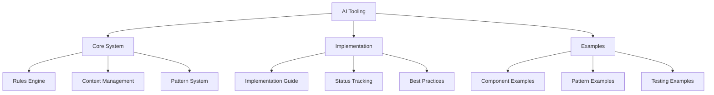
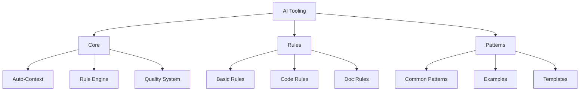

# AI Tooling System Structure

## Current Organization

## Suggested Reorganization

## Key Changes Needed

1. **Simplify Core Documentation**

   - Merge overlapping concepts
   - Remove redundant information
   - Create clear hierarchies
   - Focus on essential information

2. **Streamline Rules System**

   - Core rules only
   - Clear, actionable guidelines
   - Direct implementation paths
   - Simple validation checks

3. **Focus Pattern System**
   - Essential patterns only
   - Clear usage guides
   - Practical examples
   - Quick reference format

## Benefits

1. **For AI Assistant**

   - Clearer guidance
   - Faster pattern matching
   - More consistent output
   - Better automation

2. **For System**
   - Reduced complexity
   - Easier maintenance
   - Better scalability
   - Clearer evolution path

## Next Steps

1. **Phase 1: Core Simplification**

   - [ ] Merge overlapping docs
   - [ ] Remove redundancies
   - [ ] Create clear hierarchy
   - [ ] Streamline navigation

2. **Phase 2: Rule Enhancement**

   - [ ] Define core rules
   - [ ] Create validation system
   - [ ] Implement auto-checks
   - [ ] Add quick reference

3. **Phase 3: Pattern Focus**
   - [ ] Identify key patterns
   - [ ] Create pattern library
   - [ ] Add working examples
   - [ ] Build pattern index

## Notes

- Keep focus on AI assistant effectiveness
- Remove human-centric documentation
- Automate where possible
- Maintain system simplicity
