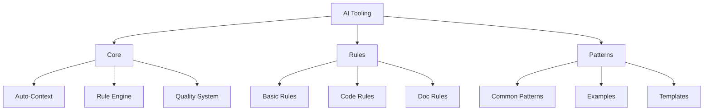

# AI Tooling System Architecture

## Overview

This document outlines the architecture of the AI Tooling system, designed to optimize AI assistant usage while reducing complexity and improving maintainability.

## System Structure

## Core Components

### Auto-Context

The Auto-Context system automatically identifies and loads relevant context without manual specification:

- **Project Analysis**: Automatically scans project structure and identifies key components
- **Pattern Recognition**: Identifies coding patterns and conventions in use
- **Context Loading**: Dynamically loads relevant context based on current task
- **Context Persistence**: Maintains context across interactions

### Rule Engine

The Rule Engine validates incoming requests against defined rules automatically:

- **Rule Validation**: Checks implementations against defined rules
- **Quality Enforcement**: Ensures adherence to quality standards
- **Compatibility Checking**: Verifies compatibility with existing code
- **Automated Feedback**: Provides immediate feedback on rule violations

### Quality System

The Quality System ensures all AI-generated code meets quality standards:

- **Automated Testing**: Suggests appropriate tests for implementations
- **Performance Optimization**: Ensures code follows performance best practices
- **Security Validation**: Checks for common security issues
- **Accessibility Compliance**: Verifies accessibility standards are met

## Rules System

### Basic Rules

Fundamental rules that apply to all aspects of the system:

- **Consistency Rules**: Ensure consistent implementations
- **Naming Conventions**: Standardize naming across the codebase
- **Structure Guidelines**: Define structural organization
- **Interaction Patterns**: Establish standard interaction flows

### Code Rules

Rules specific to code implementation:

- **Coding Standards**: Define code formatting and style
- **Architecture Patterns**: Establish architectural approaches
- **Performance Guidelines**: Set performance expectations
- **Security Requirements**: Define security practices

### Doc Rules

Rules for documentation:

- **Documentation Standards**: Define documentation format and content
- **Comment Guidelines**: Establish commenting practices
- **Example Requirements**: Set standards for examples
- **Accessibility Guidelines**: Ensure documentation accessibility

## Pattern System

### Common Patterns

Frequently used implementation patterns:

- **Component Patterns**: Standard component implementations
- **State Management**: Common state management approaches
- **API Integration**: Standard API integration patterns
- **Error Handling**: Common error handling patterns

### Examples

Concrete examples of pattern implementations:

- **Component Examples**: Working component implementations
- **State Examples**: State management demonstrations
- **Testing Examples**: Example test implementations
- **Documentation Examples**: Documentation samples

### Templates

Reusable templates for common implementations:

- **Component Templates**: Starter templates for components
- **Test Templates**: Templates for test implementation
- **Documentation Templates**: Documentation structure templates
- **Review Templates**: Templates for code review

## Implementation Phases

1. **Phase 1: Core Simplification** (Current)
   - Merge overlapping documentation
   - Remove redundancies
   - Create clear hierarchy
   - Streamline navigation

2. **Phase 2: Rule Enhancement** (Next)
   - Define core rules
   - Create validation system
   - Implement auto-checks
   - Add quick reference

3. **Phase 3: Pattern Focus** (Future)
   - Identify key patterns
   - Create pattern library
   - Add working examples
   - Build pattern index

## Benefits

1. **For AI Assistant**
   - Clearer guidance through simplified structure
   - Faster pattern matching with organized pattern system
   - More consistent output through standardized rules
   - Better automation with Auto-Context system

2. **For System**
   - Reduced complexity through clear separation of concerns
   - Easier maintenance with modular architecture
   - Better scalability with template-based approach
   - Clearer evolution path through defined phases

## Automation Focus

The system prioritizes automation to reduce manual intervention:

- **Automated Context Loading**: Context is loaded automatically based on task
- **Automated Rule Validation**: Rules are checked automatically
- **Automated Pattern Matching**: Patterns are suggested based on context
- **Automated Quality Checks**: Quality is verified automatically

## AI-Optimized Documentation

All documentation is optimized for AI consumption:

- **Clear Structure**: Hierarchical organization for easy navigation
- **Concise Format**: Direct, actionable information without verbosity
- **Pattern-Based**: Organized around recognizable patterns
- **Example-Rich**: Abundant examples for pattern recognition 