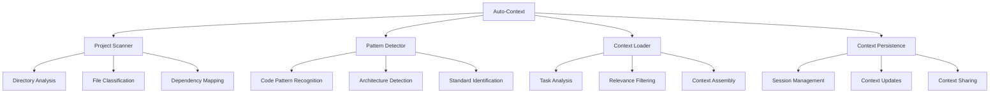

# Auto-Context System

## Overview

The Auto-Context system automatically identifies and loads relevant context without manual specification. It enables AI assistants to understand project structure, coding patterns, and requirements with minimal human intervention.

## Key Components



## Functionality

### Project Scanner

Automatically analyzes project structure to build foundational context:

```json
{
  "operation": "project_scan",
  "inputs": {
    "project_root": "./",
    "scan_depth": "full",
    "include_patterns": ["*.ts", "*.tsx", "*.js", "*.jsx", "*.md"],
    "exclude_patterns": ["node_modules", "dist", ".git"]
  },
  "outputs": {
    "project_structure": {
      "directories": [...],
      "files": [...],
      "dependencies": [...]
    }
  }
}
```

### Pattern Detector

Identifies coding patterns and conventions in use:

```json
{
  "operation": "pattern_detection",
  "inputs": {
    "code_samples": [...],
    "known_patterns": [...],
    "detection_threshold": 0.7
  },
  "outputs": {
    "detected_patterns": [
      {
        "pattern_name": "ComponentStructure",
        "confidence": 0.92,
        "instances": [...]
      },
      {
        "pattern_name": "StateManagement",
        "confidence": 0.85,
        "instances": [...]
      }
    ]
  }
}
```

### Context Loader

Dynamically loads relevant context based on current task:

```json
{
  "operation": "context_load",
  "inputs": {
    "task_description": "Implement a new React component",
    "current_file": "./src/components/Example.tsx",
    "related_patterns": ["ComponentStructure", "StateManagement"]
  },
  "outputs": {
    "loaded_context": {
      "relevant_files": [...],
      "applicable_patterns": [...],
      "related_documentation": [...]
    }
  }
}
```

### Context Persistence

Maintains context across interactions:

```json
{
  "operation": "context_persist",
  "inputs": {
    "session_id": "user_session_123",
    "current_context": {...},
    "context_updates": [...]
  },
  "outputs": {
    "updated_context": {...},
    "persistence_status": "success"
  }
}
```

## Implementation

### Automatic Triggers

The Auto-Context system activates automatically on:

1. **Session Start**: Initial context building
2. **File Changes**: Context updates based on file modifications
3. **Task Changes**: Context adjustments for new tasks
4. **Pattern Detection**: Context refinement when new patterns are identified

### Context Assembly

Context is assembled through:

1. **Relevance Scoring**: Prioritizing most relevant information
2. **Context Merging**: Combining multiple context sources
3. **Conflict Resolution**: Resolving contradictory context information
4. **Context Pruning**: Removing irrelevant or outdated context

### Context Application

Applied context influences:

1. **Code Generation**: Shaping generated code to match project patterns
2. **Documentation Creation**: Aligning documentation with project standards
3. **Testing Approach**: Adapting testing to project conventions
4. **Rule Application**: Selecting relevant rules based on context

## Benefits

1. **Reduced Manual Context Setting**: Eliminates need for manual context specification
2. **Improved Consistency**: Ensures consistent understanding across interactions
3. **Faster Task Execution**: Reduces time spent on context building
4. **More Accurate Implementations**: Better alignment with project patterns

## Example Usage

```
Task: "Create a new component for user profile display"

Auto-Context:
1. Scans project structure
2. Identifies component patterns in use
3. Loads relevant component examples
4. Detects state management approach
5. Assembles context with component structure, styling patterns, and state management
6. Applies context to generate component aligned with project patterns
```

## Integration Points

- **Rule Engine**: Provides context for rule selection and application
- **Pattern System**: Informs pattern matching and selection
- **Quality System**: Guides quality checks based on context

## Automation Metrics

The system tracks:

1. **Context Accuracy**: How well the assembled context matches actual project patterns
2. **Context Completeness**: Whether all relevant context is included
3. **Context Application**: How effectively context is applied to tasks
4. **Context Efficiency**: Time saved through automated context handling 