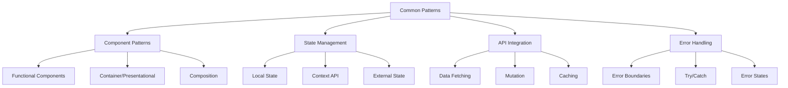

# Common Patterns

## Overview

Common Patterns define frequently used implementation approaches that ensure consistency, maintainability, and quality across the project. These patterns cover component patterns, state management, API integration, and error handling.

## Pattern Categories



## Component Patterns

### Functional Components

```json
{
  "pattern_id": "functional_component",
  "pattern_name": "Functional Component",
  "description": "Pattern for creating React functional components",
  "usage_context": "When creating any React component",
  "structure": {
    "imports": "Import React and necessary hooks",
    "type_definitions": "Define prop types and other types",
    "component_declaration": "Declare functional component with props",
    "hooks": "Use necessary hooks",
    "helper_functions": "Define helper functions",
    "return_statement": "Return JSX",
    "exports": "Export component"
  },
  "example": "import React, { useState, useEffect } from 'react';\n\ninterface UserProfileProps {\n  userId: string;\n  showDetails?: boolean;\n}\n\nconst UserProfile: React.FC<UserProfileProps> = ({ userId, showDetails = false }) => {\n  const [user, setUser] = useState<User | null>(null);\n  const [loading, setLoading] = useState(true);\n  \n  useEffect(() => {\n    const fetchUser = async () => {\n      setLoading(true);\n      try {\n        const data = await api.getUser(userId);\n        setUser(data);\n      } catch (error) {\n        console.error('Failed to fetch user:', error);\n      } finally {\n        setLoading(false);\n      }\n    };\n    \n    fetchUser();\n  }, [userId]);\n  \n  const renderDetails = () => {\n    if (!showDetails || !user) return null;\n    return (\n      <div className=\"user-details\">\n        <p>{user.email}</p>\n        <p>{user.location}</p>\n      </div>\n    );\n  };\n  \n  if (loading) return <div>Loading...</div>;\n  if (!user) return <div>User not found</div>;\n  \n  return (\n    <div className=\"user-profile\">\n      <h2>{user.name}</h2>\n      {renderDetails()}\n    </div>\n  );\n};\n\nexport default UserProfile;"
}
```

### Container/Presentational

```json
{
  "pattern_id": "container_presentational",
  "pattern_name": "Container/Presentational Pattern",
  "description": "Pattern for separating data fetching and presentation concerns",
  "usage_context": "When component has both data fetching and presentation logic",
  "structure": {
    "container_component": "Handles data fetching, state, and logic",
    "presentational_component": "Handles rendering and UI interactions",
    "data_flow": "Container passes data to presentational component via props"
  },
  "example": "// Presentational Component\nimport React from 'react';\n\ninterface UserProfileProps {\n  user: User;\n  onEdit: () => void;\n  onDelete: () => void;\n}\n\nexport const UserProfile: React.FC<UserProfileProps> = ({ user, onEdit, onDelete }) => {\n  return (\n    <div className=\"user-profile\">\n      <h2>{user.name}</h2>\n      <p>{user.email}</p>\n      <div className=\"actions\">\n        <button onClick={onEdit}>Edit</button>\n        <button onClick={onDelete}>Delete</button>\n      </div>\n    </div>\n  );\n};\n\n// Container Component\nimport React, { useState, useEffect } from 'react';\nimport { UserProfile } from './UserProfile';\n\ninterface UserProfileContainerProps {\n  userId: string;\n}\n\nexport const UserProfileContainer: React.FC<UserProfileContainerProps> = ({ userId }) => {\n  const [user, setUser] = useState<User | null>(null);\n  const [loading, setLoading] = useState(true);\n  const [error, setError] = useState<Error | null>(null);\n  \n  useEffect(() => {\n    const fetchUser = async () => {\n      setLoading(true);\n      try {\n        const data = await api.getUser(userId);\n        setUser(data);\n        setError(null);\n      } catch (error) {\n        setError(error as Error);\n        setUser(null);\n      } finally {\n        setLoading(false);\n      }\n    };\n    \n    fetchUser();\n  }, [userId]);\n  \n  const handleEdit = () => {\n    // Implementation\n  };\n  \n  const handleDelete = () => {\n    // Implementation\n  };\n  \n  if (loading) return <div>Loading...</div>;\n  if (error) return <div>Error: {error.message}</div>;\n  if (!user) return <div>User not found</div>;\n  \n  return (\n    <UserProfile \
      user={user} \
      onEdit={handleEdit} \
      onDelete={handleDelete} \
    />\n  );\n};"
}
```

## State Management

### Local State

```json
{
  "pattern_id": "local_state",
  "pattern_name": "Local State Management",
  "description": "Pattern for managing component-level state",
  "usage_context": "When state is only relevant to a single component",
  "structure": {
    "useState": "For simple state values",
    "useReducer": "For complex state logic",
    "derived_state": "Computed values based on state"
  },
  "example": "import React, { useState, useReducer, useMemo } from 'react';\n\ninterface FormState {\n  name: string;\n  email: string;\n  age: number;\n  preferences: string[];\n}\n\ntype FormAction = \
    | { type: 'SET_FIELD'; field: keyof FormState; value: any }\
    | { type: 'RESET_FORM' };\n\nconst initialState: FormState = {\n  name: '',\n  email: '',\n  age: 0,\n  preferences: []\n};\n\nconst formReducer = (state: FormState, action: FormAction): FormState => {\n  switch (action.type) {\n    case 'SET_FIELD':\n      return { ...state, [action.field]: action.value };\n    case 'RESET_FORM':\n      return initialState;\n    default:\n      return state;\n  }\n};\n\nconst UserForm: React.FC = () => {\n  // Simple state with useState\n  const [isSubmitting, setIsSubmitting] = useState(false);\n  const [showAdvanced, setShowAdvanced] = useState(false);\n  \n  // Complex state with useReducer\n  const [formState, dispatch] = useReducer(formReducer, initialState);\n  \n  // Derived state with useMemo\n  const isFormValid = useMemo(() => {\n    return (\n      formState.name.trim().length > 0 &&\
      /^[^\\s@]+@[^\\s@]+\\.[^\\s@]+$/.test(formState.email) &&\
      formState.age > 0\n    );\n  }, [formState.name, formState.email, formState.age]);\n  \n  const handleFieldChange = (field: keyof FormState, value: any) => {\n    dispatch({ type: 'SET_FIELD', field, value });\n  };\n  \n  const handleReset = () => {\n    dispatch({ type: 'RESET_FORM' });\n  };\n  \n  const handleSubmit = async (e: React.FormEvent) => {\n    e.preventDefault();\n    if (!isFormValid) return;\n    \
    setIsSubmitting(true);\n    try {\n      await api.saveUser(formState);\n      handleReset();\n    } catch (error) {\n      console.error('Failed to save user:', error);\n    } finally {\n      setIsSubmitting(false);\n    }\n  };\n  \n  return (\n    <form onSubmit={handleSubmit}>\n      {/* Form fields */}\n      <button type=\"button\" onClick={handleReset}>Reset</button>\n      <button type=\"submit\" disabled={!isFormValid || isSubmitting}>\
    {isSubmitting ? 'Submitting...' : 'Submit'}\n      </button>\n    </form>\n  );\n};"
}
```

## API Integration

### Data Fetching

```json
{
  "pattern_id": "data_fetching",
  "pattern_name": "Data Fetching Pattern",
  "description": "Pattern for fetching data from APIs",
  "usage_context": "When component needs to fetch data from an API",
  "structure": {
    "custom_hook": "Create a custom hook for data fetching",
    "loading_state": "Track loading state",
    "error_handling": "Handle and expose errors",
    "data_state": "Store and expose fetched data",
    "refetch_functionality": "Allow manual refetching"
  },
  "example": "import { useState, useEffect } from 'react';\n\ninterface UseFetchResult<T> {\n  data: T | null;\n  loading: boolean;\n  error: Error | null;\n  refetch: () => Promise<void>;\n}\n\nfunction useFetch<T>(url: string, options?: RequestInit): UseFetchResult<T> {\n  const [data, setData] = useState<T | null>(null);\n  const [loading, setLoading] = useState(true);\n  const [error, setError] = useState<Error | null>(null);\n  \n  const fetchData = async () => {\n    setLoading(true);\n    try {\n      const response = await fetch(url, options);\n      if (!response.ok) {\n        throw new Error(`HTTP error! Status: ${response.status}`);\n      }\n      const result = await response.json();\n      setData(result);\n      setError(null);\n    } catch (err) {\n      setError(err instanceof Error ? err : new Error(String(err)));\n      setData(null);\n    } finally {\n      setLoading(false);\n    }\n  };\n  \n  useEffect(() => {\n    fetchData();\n  }, [url]);\n  \n  const refetch = async () => {\n    await fetchData();\n  };\n  \n  return { data, loading, error, refetch };\n}\n\n// Usage in component\nconst UserProfile: React.FC<{ userId: string }> = ({ userId }) => {\n  const { data: user, loading, error, refetch } = useFetch<User>(`/api/users/${userId}`);\n  \n  if (loading) return <div>Loading...</div>;\n  if (error) return <div>Error: {error.message}</div>;\n  if (!user) return <div>User not found</div>;\n  \n  return (\n    <div>\n      <h2>{user.name}</h2>\n      <p>{user.email}</p>\n      <button onClick={refetch}>Refresh</button>\n    </div>\n  );\n};"
}
```

## Error Handling

### Error Boundaries

```json
{
  "pattern_id": "error_boundary",
  "pattern_name": "Error Boundary Pattern",
  "description": "Pattern for catching and handling React component errors",
  "usage_context": "When you need to prevent component errors from crashing the entire app",
  "structure": {
    "error_boundary_class": "Class component that implements error catching",
    "fallback_ui": "UI to show when an error occurs",
    "error_reporting": "Logic to report errors",
    "reset_functionality": "Method to reset the error state"
  },
  "example": "import React, { Component, ErrorInfo, ReactNode } from 'react';\n\ninterface ErrorBoundaryProps {\n  children: ReactNode;\n  fallback?: ReactNode;\n  onError?: (error: Error, errorInfo: ErrorInfo) => void;\n}\n\ninterface ErrorBoundaryState {\n  hasError: boolean;\n  error: Error | null;\n}\n\nclass ErrorBoundary extends Component<ErrorBoundaryProps, ErrorBoundaryState> {\n  constructor(props: ErrorBoundaryProps) {\n    super(props);\n    this.state = {\n      hasError: false,\n      error: null\n    };\n  }\n  \n  static getDerivedStateFromError(error: Error): ErrorBoundaryState {\n    return {\n      hasError: true,\n      error\n    };\n  }\n  \n  componentDidCatch(error: Error, errorInfo: ErrorInfo): void {\n    // Report the error\n    if (this.props.onError) {\n      this.props.onError(error, errorInfo);\n    }\n    \n    // Log the error\n    console.error('Error caught by ErrorBoundary:', error, errorInfo);\n  }\n  \n  resetError = () => {\n    this.setState({\n      hasError: false,\n      error: null\n    });\n  };\n  \n  render(): ReactNode {\n    if (this.state.hasError) {\n      // Render fallback UI\n      if (this.props.fallback) {\n        return this.props.fallback;\n      }\n      \n      // Default fallback UI\n      return (\n        <div className=\"error-boundary\">\n          <h2>Something went wrong</h2>\n          <p>{this.state.error?.message}</p>\n          <button onClick={this.resetError}>Try again</button>\n        </div>\n      );\n    }\n    \n    return this.props.children;\n  }\n}\n\n// Usage\nconst App: React.FC = () => {\n  const handleError = (error: Error, errorInfo: ErrorInfo) => {\n    // Send error to error reporting service\n    errorReportingService.report(error, errorInfo);\n  };\n  \n  return (\n    <ErrorBoundary \
      onError={handleError}\n      fallback={\n        <div>\n          <h2>Oops! Something went wrong</h2>\n          <p>We've been notified and will fix the issue soon.</p>\n          <button onClick={() => window.location.reload()}>Reload page</button>\n        </div>\n      }\n    >\n      <UserProfile userId=\"123\" />\n    </ErrorBoundary>\n  );\n};"
}
```

## Implementation

### Pattern Selection

Patterns are selected based on:

1. **Task Requirements**: What the task needs to accomplish
2. **Project Context**: Existing patterns in the project
3. **Complexity**: Appropriate pattern for the complexity level
4. **Maintainability**: Pattern that's easiest to maintain

### Pattern Adaptation

Patterns can be adapted through:

1. **Customization**: Adjusting pattern to specific needs
2. **Combination**: Combining multiple patterns
3. **Extension**: Extending pattern with additional functionality
4. **Simplification**: Simplifying pattern for simpler use cases

## Benefits

1. **Consistency**: Ensures consistent implementation approaches
2. **Maintainability**: Makes code easier to understand and maintain
3. **Quality**: Promotes high-quality implementations
4. **Efficiency**: Speeds up development with proven patterns

## Example Usage

```
Task: "Create a new component for user profile display that fetches data from an API"

Pattern Application:
1. Uses Functional Component pattern for component structure
2. Applies Container/Presentational pattern to separate concerns
3. Implements Data Fetching pattern for API integration
4. Uses Error Boundary pattern for error handling
5. Applies Local State pattern for component state
```

## Integration Points

- **Auto-Context**: Uses context to suggest appropriate patterns
- **Rule Engine**: Validates implementations against pattern requirements
- **Quality System**: Uses patterns as quality benchmarks

## Pattern Metrics

The system tracks:

1. **Pattern Usage**: How often each pattern is used
2. **Pattern Effectiveness**: How well patterns solve problems
3. **Pattern Adaptations**: How patterns are customized
4. **Pattern Evolution**: How patterns evolve over time 