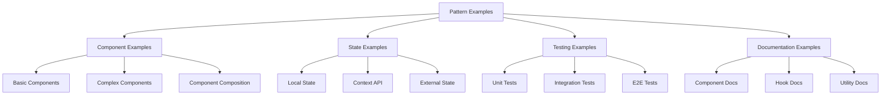

# Pattern Examples

## Overview

Pattern Examples provide concrete implementations of common patterns, demonstrating how to apply patterns in real-world scenarios. These examples serve as reference implementations that can be adapted for specific use cases.

## Example Categories



## Component Examples

### Basic Component Example

```tsx
// UserCard.tsx - A simple presentational component
import React from 'react';
import './UserCard.css';

interface UserCardProps {
  /** User's full name */
  name: string;
  /** User's email address */
  email: string;
  /** URL to user's avatar image */
  avatarUrl?: string;
  /** Whether the card is selectable */
  selectable?: boolean;
  /** Callback when card is selected */
  onSelect?: () => void;
}

/**
 * A card component that displays basic user information
 */
export const UserCard: React.FC<UserCardProps> = ({
  name,
  email,
  avatarUrl,
  selectable = false,
  onSelect
}) => {
  const handleClick = () => {
    if (selectable && onSelect) {
      onSelect();
    }
  };

  return (
    <div 
      className={`user-card ${selectable ? 'selectable' : ''}`}
      onClick={handleClick}
      role={selectable ? 'button' : undefined}
      tabIndex={selectable ? 0 : undefined}
    >
      {avatarUrl && (
        <div className="user-card__avatar">
          
        </div>
      )}
      <div className="user-card__info">
        <h3 className="user-card__name">{name}</h3>
        <p className="user-card__email">{email}</p>
      </div>
    </div>
  );
};

export default UserCard;
```

### Complex Component Example

```tsx
// UserProfileContainer.tsx - A container component with data fetching
import React, { useState, useEffect, useCallback } from 'react';
import UserProfile from './UserProfile';
import { fetchUser, updateUser } from '../api/userApi';
import { User } from '../types';
import ErrorBoundary from '../common/ErrorBoundary';
import LoadingSpinner from '../common/LoadingSpinner';
import ErrorMessage from '../common/ErrorMessage';

interface UserProfileContainerProps {
  /** User ID to display */
  userId: string;
  /** Whether profile is editable */
  editable?: boolean;
  /** Callback when user is updated */
  onUserUpdated?: (user: User) => void;
}

/**
 * Container component that fetches and manages user data
 */
export const UserProfileContainer: React.FC<UserProfileContainerProps> = ({
  userId,
  editable = false,
  onUserUpdated
}) => {
  // State management
  const [user, setUser] = useState<User | null>(null);
  const [loading, setLoading] = useState<boolean>(true);
  const [error, setError] = useState<Error | null>(null);
  const [isUpdating, setIsUpdating] = useState<boolean>(false);

  // Fetch user data
  useEffect(() => {
    const loadUser = async () => {
      setLoading(true);
      setError(null);
      
      try {
        const userData = await fetchUser(userId);
        setUser(userData);
      } catch (err) {
        setError(err instanceof Error ? err : new Error('Failed to fetch user'));
        setUser(null);
      } finally {
        setLoading(false);
      }
    };
    
    loadUser();
  }, [userId]);

  // Handle user updates
  const handleUpdateUser = useCallback(async (updatedUser: User) => {
    if (!editable) return;
    
    setIsUpdating(true);
    try {
      const result = await updateUser(userId, updatedUser);
      setUser(result);
      if (onUserUpdated) {
        onUserUpdated(result);
      }
    } catch (err) {
      setError(err instanceof Error ? err : new Error('Failed to update user'));
    } finally {
      setIsUpdating(false);
    }
  }, [userId, editable, onUserUpdated]);

  // Render loading state
  if (loading) {
    return <LoadingSpinner label="Loading user profile" />;
  }

  // Render error state
  if (error) {
    return <ErrorMessage message={error.message} />;
  }

  // Render when no user found
  if (!user) {
    return <div>User not found</div>;
  }

  // Render user profile with error boundary
  return (
    <ErrorBoundary>
      <UserProfile 
        user={user}
        editable={editable}
        onUpdate={handleUpdateUser}
        isUpdating={isUpdating}
      />
    </ErrorBoundary>
  );
};

export default UserProfileContainer;
```

## State Examples

### Context API Example

```tsx
// UserContext.tsx - Context for user state management
import React, { createContext, useContext, useReducer, ReactNode } from 'react';
import { User } from '../types';

// Define context state
interface UserState {
  currentUser: User | null;
  isAuthenticated: boolean;
  isLoading: boolean;
  error: Error | null;
}

// Define context actions
type UserAction = 
  | { type: 'LOGIN_START' }
  | { type: 'LOGIN_SUCCESS'; payload: User }
  | { type: 'LOGIN_FAILURE'; payload: Error }
  | { type: 'LOGOUT' }
  | { type: 'UPDATE_USER'; payload: User };

// Define context value
interface UserContextValue {
  state: UserState;
  login: (username: string, password: string) => Promise<void>;
  logout: () => void;
  updateUser: (user: User) => Promise<void>;
}

// Create context
const UserContext = createContext<UserContextValue | undefined>(undefined);

// Initial state
const initialState: UserState = {
  currentUser: null,
  isAuthenticated: false,
  isLoading: false,
  error: null
};

// Reducer function
const userReducer = (state: UserState, action: UserAction): UserState => {
  switch (action.type) {
    case 'LOGIN_START':
      return {
        ...state,
        isLoading: true,
        error: null
      };
    case 'LOGIN_SUCCESS':
      return {
        ...state,
        isLoading: false,
        isAuthenticated: true,
        currentUser: action.payload,
        error: null
      };
    case 'LOGIN_FAILURE':
      return {
        ...state,
        isLoading: false,
        isAuthenticated: false,
        currentUser: null,
        error: action.payload
      };
    case 'LOGOUT':
      return {
        ...state,
        isAuthenticated: false,
        currentUser: null
      };
    case 'UPDATE_USER':
      return {
        ...state,
        currentUser: action.payload
      };
    default:
      return state;
  }
};

// Provider component
interface UserProviderProps {
  children: ReactNode;
}

export const UserProvider: React.FC<UserProviderProps> = ({ children }) => {
  const [state, dispatch] = useReducer(userReducer, initialState);

  // Login function
  const login = async (username: string, password: string) => {
    dispatch({ type: 'LOGIN_START' });
    try {
      // API call would go here
      const user = await fakeLoginApi(username, password);
      dispatch({ type: 'LOGIN_SUCCESS', payload: user });
    } catch (error) {
      dispatch({ 
        type: 'LOGIN_FAILURE', 
        payload: error instanceof Error ? error : new Error('Login failed') 
      });
    }
  };

  // Logout function
  const logout = () => {
    dispatch({ type: 'LOGOUT' });
  };

  // Update user function
  const updateUser = async (user: User) => {
    try {
      // API call would go here
      const updatedUser = await fakeUpdateUserApi(user);
      dispatch({ type: 'UPDATE_USER', payload: updatedUser });
    } catch (error) {
      console.error('Failed to update user:', error);
      // We might want to dispatch an error action here
    }
  };

  return (
    <UserContext.Provider value={{ state, login, logout, updateUser }}>
      {children}
    </UserContext.Provider>
  );
};

// Custom hook for using the context
export const useUser = () => {
  const context = useContext(UserContext);
  if (context === undefined) {
    throw new Error('useUser must be used within a UserProvider');
  }
  return context;
};

// Mock API functions for the example
async function fakeLoginApi(username: string, password: string): Promise<User> {
  return new Promise((resolve, reject) => {
    setTimeout(() => {
      if (username === 'test' && password === 'password') {
        resolve({
          id: '1',
          name: 'Test User',
          email: 'test@example.com'
        });
      } else {
        reject(new Error('Invalid credentials'));
      }
    }, 1000);
  });
}

async function fakeUpdateUserApi(user: User): Promise<User> {
  return new Promise((resolve) => {
    setTimeout(() => {
      resolve(user);
    }, 1000);
  });
}
```

## Testing Examples

### Component Test Example

```tsx
// UserCard.test.tsx - Unit tests for UserCard component
import React from 'react';
import { render, screen, fireEvent } from '@testing-library/react';
import UserCard from './UserCard';

describe('UserCard', () => {
  const defaultProps = {
    name: 'John Doe',
    email: 'john@example.com'
  };

  test('renders user information correctly', () => {
    render(<UserCard {...defaultProps} />);
    
    expect(screen.getByText('John Doe')).toBeInTheDocument();
    expect(screen.getByText('john@example.com')).toBeInTheDocument();
  });

  test('renders avatar when avatarUrl is provided', () => {
    render(
      <UserCard 
        {...defaultProps} 
        avatarUrl="https://example.com/avatar.jpg" 
      />
    );
    
    const avatar = screen.getByAltText("John Doe's avatar");
    expect(avatar).toBeInTheDocument();
    expect(avatar).toHaveAttribute('src', 'https://example.com/avatar.jpg');
  });

  test('does not render avatar when avatarUrl is not provided', () => {
    render(<UserCard {...defaultProps} />);
    
    expect(screen.queryByRole('img')).not.toBeInTheDocument();
  });

  test('calls onSelect when clicked and selectable is true', () => {
    const handleSelect = jest.fn();
    render(
      <UserCard 
        {...defaultProps} 
        selectable={true} 
        onSelect={handleSelect} 
      />
    );
    
    const card = screen.getByRole('button');
    fireEvent.click(card);
    
    expect(handleSelect).toHaveBeenCalledTimes(1);
  });

  test('does not call onSelect when clicked and selectable is false', () => {
    const handleSelect = jest.fn();
    render(
      <UserCard 
        {...defaultProps} 
        selectable={false} 
        onSelect={handleSelect} 
      />
    );
    
    const card = screen.getByText('John Doe').closest('div');
    if (card) {
      fireEvent.click(card);
    }
    
    expect(handleSelect).not.toHaveBeenCalled();
  });

  test('has correct accessibility attributes when selectable', () => {
    render(
      <UserCard 
        {...defaultProps} 
        selectable={true} 
        onSelect={() => {}} 
      />
    );
    
    const card = screen.getByRole('button');
    expect(card).toHaveAttribute('tabIndex', '0');
  });

  test('does not have button role when not selectable', () => {
    render(<UserCard {...defaultProps} selectable={false} />);
    
    expect(screen.queryByRole('button')).not.toBeInTheDocument();
  });
});
```

## Documentation Examples

### Component Documentation Example

```markdown
# UserCard Component

## Overview

The UserCard component displays a user's basic information in a card format. It can be used in lists, grids, or anywhere a compact user representation is needed.

## Props

| Prop | Type | Required | Default | Description |
|------|------|----------|---------|-------------|
| name | string | Yes | - | User's full name |
| email | string | Yes | - | User's email address |
| avatarUrl | string | No | undefined | URL to user's avatar image |
| selectable | boolean | No | false | Whether the card is selectable |
| onSelect | () => void | No | undefined | Callback when card is selected |

## Usage

### Basic Usage

```tsx
import { UserCard } from './components/UserCard';

const MyComponent = () => {
  return (
    <UserCard
      name="John Doe"
      email="john@example.com"
    />
  );
};
```

### With Avatar

```tsx
import { UserCard } from './components/UserCard';

const MyComponent = () => {
  return (
    <UserCard
      name="John Doe"
      email="john@example.com"
      avatarUrl="https://example.com/avatar.jpg"
    />
  );
};
```

### Selectable Card

```tsx
import { UserCard } from './components/UserCard';

const MyComponent = () => {
  const handleSelect = () => {
    console.log('Card selected');
  };

  return (
    <UserCard
      name="John Doe"
      email="john@example.com"
      selectable={true}
      onSelect={handleSelect}
    />
  );
};
```

## Accessibility

- When `selectable` is true, the component has a `button` role and is keyboard navigable
- Avatar images have appropriate alt text
- Color contrast meets WCAG AA standards

## CSS Customization

The component uses the following CSS classes that can be customized:

- `.user-card`: The main container
- `.user-card.selectable`: Applied when the card is selectable
- `.user-card__avatar`: The avatar container
- `.user-card__info`: The text information container
- `.user-card__name`: The user's name
- `.user-card__email`: The user's email

## Notes

- The component is fully responsive and will adapt to its container width
- For lists of users, consider using a virtualized list for performance
```

## Implementation

### Example Usage

Examples are used by:

1. **Direct Reference**: Copying and adapting example code
2. **Pattern Guidance**: Understanding how patterns are implemented
3. **Best Practices**: Learning best practices from examples
4. **Testing Approach**: Understanding how to test implementations

### Example Adaptation

Examples can be adapted through:

1. **Customization**: Modifying examples for specific needs
2. **Extension**: Adding functionality to examples
3. **Simplification**: Removing unnecessary parts for simpler use cases
4. **Combination**: Combining multiple examples

## Benefits

1. **Learning**: Facilitates learning through concrete examples
2. **Consistency**: Promotes consistent implementation approaches
3. **Efficiency**: Speeds up development with ready-to-use code
4. **Quality**: Demonstrates high-quality implementation standards

## Integration Points

- **Auto-Context**: Uses examples to suggest implementations
- **Rule Engine**: Validates implementations against example patterns
- **Quality System**: Uses examples as quality benchmarks

## Example Metrics

The system tracks:

1. **Example Usage**: How often examples are referenced
2. **Example Effectiveness**: How well examples guide implementations
3. **Example Adaptations**: How examples are customized
4. **Example Coverage**: What percentage of patterns have examples 