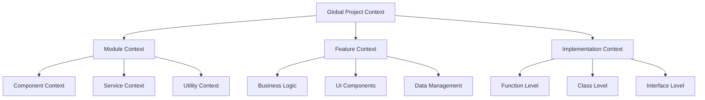

# AI Context Hierarchy Examples

## Overview

This document provides practical examples of the context hierarchy system, demonstrating how different levels interact and how to implement context-aware features.

## Context Levels



## Implementation Examples

### 1. Project Context Analysis

```typescript
interface ProjectContext {
  // Project level settings
  project: {
    name: string;
    version: string;
    dependencies: string[];
    patterns: string[];
  };

  // Module configurations
  modules: {
    name: string;
    type: 'component' | 'service' | 'utility';
    dependencies: string[];
    patterns: string[];
  }[];

  // Feature definitions
  features: {
    name: string;
    type: 'business' | 'ui' | 'data';
    components: string[];
    patterns: string[];
  }[];
}
```

### 2. Context Relationships

```yaml
relationship_patterns:
  parent_child:
    - Global -> Module
    - Module -> Component
    - Feature -> Implementation

  peer_connections:
    - Component <-> Component
    - Service <-> Service
    - Feature <-> Feature

  cross_cutting:
    - Utilities -> All
    - Services -> Components
    - Data -> Features
```

### 3. Context Application

```typescript
interface ContextAwareComponent {
  // Component level
  component: {
    name: string;
    type: string;
    patterns: string[];
  };

  // Parent module
  module: {
    name: string;
    context: ModuleContext;
  };

  // Feature association
  feature?: {
    name: string;
    context: FeatureContext;
  };

  // Implementation details
  implementation: {
    level: 'function' | 'class' | 'interface';
    patterns: string[];
  };
}
```

## Pattern Examples

### 1. Component Context

```typescript
// Component with context awareness
interface ButtonProps {
  // Standard props
  variant: 'primary' | 'secondary';
  size: 'small' | 'medium' | 'large';

  // Context integration
  context?: {
    theme: ThemeContext;
    pattern: ComponentPattern;
    validation: ValidationRules;
  };
}

// Usage example
const Button: React.FC<ButtonProps> = ({ context, ...props }) => {
  // Apply context-aware styling
  // Follow pattern rules
  // Implement validation
};
```

### 2. Feature Context

```typescript
interface FeatureImplementation {
  // Feature context
  context: {
    name: string;
    type: FeatureType;
    patterns: string[];
  };

  // Component relationships
  components: {
    name: string;
    role: string;
    context: ComponentContext;
  }[];

  // Data relationships
  data: {
    models: string[];
    services: string[];
    validations: string[];
  };
}
```

## Context Management

### 1. Update Patterns

```yaml
context_updates:
  triggers:
    - New components added
    - Feature changes
    - Pattern updates
    - Integration points

  procedures:
    - Analyze impact
    - Update relationships
    - Validate consistency
    - Document changes
```

### 2. Validation Rules

```typescript
interface ContextValidation {
  // Structure validation
  structure: {
    required: string[];
    optional: string[];
    relationships: string[];
  };

  // Pattern validation
  patterns: {
    allowed: string[];
    deprecated: string[];
    required: string[];
  };

  // Relationship validation
  relationships: {
    allowed: string[];
    prohibited: string[];
    required: string[];
  };
}
```

## Best Practices

### 1. Context Analysis

1. Start with project-level context
2. Move to module-level details
3. Consider feature relationships
4. Document implementation patterns

### 2. Pattern Application

1. Follow established hierarchies
2. Maintain consistency
3. Document relationships
4. Validate context usage

### 3. Maintenance Guidelines

1. Regular context reviews
2. Pattern updates
3. Relationship validation
4. Documentation updates

## Quality Standards

### 1. Documentation

- Clear hierarchy definitions
- Relationship documentation
- Pattern examples
- Update procedures

### 2. Implementation

- Type safety
- Pattern consistency
- Context validation
- Relationship integrity

### 3. Validation

- Structure checks
- Pattern compliance
- Relationship validation
- Context integrity

## Success Metrics

### 1. Implementation Quality

- Documentation completeness
- Pattern adherence
- Context consistency
- Relationship validity

### 2. Usage Effectiveness

- Developer understanding
- Pattern adoption
- Context utilization
- Maintenance efficiency

### 3. System Health

- Context clarity
- Pattern relevance
- Documentation quality
- Update frequency
