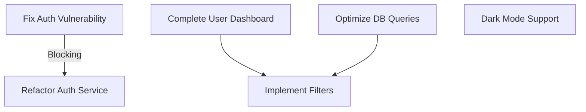

# Task Prioritization Patterns

## Overview

This document defines patterns and guidelines for prioritizing development tasks. These patterns ensure consistent, objective decision-making for task sequencing based on value, dependencies, and resource constraints.

## Table of Contents

1. [Prioritization Factors](#prioritization-factors)
2. [Priority Levels](#priority-levels)
3. [Decision Framework](#decision-framework)
4. [Dependency Management](#dependency-management)
5. [Resource Optimization](#resource-optimization)
6. [Best Practices](#best-practices)

## Prioritization Factors

```yaml
prioritization_factors:
  business_value:
    - User impact
    - Revenue potential
    - Strategic alignment
    - Market differentiation
    
  technical_value:
    - Technical debt reduction
    - Architecture improvement
    - Performance enhancement
    - Security strengthening
    
  urgency:
    - Deadline constraints
    - Blocking dependencies
    - Customer commitments
    - Competitive pressure
    
  effort:
    - Implementation complexity
    - Resource requirements
    - Testing scope
    - Deployment complexity
```

### Factor Weighting

```yaml
factor_weighting:
  calculation: |
    Priority Score = (Business Value × 0.4) + (Technical Value × 0.3) + (Urgency × 0.2) - (Effort × 0.1)
    
  customization:
    - Adjust weights based on project phase
    - Increase urgency weight for critical deadlines
    - Emphasize technical value for refactoring phases
    - Focus on business value for feature development
```

## Priority Levels

### Level Definitions

```yaml
priority_levels:
  critical:
    score: 8.5 - 10.0
    characteristics:
      - Blocking other high-priority work
      - Significant business impact
      - Urgent deadline
      - Strategic importance
    response:
      - Immediate attention
      - Dedicated resources
      - Daily progress tracking
      - Escalation path defined
      
  high:
    score: 7.0 - 8.4
    characteristics:
      - Important business value
      - Near-term deadline
      - Enables multiple other tasks
      - Significant technical value
    response:
      - Prioritized in current sprint
      - Assigned to primary resources
      - Regular progress tracking
      - Clear ownership
      
  medium:
    score: 5.0 - 6.9
    characteristics:
      - Moderate business value
      - Standard timeline
      - Some dependencies
      - Normal technical importance
    response:
      - Scheduled in upcoming sprints
      - Standard resource allocation
      - Regular tracking
      - Defined ownership
      
  low:
    score: 3.0 - 4.9
    characteristics:
      - Limited immediate value
      - Flexible timeline
      - Few dependencies
      - Isolated impact
    response:
      - Scheduled as resources allow
      - Secondary resource allocation
      - Standard tracking
      - May be deferred if needed
      
  backlog:
    score: 0.0 - 2.9
    characteristics:
      - Minimal immediate value
      - No timeline constraints
      - No critical dependencies
      - Nice-to-have features
    response:
      - Kept in backlog
      - Periodically reassessed
      - Implemented when resources available
      - May be grouped with related work
```

### Visual Indicators

```yaml
priority_indicators:
  symbols:
    critical: 🔴
    high: 🟠
    medium: 🟡
    low: 🟢
    backlog: ⚪
    
  labels:
    critical: "P0"
    high: "P1"
    medium: "P2"
    low: "P3"
    backlog: "P4"
```

## Decision Framework

### Prioritization Process

```yaml
prioritization_process:
  steps: 1. Gather task information
    2. Assess value dimensions
    3. Evaluate urgency factors
    4. Consider dependencies
    5. Calculate priority score
    6. Assign priority level
    7. Review and adjust
    
  frequency:
    - Initial backlog creation
    - Sprint planning
    - Major milestone completion
    - Significant requirement changes
```

### Decision Matrix

```yaml
decision_matrix:
  axes:
    x: Business Value (Low to High)
    y: Urgency (Low to High)
    
  quadrants:
    q1: # High Value, High Urgency
      label: "Do First"
      priority: Critical/High
      
    q2: # Low Value, High Urgency
      label: "Do Next"
      priority: High/Medium
      
    q3: # High Value, Low Urgency
      label: "Schedule"
      priority: Medium
      
    q4: # Low Value, Low Urgency
      label: "Backlog"
      priority: Low/Backlog
```

## Dependency Management

### Dependency Types

```yaml
dependency_types:
  blocking:
    description: Task cannot start until dependency is complete
    impact: Critical for sequencing
    visualization: Solid arrow
    
  partial:
    description: Task can start but cannot complete without dependency
    impact: Important for planning
    visualization: Dashed arrow
    
  related:
    description: Tasks are related but not strictly dependent
    impact: Efficiency opportunity
    visualization: Dotted line
```

### Dependency Analysis

```yaml
dependency_analysis:
  steps: 1. Identify all dependencies
    2. Classify dependency types
    3. Create dependency graph
    4. Identify critical paths
    5. Optimize task sequence
    
  visualization:
    - Dependency graphs
    - Critical path highlighting
    - Sequence diagrams
    - Gantt charts
```

## Resource Optimization

### Resource Allocation

```yaml
resource_allocation:
  principles:
    - Match skills to requirements
    - Balance workload
    - Consider learning curves
    - Maintain focus
    
  patterns:
    - Assign related tasks to same resources
    - Group similar technical tasks
    - Balance complex and simple tasks
    - Consider context switching costs
```

### Capacity Planning

```yaml
capacity_planning:
  calculation: |
    Available Capacity = Team Size × Working Days × Efficiency Factor
    
  considerations:
    - Skill distribution
    - Concurrent tasks
    - Support responsibilities
    - Non-development activities
    
  optimization:
    - Critical tasks first
    - Dependency resolution
    - Skill matching
    - Context minimization
```

## Best Practices

### Effective Prioritization

```yaml
prioritization_best_practices:
  principles:
    - Be objective in assessment
    - Consider full context
    - Balance short and long-term
    - Reassess regularly
    - Communicate clearly
    
  pitfalls:
    - Recency bias
    - Squeaky wheel prioritization
    - Ignoring technical debt
    - Underestimating dependencies
    - Overcommitting resources
```

### Continuous Improvement

```yaml
improvement_process:
  steps: 1. Track priority effectiveness
    2. Analyze completion patterns
    3. Review value realization
    4. Adjust prioritization factors
    5. Refine decision process
    
  metrics:
    - Value delivery rate
    - Priority accuracy
    - Resource utilization
    - Dependency management
```

## Implementation Examples

### Sprint Prioritization

```markdown
# Sprint 12 Prioritization

## High Priority Tasks

1. 🔴 **Fix authentication security vulnerability** (P0)
   - Business Value: 9 (Security critical)
   - Urgency: 10 (Active vulnerability)
   - Dependencies: None
   - Assigned to: Security Team

2. 🟠 **Complete user dashboard implementation** (P1)
   - Business Value: 8 (Key feature for release)
   - Urgency: 7 (Release deadline approaching)
   - Dependencies: API endpoints completed
   - Assigned to: Frontend Team

3. 🟠 **Optimize database queries for product listing** (P1)
   - Business Value: 7 (Performance issue affecting users)
   - Urgency: 7 (Growing user complaints)
   - Dependencies: None
   - Assigned to: Backend Team

## Medium Priority Tasks

4. 🟡 **Implement filter functionality** (P2)
   - Business Value: 6 (Useful feature)
   - Urgency: 5 (Planned for current release)
   - Dependencies: Product listing API
   - Assigned to: Full-stack Team

5. 🟡 **Refactor authentication service** (P2)
   - Business Value: 5 (Technical debt reduction)
   - Urgency: 5 (Blocking future features)
   - Dependencies: Security fix completed
   - Assigned to: Backend Team

## Low Priority Tasks

6. 🟢 **Add dark mode support** (P3)
   - Business Value: 4 (Nice to have feature)
   - Urgency: 3 (No deadline pressure)
   - Dependencies: None
   - Assigned to: Frontend Team when available

## Dependency Graph


```

### Priority Decision Matrix

```markdown
# Priority Decision Matrix

|                    | Low Urgency              | High Urgency             |
|--------------------|--------------------------|--------------------------|
| **High Value**     | **Schedule (P2)**        | **Do First (P0/P1)**     |
|                    | - Refactor Auth Service  | - Fix Auth Vulnerability |
|                    | - Add Analytics          | - Complete User Dashboard|
|                    |                          | - Optimize DB Queries    |
|--------------------|--------------------------|--------------------------|
| **Low Value**      | **Backlog (P3/P4)**      | **Do Next (P2)**         |
|                    | - Dark Mode Support      | - Implement Filters      |
|                    | - Admin Panel Redesign   | - Update Dependencies    |
|                    | - Documentation Updates  |                          |
``` 