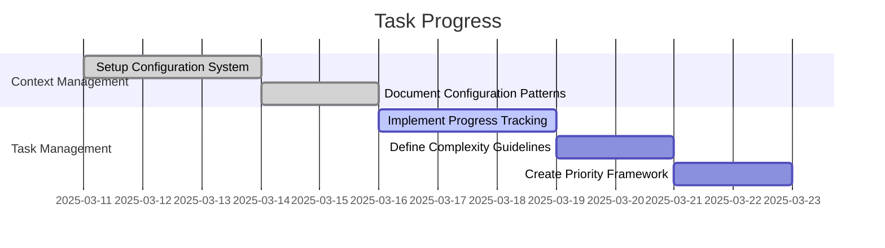

# Progress Tracking Patterns

## Overview

This document defines patterns for tracking progress in development tasks. These patterns ensure consistent measurement, reporting, and assessment of task completion across the project.

## Table of Contents

1. [Progress Indicators](#progress-indicators)
2. [Measurement Guidelines](#measurement-guidelines)
3. [Reporting Patterns](#reporting-patterns)
4. [Assessment Templates](#assessment-templates)
5. [Review Guidelines](#review-guidelines)
6. [Best Practices](#best-practices)

## Progress Indicators

```yaml
progress_indicators:
  types:
    - Percentage completion
    - Phase status
    - Task completion
    - Quality metrics

  implementation:
    - Clear metrics definition
    - Measurable checkpoints
    - Visual indicators
    - Status categorization
```

### Status Categories

```yaml
status_categories:
  not_started:
    symbol: ⚪
    description: Task has not been initiated
    
  in_progress:
    symbol: 🟡
    description: Task is actively being worked on
    
  completed:
    symbol: 🟢
    description: Task has been fully completed
    
  blocked:
    symbol: 🔴
    description: Task is blocked by dependencies or issues
    
  review:
    symbol: 🟣
    description: Task is complete but awaiting review
```

## Measurement Guidelines

### Task Completion Metrics

```yaml
completion_metrics:
  steps:
    - Define clear deliverables
    - Establish completion criteria
    - Create measurable checkpoints
    - Document validation requirements

  tracking_points:
    - Requirements analysis: 10%
    - Design completion: 25%
    - Implementation: 60%
    - Testing: 80%
    - Documentation: 90%
    - Review approval: 100%
```

### Phase Progress Tracking

```yaml
phase_tracking:
  calculation: |
    Phase Progress = (Completed Tasks / Total Tasks) * 100%
    
  visualization:
    - Progress bars
    - Status dashboards
    - Completion charts
    - Milestone indicators
```

## Reporting Patterns

### Status Report Template

```markdown
# Status Report: [Project/Component Name]

## Overview

Current Status: [Status Category]
Progress: [Percentage]%
Last Updated: [Date]

## Milestone Progress

| Milestone | Status | Progress | Due Date |
|-----------|--------|----------|----------|
| [Name]    | [Status] | [Progress]% | [Date] |

## Task Breakdown

| Task | Status | Owner | Notes |
|------|--------|-------|-------|
| [Task] | [Status] | [Owner] | [Notes] |

## Blockers & Risks

- [Description of any blockers]
- [Identified risks]

## Next Steps

1. [Next immediate action]
2. [Following steps]
```

### Progress Update Pattern

```yaml
progress_update:
  frequency:
    - Daily updates for active tasks
    - Weekly summaries for projects
    - Milestone completion reports
    - Phase transition documentation

  content:
    - Status changes
    - Percentage updates
    - Blocker identification
    - Next steps
```

## Assessment Templates

### Task Assessment

```yaml
task_assessment:
  criteria:
    - Requirements fulfilled
    - Quality standards met
    - Documentation complete
    - Tests implemented
    - Review feedback addressed

  scoring:
    - 1: Does not meet requirements
    - 2: Partially meets requirements
    - 3: Meets basic requirements
    - 4: Exceeds requirements
    - 5: Exceptional implementation
```

### Quality Assessment

```yaml
quality_assessment:
  dimensions:
    - Code quality
    - Documentation
    - Test coverage
    - Performance
    - Maintainability

  measurement:
    - Automated metrics
    - Peer review
    - User feedback
    - Performance testing
```

## Review Guidelines

### Review Process

```yaml
review_process:
  steps: 1. Self-assessment
    2. Peer review
    3. Feedback collection
    4. Improvement implementation
    5. Final validation

  focus_areas:
    - Requirement fulfillment
    - Pattern adherence
    - Quality standards
    - Documentation completeness
```

### Feedback Integration

```yaml
feedback_integration:
  sources:
    - Peer reviews
    - User testing
    - Automated checks
    - Performance metrics

  application:
    - Prioritize critical issues
    - Document improvements
    - Track implementation
    - Validate changes
```

## Best Practices

### Effective Tracking

```yaml
tracking_best_practices:
  principles:
    - Keep metrics simple and clear
    - Update progress regularly
    - Document blockers immediately
    - Maintain accurate status

  implementation:
    - Use consistent templates
    - Automate where possible
    - Maintain historical data
    - Provide visual indicators
```

### Continuous Improvement

```yaml
improvement_cycle:
  steps: 1. Measure current progress
    2. Identify bottlenecks
    3. Implement improvements
    4. Validate effectiveness
    5. Document learnings

  focus:
    - Process efficiency
    - Quality improvement
    - Communication clarity
    - Tool effectiveness
```

## Implementation Examples

### Progress Tracking in STATUS.md

```markdown
# Project Status

## Quick Status

🟢 Phase 1 (Foundation): Completed
🟡 Phase 2 (Core Rules): In Progress (65%)
⚪ Phase 3 (Optimization): Not Started
⚪ Phase 4 (Documentation): Not Started

## Phase Progress

### Phase 1: Foundation

Status: Completed ✅
Completion Date: 2025-03-15

#### Context Management

- [x] Initial project analysis patterns defined
- [x] Basic dependency tracking established
- [x] Configuration management system
- [x] Context hierarchy documentation

#### Task Management Patterns

- [x] Task pattern guidelines documented
- [x] Progress tracking patterns
- [x] Complexity assessment rules
- [x] Task prioritization patterns
```

### Task Progress Visualization

