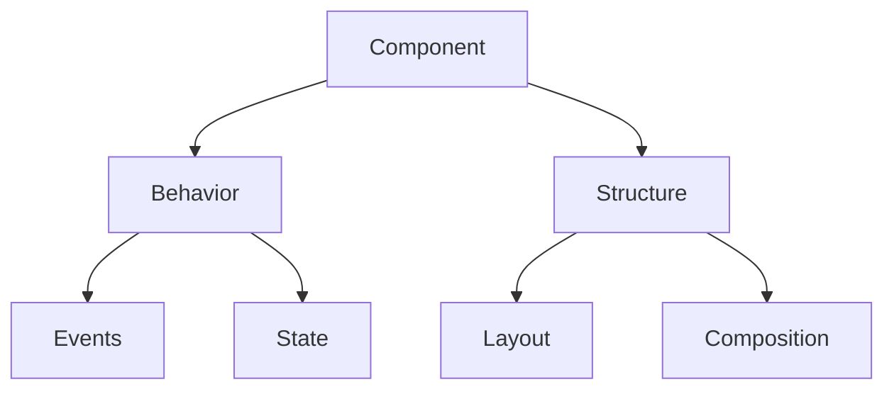
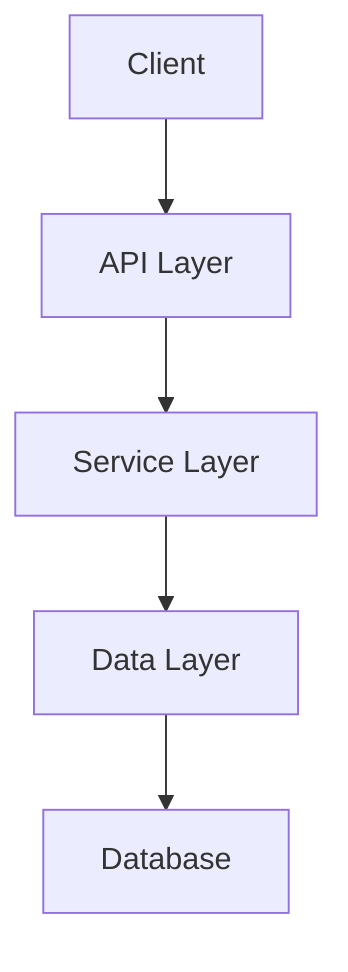

# Documentation Pattern Templates

## Overview

This document defines standardized templates for creating consistent, high-quality documentation across the project. These templates ensure documentation is comprehensive, accessible, and maintainable.

## Table of Contents

1. [Component Documentation](#component-documentation)
2. [API Documentation](#api-documentation)
3. [Pattern Documentation](#pattern-documentation)
4. [Implementation Guide](#implementation-guide)
5. [Best Practices](#best-practices)
6. [Usage Examples](#usage-examples)

## Component Documentation

### Basic Component Template

````markdown
# Component: {{ComponentName}}

## Overview

[Brief description of the component's purpose and functionality]

## Props

| Name | Type | Required | Default | Description |
|------|------|----------|---------|-------------|
| prop1 | string | Yes | - | Description of prop1 |
| prop2 | number | No | 0 | Description of prop2 |
| prop3 | boolean | No | false | Description of prop3 |

## Usage

```tsx
import { {{ComponentName}} } from './{{ComponentName}}';

const MyComponent = () => (
  <{{ComponentName}}
    prop1="value"
    prop2={42}
    prop3={true}
  />
);
```

## Behavior

- [Description of component behavior]
- [Interaction patterns]
- [State management]
- [Event handling]

## Accessibility

- [ARIA attributes]
- [Keyboard navigation]
- [Screen reader considerations]
- [Focus management]

## Styling

- [Styling approach]
- [Available customization]
- [Theme integration]
- [Responsive behavior]

## Examples

### Basic Example

```tsx
<{{ComponentName}} prop1="basic example" />
```

### Advanced Example

```tsx
<{{ComponentName}}
  prop1="advanced example"
  prop2={100}
  prop3={true}
/>
```

## Related Components

- [Related component 1]
- [Related component 2]

## Implementation Notes

- [Technical details]
- [Performance considerations]
- [Browser compatibility]
- [Known limitations]
````

### Complex Component Template

````markdown
# Component: {{ComponentName}}

## Overview

[Comprehensive description of the component's purpose, functionality, and use cases]

## Component Architecture

```mermaid
graph TD
    A[{{ComponentName}}] --> B[SubComponent1]
    A --> C[SubComponent2]
    B --> D[Utility1]
    C --> E[Utility2]
```

## Props

| Name | Type | Required | Default | Description |
|------|------|----------|---------|-------------|
| prop1 | string | Yes | - | Description of prop1 |
| prop2 | number | No | 0 | Description of prop2 |
| prop3 | boolean | No | false | Description of prop3 |
| prop4 | object | No | {} | Complex configuration object |

### Complex Prop Types

```typescript
interface Prop4Config {
  option1: string;
  option2: number;
  settings: {
    enabled: boolean;
    mode: 'simple' | 'advanced';
  }
}
```

## State Management

- [Internal state description]
- [State transitions]
- [External state integration]

## Lifecycle

- [Initialization]
- [Update behavior]
- [Cleanup]
- [Performance optimizations]

## Event Handling

| Event | Description | Arguments |
|-------|-------------|-----------|
| onChange | Triggered when value changes | (newValue, oldValue) |
| onFocus | Triggered when component receives focus | (event) |
| onBlur | Triggered when component loses focus | (event) |

## Accessibility

- [ARIA roles]
- [ARIA attributes]
- [Keyboard navigation]
- [Focus management]
- [Screen reader considerations]
- [Color contrast requirements]

## Styling

- [Styling architecture]
- [CSS variables]
- [Theme integration]
- [Responsive behavior]
- [Customization API]

## Examples

### Basic Usage

```tsx
<{{ComponentName}} prop1="basic example" />
```

### Advanced Configuration

```tsx
<{{ComponentName}}
  prop1="advanced example"
  prop2={100}
  prop3={true}
  prop4={{
    option1: "value",
    option2: 42,
    settings: {
      enabled: true,
      mode: "advanced"
    }
  }}
  onChange={(newValue, oldValue) => {
    console.log('Value changed', { newValue, oldValue });
  }}
/>
```

## Testing

- [Testing approach]
- [Key test scenarios]
- [Mocking strategies]
- [Performance testing]

## Implementation Notes

- [Technical details]
- [Performance considerations]
- [Browser compatibility]
- [Known limitations]
- [Future improvements]

## Related Components

- [Related component 1]
- [Related component 2]
- [Alternative components]
````

## API Documentation

### REST API Template

````markdown
# API: {{EndpointName}}

## Endpoint

`{{Method}} {{BasePath}}/{{Path}}`

## Description

[Detailed description of what this API endpoint does]

## Authentication

- [Authentication requirements]
- [Required permissions]
- [Rate limiting]

## Request Parameters

### Path Parameters

| Name | Type | Required | Description |
|------|------|----------|-------------|
| param1 | string | Yes | Description of param1 |
| param2 | number | Yes | Description of param2 |

### Query Parameters

| Name | Type | Required | Default | Description |
|------|------|----------|---------|-------------|
| filter | string | No | null | Filter results by property |
| sort | string | No | "createdAt" | Sort field |
| order | string | No | "desc" | Sort order (asc/desc) |
| limit | number | No | 20 | Maximum number of results |
| offset | number | No | 0 | Result offset for pagination |

### Request Body

```typescript
interface RequestBody {
  property1: string;
  property2: number;
  property3: boolean;
  property4?: {
    nestedProperty1: string;
    nestedProperty2: number;
  }
}
```

#### Example Request

```json
{
  "property1": "value",
  "property2": 42,
  "property3": true,
  "property4": {
    "nestedProperty1": "nested value",
    "nestedProperty2": 100
  }
}
```

## Response

### Success Response

**Status Code:** 200 OK

```typescript
interface SuccessResponse {
  data: {
    id: string;
    property1: string;
    property2: number;
    property3: boolean;
    createdAt: string;
    updatedAt: string;
  };
  meta: {
    requestId: string;
  }
}
```

#### Example Response

```json
{
  "data": {
    "id": "123e4567-e89b-12d3-a456-426614174000",
    "property1": "value",
    "property2": 42,
    "property3": true,
    "createdAt": "2025-03-15T14:30:00Z",
    "updatedAt": "2025-03-15T14:30:00Z"
  },
  "meta": {
    "requestId": "req_123456789"
  }
}
```

### Error Responses

#### 400 Bad Request

```json
{
  "error": {
    "code": "INVALID_REQUEST",
    "message": "Invalid request parameters",
    "details": {
      "property1": "This field is required"
    }
  },
  "meta": {
    "requestId": "req_123456789"
  }
}
```

#### 401 Unauthorized

```json
{
  "error": {
    "code": "UNAUTHORIZED",
    "message": "Authentication required"
  },
  "meta": {
    "requestId": "req_123456789"
  }
}
```

#### 403 Forbidden

```json
{
  "error": {
    "code": "FORBIDDEN",
    "message": "Insufficient permissions"
  },
  "meta": {
    "requestId": "req_123456789"
  }
}
```

#### 404 Not Found

```json
{
  "error": {
    "code": "NOT_FOUND",
    "message": "Resource not found"
  },
  "meta": {
    "requestId": "req_123456789"
  }
}
```

#### 500 Internal Server Error

```json
{
  "error": {
    "code": "INTERNAL_ERROR",
    "message": "An unexpected error occurred"
  },
  "meta": {
    "requestId": "req_123456789"
  }
}
```

## Examples

### cURL

```bash
curl -X {{Method}} \
  {{BasePath}}/{{Path}} \
  -H "Content-Type: application/json" \
  -H "Authorization: Bearer <token>" \
  -d '{
    "property1": "value",
    "property2": 42,
    "property3": true
  }'
```

### JavaScript Fetch

```javascript
fetch('{{BasePath}}/{{Path}}', {
  method: '{{Method}}',
  headers: {
    'Content-Type': 'application/json',
    'Authorization': 'Bearer <token>'
  },
  body: JSON.stringify({
    property1: 'value',
    property2: 42,
    property3: true
  })
})
.then(response => response.json())
.then(data => console.log(data))
.catch(error => console.error('Error:', error));
```

## Notes

- [Usage notes]
- [Rate limiting information]
- [Caching behavior]
- [Versioning information]
````

## Pattern Documentation

### Pattern Template

````markdown
# Pattern: {{PatternName}}

## Overview

[Description of the pattern, its purpose, and when to use it]

## Pattern Structure



## Implementation Guidelines

### Core Principles

- [Principle 1]
- [Principle 2]
- [Principle 3]

### Pattern Rules

1. [Rule 1]
2. [Rule 2]
3. [Rule 3]

### Code Structure

```typescript
// Pattern implementation structure
interface {{PatternName}}Config {
  // Configuration options
}

function use{{PatternName}}(config: {{PatternName}}Config) {
  // Implementation
}
```

## Usage Examples

### Basic Implementation

```typescript
const config: {{PatternName}}Config = {
  // Configuration
};

const result = use{{PatternName}}(config);
```

### Advanced Implementation

```typescript
// Advanced usage example
```

## Variations

### Variation 1: {{VariationName}}

[Description of variation]

```typescript
// Variation implementation
```

### Variation 2: {{VariationName}}

[Description of variation]

```typescript
// Variation implementation
```

## Best Practices

- [Best practice 1]
- [Best practice 2]
- [Best practice 3]

## Anti-patterns

- [Anti-pattern 1]
- [Anti-pattern 2]
- [Anti-pattern 3]

## Related Patterns

- [Related pattern 1]
- [Related pattern 2]
- [Related pattern 3]
````

## Implementation Guide

### Implementation Template

````markdown
# Implementation Guide: {{FeatureName}}

## Overview

[Description of the feature and its purpose]

## Architecture



## Components

### Component 1: {{ComponentName}}

- [Purpose]
- [Responsibilities]
- [Implementation details]

### Component 2: {{ComponentName}}

- [Purpose]
- [Responsibilities]
- [Implementation details]

## Implementation Steps

1. [Step 1]
   - [Details]
   - [Code example]

2. [Step 2]
   - [Details]
   - [Code example]

3. [Step 3]
   - [Details]
   - [Code example]

## Configuration

```typescript
interface Configuration {
  // Configuration options
}

const defaultConfig: Configuration = {
  // Default values
};
```

## Integration Points

- [Integration point 1]
- [Integration point 2]
- [Integration point 3]

## Testing Strategy

### Unit Tests

- [Test approach]
- [Key test cases]
- [Mocking strategy]

### Integration Tests

- [Test approach]
- [Key test scenarios]
- [Environment setup]

## Deployment

- [Deployment process]
- [Environment requirements]
- [Configuration changes]

## Monitoring

- [Metrics to track]
- [Alerting rules]
- [Logging guidelines]

## Troubleshooting

| Issue | Possible Cause | Resolution |
|-------|----------------|------------|
| [Issue 1] | [Cause] | [Resolution] |
| [Issue 2] | [Cause] | [Resolution] |
| [Issue 3] | [Cause] | [Resolution] |
````

## Best Practices

### Documentation Standards

```yaml
documentation_standards:
  structure:
    - Clear title and overview
    - Logical section organization
    - Comprehensive examples
    - Related resources
    
  content:
    - Concise descriptions
    - Complete API details
    - Practical examples
    - Edge case coverage
    
  formatting:
    - Consistent markdown
    - Proper code blocks
    - Readable tables
    - Visual diagrams
    
  maintenance:
    - Regular updates
    - Version tracking
    - Deprecation notices
    - Change history
```

### Writing Guidelines

```yaml
writing_guidelines:
  style:
    - Clear and concise
    - Active voice
    - Present tense
    - Consistent terminology
    
  organization:
    - Most important information first
    - Logical progression
    - Hierarchical structure
    - Progressive disclosure
    
  examples:
    - Start with simple cases
    - Include common use cases
    - Show edge cases
    - Provide complete context
    
  accessibility:
    - Alt text for images
    - Descriptive link text
    - Proper heading hierarchy
    - Sufficient color contrast
```

## Usage Examples

### Component Documentation Example

````markdown
# Component: Button

## Overview

A versatile button component that supports multiple variants, sizes, and states. The Button component follows accessibility best practices and integrates with the theme system.

## Props

| Name | Type | Required | Default | Description |
|------|------|----------|---------|-------------|
| variant | 'primary' \| 'secondary' \| 'tertiary' | No | 'primary' | Visual style variant |
| size | 'sm' \| 'md' \| 'lg' | No | 'md' | Button size |
| disabled | boolean | No | false | Disables the button |
| loading | boolean | No | false | Shows loading state |
| leftIcon | ReactNode | No | undefined | Icon to display before text |
| rightIcon | ReactNode | No | undefined | Icon to display after text |
| onClick | (event: React.MouseEvent) => void | No | undefined | Click handler |
| children | ReactNode | Yes | - | Button content |

## Usage

```tsx
import { Button } from '@components/Button';
import { IconHeart } from '@icons/IconHeart';

const MyComponent = () => (
  <>
    <Button variant="primary" size="md">
      Click Me
    </Button>
    
    <Button 
      variant="secondary" 
      leftIcon={<IconHeart />}
      disabled={false}
      onClick={() => console.log('Clicked!')}
    >
      Like
    </Button>
    
    <Button loading>Loading</Button>
  </>
);
```

## Accessibility

- Uses native `button` element
- Manages focus states
- Communicates loading state to screen readers
- Supports keyboard navigation
- Maintains sufficient color contrast in all variants

## Styling

The Button component uses CSS modules with theme variables:

```css
.button {
  /* Base styles */
}

.primary {
  background-color: var(--color-primary);
  color: var(--color-white);
}

.secondary {
  background-color: var(--color-secondary);
  color: var(--color-black);
}

/* Size variations */
.sm { /* ... */ }
.md { /* ... */ }
.lg { /* ... */ }
```

## Examples

### Basic Variants

```tsx
<>
  <Button variant="primary">Primary</Button>
  <Button variant="secondary">Secondary</Button>
  <Button variant="tertiary">Tertiary</Button>
</>
```

### With Icons

```tsx
<>
  <Button leftIcon={<IconDownload />}>Download</Button>
  <Button rightIcon={<IconArrowRight />}>Next</Button>
  <Button leftIcon={<IconSave />} rightIcon={<IconArrowDown />}>Save</Button>
</>
```

### States

```tsx
<>
  <Button disabled>Disabled</Button>
  <Button loading>Loading</Button>
</>
```

## Related Components

- `IconButton` - For icon-only buttons
- `LinkButton` - For button-styled links
- `ButtonGroup` - For grouping related buttons
````

### API Documentation Example

````markdown
# API: Create User

## Endpoint

`POST /api/v1/users`

## Description

Creates a new user in the system. This endpoint handles user registration, validation, and initial setup.

## Authentication

- Requires API key authentication
- Rate limited to 10 requests per minute

## Request Parameters

### Request Body

```typescript
interface CreateUserRequest {
  email: string;
  password: string;
  firstName: string;
  lastName: string;
  role?: 'user' | 'admin';
  metadata?: Record<string, unknown>;
}
```

#### Example Request

```json
{
  "email": "user@example.com",
  "password": "securePassword123",
  "firstName": "John",
  "lastName": "Doe",
  "role": "user",
  "metadata": {
    "source": "website",
    "referral": "direct"
  }
}
```

## Response

### Success Response

**Status Code:** 201 Created

```typescript
interface CreateUserResponse {
  data: {
    id: string;
    email: string;
    firstName: string;
    lastName: string;
    role: string;
    createdAt: string;
  };
  meta: {
    requestId: string;
  }
}
```

#### Example Response

```json
{
  "data": {
    "id": "usr_123456789",
    "email": "user@example.com",
    "firstName": "John",
    "lastName": "Doe",
    "role": "user",
    "createdAt": "2025-03-15T14:30:00Z"
  },
  "meta": {
    "requestId": "req_abcdef123"
  }
}
```

### Error Responses

#### 400 Bad Request

```json
{
  "error": {
    "code": "VALIDATION_ERROR",
    "message": "Invalid request parameters",
    "details": {
      "email": "Must be a valid email address",
      "password": "Must be at least 8 characters"
    }
  },
  "meta": {
    "requestId": "req_abcdef123"
  }
}
```

#### 409 Conflict

```json
{
  "error": {
    "code": "USER_EXISTS",
    "message": "A user with this email already exists"
  },
  "meta": {
    "requestId": "req_abcdef123"
  }
}
```

## Examples

### cURL

```bash
curl -X POST \
  https://api.example.com/api/v1/users \
  -H "Content-Type: application/json" \
  -H "X-API-Key: your_api_key" \
  -d '{
    "email": "user@example.com",
    "password": "securePassword123",
    "firstName": "John",
    "lastName": "Doe",
    "role": "user"
  }'
```

### JavaScript Fetch

```javascript
fetch('https://api.example.com/api/v1/users', {
  method: 'POST',
  headers: {
    'Content-Type': 'application/json',
    'X-API-Key': 'your_api_key'
  },
  body: JSON.stringify({
    email: 'user@example.com',
    password: 'securePassword123',
    firstName: 'John',
    lastName: 'Doe',
    role: 'user'
  })
})
.then(response => response.json())
.then(data => console.log(data))
.catch(error => console.error('Error:', error));
```

## Notes

- Passwords must be at least 8 characters and include a mix of letters, numbers, and special characters
- Email addresses must be unique in the system
- User IDs are prefixed with `usr_` and are globally unique
- The API is versioned; this documentation is for v1
`