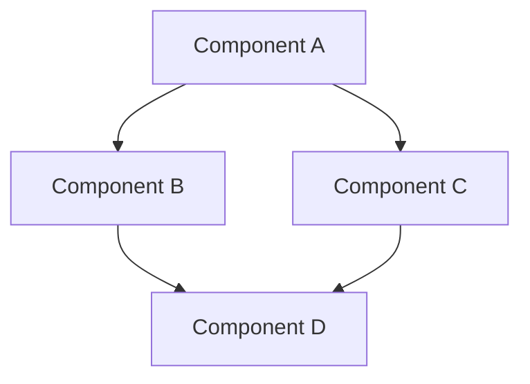

# Review Pattern Templates

## Overview

This document defines standardized templates and patterns for conducting effective reviews across different aspects of the project. These templates ensure consistent, thorough evaluation of code, documentation, and implementation quality.

## Table of Contents

1. [Code Review Templates](#code-review-templates)
2. [Documentation Review Templates](#documentation-review-templates)
3. [Design Review Templates](#design-review-templates)
4. [Performance Review Templates](#performance-review-templates)
5. [Security Review Templates](#security-review-templates)
6. [Best Practices](#best-practices)

## Code Review Templates

### Standard Code Review Template

```markdown
# Code Review: [Pull Request #]

## Overview

**Author:** [Author Name]
**Reviewer:** [Reviewer Name]
**Date:** [Review Date]

## General Assessment

- [ ] Code follows project style guidelines
- [ ] Implementation matches requirements
- [ ] Appropriate test coverage
- [ ] Documentation is complete and accurate
- [ ] Error handling is appropriate
- [ ] Performance considerations addressed

## Detailed Feedback

### Strengths

- [Positive aspect 1]
- [Positive aspect 2]
- [Positive aspect 3]

### Areas for Improvement

#### Critical Issues (Must Fix)

1. [Critical issue description]
   - File: [filename]
   - Line: [line number]
   - Suggestion: [improvement suggestion]

2. [Critical issue description]
   - File: [filename]
   - Line: [line number]
   - Suggestion: [improvement suggestion]

#### Recommendations (Should Consider)

1. [Recommendation description]
   - File: [filename]
   - Line: [line number]
   - Suggestion: [improvement suggestion]

2. [Recommendation description]
   - File: [filename]
   - Line: [line number]
   - Suggestion: [improvement suggestion]

#### Minor Suggestions (Optional)

1. [Minor suggestion description]
   - File: [filename]
   - Line: [line number]
   - Suggestion: [improvement suggestion]

## Questions

- [Question about implementation]
- [Question about design decision]
- [Question about alternative approach]

## Summary

[Overall assessment and next steps]
```

### Technical Debt Review Template

```markdown
# Technical Debt Review

## Overview

**Component/Module:** [Component Name]
**Reviewer:** [Reviewer Name]
**Date:** [Review Date]

## Technical Debt Assessment

| Category | Severity (1-5) | Impact (1-5) | Priority |
|----------|----------------|--------------|----------|
| Code Quality | [Rating] | [Rating] | [High/Medium/Low] |
| Architecture | [Rating] | [Rating] | [High/Medium/Low] |
| Testing | [Rating] | [Rating] | [High/Medium/Low] |
| Documentation | [Rating] | [Rating] | [High/Medium/Low] |
| Performance | [Rating] | [Rating] | [High/Medium/Low] |
| Security | [Rating] | [Rating] | [High/Medium/Low] |

## Identified Issues

### High Priority

1. [Issue description]
   - Location: [file/component]
   - Impact: [description of impact]
   - Remediation: [suggested fix]
   - Estimated effort: [time estimate]

2. [Issue description]
   - Location: [file/component]
   - Impact: [description of impact]
   - Remediation: [suggested fix]
   - Estimated effort: [time estimate]

### Medium Priority

1. [Issue description]
   - Location: [file/component]
   - Impact: [description of impact]
   - Remediation: [suggested fix]
   - Estimated effort: [time estimate]

### Low Priority

1. [Issue description]
   - Location: [file/component]
   - Impact: [description of impact]
   - Remediation: [suggested fix]
   - Estimated effort: [time estimate]

## Remediation Plan

1. Short-term actions (Next sprint)
   - [Action item]
   - [Action item]

2. Medium-term actions (Next quarter)
   - [Action item]
   - [Action item]

3. Long-term actions (Next 6 months)
   - [Action item]
   - [Action item]

## Metrics and Monitoring

- [Metric to track improvement]
- [Monitoring approach]
- [Success criteria]
```

## Documentation Review Templates

### Documentation Quality Review Template

```markdown
# Documentation Review

## Overview

**Document:** [Document Name/Path]
**Reviewer:** [Reviewer Name]
**Date:** [Review Date]

## Content Assessment

| Criteria | Rating (1-5) | Comments |
|----------|--------------|----------|
| Completeness | [Rating] | [Comments] |
| Accuracy | [Rating] | [Comments] |
| Clarity | [Rating] | [Comments] |
| Structure | [Rating] | [Comments] |
| Examples | [Rating] | [Comments] |
| Formatting | [Rating] | [Comments] |

## Detailed Feedback

### Strengths

- [Positive aspect 1]
- [Positive aspect 2]
- [Positive aspect 3]

### Areas for Improvement

#### Content Issues

1. [Issue description]
   - Section: [section name]
   - Suggestion: [improvement suggestion]

2. [Issue description]
   - Section: [section name]
   - Suggestion: [improvement suggestion]

#### Structure Issues

1. [Issue description]
   - Suggestion: [improvement suggestion]

2. [Issue description]
   - Suggestion: [improvement suggestion]

#### Formatting Issues

1. [Issue description]
   - Location: [specific location]
   - Suggestion: [improvement suggestion]

## Missing Information

- [Missing topic/section]
- [Missing example]
- [Missing explanation]

## Improvement Plan

1. Critical updates
   - [Update item]
   - [Update item]

2. Recommended improvements
   - [Improvement item]
   - [Improvement item]

3. Future enhancements
   - [Enhancement item]
   - [Enhancement item]

## Summary

[Overall assessment and next steps]
```

### API Documentation Review Template

```markdown
# API Documentation Review

## Overview

**API:** [API Name]
**Reviewer:** [Reviewer Name]
**Date:** [Review Date]

## Endpoint Assessment

| Endpoint | Completeness (1-5) | Accuracy (1-5) | Examples (1-5) | Overall Quality |
|----------|-------------------|----------------|----------------|-----------------|
| [Endpoint 1] | [Rating] | [Rating] | [Rating] | [High/Medium/Low] |
| [Endpoint 2] | [Rating] | [Rating] | [Rating] | [High/Medium/Low] |
| [Endpoint 3] | [Rating] | [Rating] | [Rating] | [High/Medium/Low] |

## Detailed Feedback

### General Issues

1. [Issue description]
   - Impact: [description of impact]
   - Suggestion: [improvement suggestion]

2. [Issue description]
   - Impact: [description of impact]
   - Suggestion: [improvement suggestion]

### Endpoint-Specific Issues

#### [Endpoint 1]

1. [Issue description]
   - Section: [request/response/parameters/etc.]
   - Suggestion: [improvement suggestion]

2. [Issue description]
   - Section: [request/response/parameters/etc.]
   - Suggestion: [improvement suggestion]

#### [Endpoint 2]

1. [Issue description]
   - Section: [request/response/parameters/etc.]
   - Suggestion: [improvement suggestion]

## Missing Information

- [Missing endpoint]
- [Missing parameter]
- [Missing response code]
- [Missing example]

## Developer Experience Assessment

- Ease of understanding: [Rating 1-5]
- Completeness of examples: [Rating 1-5]
- Error documentation: [Rating 1-5]
- Authentication clarity: [Rating 1-5]

## Improvement Plan

1. Critical updates
   - [Update item]
   - [Update item]

2. Recommended improvements
   - [Improvement item]
   - [Improvement item]

## Summary

[Overall assessment and next steps]
```

## Design Review Templates

### Component Design Review Template

```markdown
# Component Design Review

## Overview

**Component:** [Component Name]
**Designer/Developer:** [Name]
**Reviewer:** [Reviewer Name]
**Date:** [Review Date]

## Design Assessment

| Criteria | Rating (1-5) | Comments |
|----------|--------------|----------|
| Requirements Fulfillment | [Rating] | [Comments] |
| API Design | [Rating] | [Comments] |
| Architecture | [Rating] | [Comments] |
| Reusability | [Rating] | [Comments] |
| Maintainability | [Rating] | [Comments] |
| Testability | [Rating] | [Comments] |
| Performance | [Rating] | [Comments] |
| Accessibility | [Rating] | [Comments] |

## Detailed Feedback

### Strengths

- [Positive aspect 1]
- [Positive aspect 2]
- [Positive aspect 3]

### Areas for Improvement

#### API Design

1. [Issue description]
   - Impact: [description of impact]
   - Suggestion: [improvement suggestion]

2. [Issue description]
   - Impact: [description of impact]
   - Suggestion: [improvement suggestion]

#### Architecture

1. [Issue description]
   - Impact: [description of impact]
   - Suggestion: [improvement suggestion]

2. [Issue description]
   - Impact: [description of impact]
   - Suggestion: [improvement suggestion]

#### Implementation Concerns

1. [Issue description]
   - Impact: [description of impact]
   - Suggestion: [improvement suggestion]

## Alternative Approaches

1. [Alternative approach 1]
   - Pros: [advantages]
   - Cons: [disadvantages]
   - Recommendation: [adopt/consider/reject]

2. [Alternative approach 2]
   - Pros: [advantages]
   - Cons: [disadvantages]
   - Recommendation: [adopt/consider/reject]

## Questions

- [Question about design decision]
- [Question about implementation approach]
- [Question about requirements]

## Improvement Plan

1. Required changes
   - [Change item]
   - [Change item]

2. Recommended improvements
   - [Improvement item]
   - [Improvement item]

## Summary

[Overall assessment and next steps]
```

### Architecture Review Template

```markdown
# Architecture Review

## Overview

**System/Feature:** [System/Feature Name]
**Architect/Designer:** [Name]
**Reviewer:** [Reviewer Name]
**Date:** [Review Date]

## Architecture Assessment

| Criteria | Rating (1-5) | Comments |
|----------|--------------|----------|
| Requirements Alignment | [Rating] | [Comments] |
| Scalability | [Rating] | [Comments] |
| Performance | [Rating] | [Comments] |
| Maintainability | [Rating] | [Comments] |
| Security | [Rating] | [Comments] |
| Resilience | [Rating] | [Comments] |
| Cost Efficiency | [Rating] | [Comments] |
| Technical Alignment | [Rating] | [Comments] |

## Architecture Overview



## Detailed Feedback

### Strengths

- [Positive aspect 1]
- [Positive aspect 2]
- [Positive aspect 3]

### Areas for Improvement

#### Scalability Concerns

1. [Issue description]
   - Impact: [description of impact]
   - Suggestion: [improvement suggestion]

2. [Issue description]
   - Impact: [description of impact]
   - Suggestion: [improvement suggestion]

#### Performance Concerns

1. [Issue description]
   - Impact: [description of impact]
   - Suggestion: [improvement suggestion]

2. [Issue description]
   - Impact: [description of impact]
   - Suggestion: [improvement suggestion]

#### Security Concerns

1. [Issue description]
   - Impact: [description of impact]
   - Suggestion: [improvement suggestion]

## Risk Assessment

| Risk | Likelihood (1-5) | Impact (1-5) | Mitigation |
|------|------------------|--------------|------------|
| [Risk 1] | [Rating] | [Rating] | [Mitigation strategy] |
| [Risk 2] | [Rating] | [Rating] | [Mitigation strategy] |
| [Risk 3] | [Rating] | [Rating] | [Mitigation strategy] |

## Alternative Approaches

1. [Alternative approach 1]
   - Pros: [advantages]
   - Cons: [disadvantages]
   - Recommendation: [adopt/consider/reject]

2. [Alternative approach 2]
   - Pros: [advantages]
   - Cons: [disadvantages]
   - Recommendation: [adopt/consider/reject]

## Implementation Considerations

- [Consideration 1]
- [Consideration 2]
- [Consideration 3]

## Summary

[Overall assessment and next steps]
```

## Performance Review Templates

### Performance Assessment Template

```markdown
# Performance Review

## Overview

**Component/System:** [Component/System Name]
**Reviewer:** [Reviewer Name]
**Date:** [Review Date]
**Environment:** [Test Environment Details]

## Performance Metrics

| Metric | Target | Actual | Status |
|--------|--------|--------|--------|
| Response Time | [Target] | [Actual] | [Met/Not Met] |
| Throughput | [Target] | [Actual] | [Met/Not Met] |
| Resource Utilization | [Target] | [Actual] | [Met/Not Met] |
| Latency | [Target] | [Actual] | [Met/Not Met] |
| Error Rate | [Target] | [Actual] | [Met/Not Met] |

## Test Scenarios

### Scenario 1: [Scenario Name]

- **Description:** [Scenario description]
- **Load:** [Load details]
- **Duration:** [Test duration]
- **Results:**
  - Average response time: [Value]
  - 95th percentile: [Value]
  - Max response time: [Value]
  - Throughput: [Value]
  - Error rate: [Value]

### Scenario 2: [Scenario Name]

- **Description:** [Scenario description]
- **Load:** [Load details]
- **Duration:** [Test duration]
- **Results:**
  - Average response time: [Value]
  - 95th percentile: [Value]
  - Max response time: [Value]
  - Throughput: [Value]
  - Error rate: [Value]

## Performance Bottlenecks

1. [Bottleneck description]
   - Impact: [description of impact]
   - Root cause: [identified cause]
   - Recommendation: [improvement suggestion]
   - Estimated improvement: [expected improvement]

2. [Bottleneck description]
   - Impact: [description of impact]
   - Root cause: [identified cause]
   - Recommendation: [improvement suggestion]
   - Estimated improvement: [expected improvement]

## Resource Utilization

### CPU

- Average: [Value]%
- Peak: [Value]%
- Pattern: [Usage pattern description]

### Memory

- Average: [Value] MB
- Peak: [Value] MB
- Pattern: [Usage pattern description]

### Network

- Average throughput: [Value] Mbps
- Peak throughput: [Value] Mbps
- Pattern: [Usage pattern description]

## Optimization Plan

1. High-priority optimizations
   - [Optimization item]
   - [Optimization item]

2. Medium-priority optimizations
   - [Optimization item]
   - [Optimization item]

3. Low-priority optimizations
   - [Optimization item]
   - [Optimization item]

## Summary

[Overall assessment and next steps]
```

### Load Test Review Template

```markdown
# Load Test Review

## Overview

**System/API:** [System/API Name]
**Reviewer:** [Reviewer Name]
**Date:** [Review Date]
**Test Environment:** [Environment Details]

## Test Configuration

- **Tool:** [Load testing tool]
- **Virtual Users:** [Number of users]
- **Ramp-up Period:** [Time period]
- **Steady State Duration:** [Time period]
- **Test Scenarios:** [Number of scenarios]

## Performance Results

| Metric | Baseline | Current | Change | Target | Status |
|--------|----------|---------|--------|--------|--------|
| Avg Response Time | [Value] | [Value] | [%] | [Target] | [Met/Not Met] |
| 95th Percentile | [Value] | [Value] | [%] | [Target] | [Met/Not Met] |
| Throughput | [Value] | [Value] | [%] | [Target] | [Met/Not Met] |
| Error Rate | [Value] | [Value] | [%] | [Target] | [Met/Not Met] |
| Max Users Supported | [Value] | [Value] | [%] | [Target] | [Met/Not Met] |

## Scenario Results

### Scenario 1: [Scenario Name]

- **Description:** [Scenario description]
- **User Load:** [Number of users]
- **Results:**
  - Average response time: [Value]
  - 95th percentile: [Value]
  - Throughput: [Value]
  - Error rate: [Value]
  - Status: [Pass/Fail]

### Scenario 2: [Scenario Name]

- **Description:** [Scenario description]
- **User Load:** [Number of users]
- **Results:**
  - Average response time: [Value]
  - 95th percentile: [Value]
  - Throughput: [Value]
  - Error rate: [Value]
  - Status: [Pass/Fail]

## Resource Utilization

### Server 1: [Server Name]

- **CPU:** [Average]% (Peak: [Peak]%)
- **Memory:** [Average] GB (Peak: [Peak] GB)
- **Disk I/O:** [Average] IOPS (Peak: [Peak] IOPS)
- **Network:** [Average] Mbps (Peak: [Peak] Mbps)

### Server 2: [Server Name]

- **CPU:** [Average]% (Peak: [Peak]%)
- **Memory:** [Average] GB (Peak: [Peak] GB)
- **Disk I/O:** [Average] IOPS (Peak: [Peak] IOPS)
- **Network:** [Average] Mbps (Peak: [Peak] Mbps)

## Performance Issues

1. [Issue description]
   - Impact: [description of impact]
   - Root cause: [identified cause]
   - Recommendation: [improvement suggestion]

2. [Issue description]
   - Impact: [description of impact]
   - Root cause: [identified cause]
   - Recommendation: [improvement suggestion]

## Scalability Assessment

- **Current Capacity:** [Number of users/requests]
- **Scaling Limit:** [Identified limit]
- **Bottleneck:** [Primary bottleneck]
- **Scaling Recommendation:** [Horizontal/Vertical/Both]

## Improvement Plan

1. Critical improvements
   - [Improvement item]
   - [Improvement item]

2. Recommended improvements
   - [Improvement item]
   - [Improvement item]

## Summary

[Overall assessment and next steps]
```

## Security Review Templates

### Security Assessment Template

```markdown
# Security Review

## Overview

**Component/System:** [Component/System Name]
**Reviewer:** [Reviewer Name]
**Date:** [Review Date]
**Scope:** [Review Scope]

## Risk Assessment

| Category | Risk Level | Issues Found | Priority |
|----------|------------|--------------|----------|
| Authentication | [High/Medium/Low] | [Number] | [Priority] |
| Authorization | [High/Medium/Low] | [Number] | [Priority] |
| Data Protection | [High/Medium/Low] | [Number] | [Priority] |
| Input Validation | [High/Medium/Low] | [Number] | [Priority] |
| Output Encoding | [High/Medium/Low] | [Number] | [Priority] |
| Configuration | [High/Medium/Low] | [Number] | [Priority] |
| Cryptography | [High/Medium/Low] | [Number] | [Priority] |
| Error Handling | [High/Medium/Low] | [Number] | [Priority] |

## Security Issues

### Critical Issues

1. [Issue description]
   - Location: [file/component]
   - CVSS Score: [score]
   - Impact: [description of impact]
   - Recommendation: [remediation steps]

2. [Issue description]
   - Location: [file/component]
   - CVSS Score: [score]
   - Impact: [description of impact]
   - Recommendation: [remediation steps]

### High-Priority Issues

1. [Issue description]
   - Location: [file/component]
   - CVSS Score: [score]
   - Impact: [description of impact]
   - Recommendation: [remediation steps]

2. [Issue description]
   - Location: [file/component]
   - CVSS Score: [score]
   - Impact: [description of impact]
   - Recommendation: [remediation steps]

### Medium-Priority Issues

1. [Issue description]
   - Location: [file/component]
   - CVSS Score: [score]
   - Impact: [description of impact]
   - Recommendation: [remediation steps]

### Low-Priority Issues

1. [Issue description]
   - Location: [file/component]
   - CVSS Score: [score]
   - Impact: [description of impact]
   - Recommendation: [remediation steps]

## Compliance Assessment

| Requirement | Status | Notes |
|-------------|--------|-------|
| [Requirement 1] | [Compliant/Non-Compliant] | [Notes] |
| [Requirement 2] | [Compliant/Non-Compliant] | [Notes] |
| [Requirement 3] | [Compliant/Non-Compliant] | [Notes] |

## Remediation Plan

1. Immediate actions
   - [Action item]
   - [Action item]

2. Short-term actions (Next sprint)
   - [Action item]
   - [Action item]

3. Long-term actions
   - [Action item]
   - [Action item]

## Summary

[Overall assessment and next steps]
```

### Vulnerability Assessment Template

```markdown
# Vulnerability Assessment

## Overview

**System/Application:** [System/Application Name]
**Reviewer:** [Reviewer Name]
**Date:** [Review Date]
**Tools Used:** [List of tools]

## Executive Summary

[Brief summary of findings and overall risk assessment]

## Vulnerability Summary

| Severity | Count | Remediated | Accepted Risk | In Progress |
|----------|-------|------------|---------------|-------------|
| Critical | [Number] | [Number] | [Number] | [Number] |
| High | [Number] | [Number] | [Number] | [Number] |
| Medium | [Number] | [Number] | [Number] | [Number] |
| Low | [Number] | [Number] | [Number] | [Number] |
| Informational | [Number] | [Number] | [Number] | [Number] |

## Detailed Findings

### Critical Vulnerabilities

1. [Vulnerability name]
   - **Description:** [Description]
   - **Affected Component:** [Component]
   - **CVSS Score:** [Score]
   - **Proof of Concept:** [Details or steps to reproduce]
   - **Recommendation:** [Remediation steps]
   - **Status:** [Open/Fixed/In Progress/Accepted Risk]

2. [Vulnerability name]
   - **Description:** [Description]
   - **Affected Component:** [Component]
   - **CVSS Score:** [Score]
   - **Proof of Concept:** [Details or steps to reproduce]
   - **Recommendation:** [Remediation steps]
   - **Status:** [Open/Fixed/In Progress/Accepted Risk]

### High Vulnerabilities

1. [Vulnerability name]
   - **Description:** [Description]
   - **Affected Component:** [Component]
   - **CVSS Score:** [Score]
   - **Proof of Concept:** [Details or steps to reproduce]
   - **Recommendation:** [Remediation steps]
   - **Status:** [Open/Fixed/In Progress/Accepted Risk]

### Medium Vulnerabilities

1. [Vulnerability name]
   - **Description:** [Description]
   - **Affected Component:** [Component]
   - **CVSS Score:** [Score]
   - **Proof of Concept:** [Details or steps to reproduce]
   - **Recommendation:** [Remediation steps]
   - **Status:** [Open/Fixed/In Progress/Accepted Risk]

## Remediation Timeline

| Severity | Recommended Timeline |
|----------|----------------------|
| Critical | [Timeline] |
| High | [Timeline] |
| Medium | [Timeline] |
| Low | [Timeline] |

## Remediation Plan

1. Immediate actions
   - [Action item]
   - [Action item]

2. Short-term actions (Next sprint)
   - [Action item]
   - [Action item]

3. Long-term actions
   - [Action item]
   - [Action item]

## Summary

[Overall assessment and next steps]
```

## Best Practices

### Review Process Guidelines

```yaml
review_process:
  preparation:
    - Review requirements and context
    - Understand acceptance criteria
    - Familiarize with relevant standards
    - Prepare review environment
    
  execution:
    - Focus on critical areas first
    - Document issues as they are found
    - Provide constructive feedback
    - Suggest specific improvements
    - Consider alternative approaches
    
  follow_up:
    - Verify issue resolution
    - Re-review critical changes
    - Document lessons learned
    - Update standards if needed
    - Share knowledge with team
```

### Feedback Guidelines

```yaml
feedback_guidelines:
  principles:
    - Be specific and actionable
    - Focus on the work, not the person
    - Provide context for suggestions
    - Explain the "why" behind feedback
    - Balance positive and critical feedback
    
  structure:
    - Start with strengths
    - Group related issues
    - Prioritize feedback clearly
    - Provide clear recommendations
    - End with overall assessment
    
  tone:
    - Use collaborative language
    - Ask questions to promote discussion
    - Avoid absolute statements
    - Acknowledge alternative approaches
    - Recognize constraints and trade-offs
```

### Review Quality Metrics

```yaml
review_quality_metrics:
  effectiveness:
    - Issues found per review
    - Critical issues identified
    - Defect prevention rate
    - Knowledge sharing impact
    - Process improvement suggestions
    
  efficiency:
    - Time spent per review
    - Review coverage
    - Response time
    - Resolution rate
    - Re-review frequency
    
  satisfaction:
    - Author satisfaction
    - Reviewer satisfaction
    - Team perception
    - Learning opportunities
    - Collaboration quality
``` 