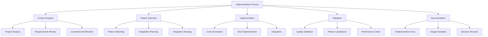

# Rules and Patterns for AI Tooling

## Overview

This document defines the core rules and patterns that govern ZenReact's AI tooling system. These guidelines ensure consistent, high-quality development assistance across all AI interactions and implementations.

## Core Rules

### Fundamental Principles

1. **Consistency First**
   - Follow established project patterns
   - Maintain consistent code style
   - Use standardized naming conventions
   - Apply patterns uniformly

2. **Quality Assurance**
   - Include appropriate tests
   - Follow security best practices
   - Optimize for performance
   - Ensure accessibility compliance

3. **Documentation Integration**
   - Document all implementations
   - Explain key decisions
   - Provide usage examples
   - Link to related patterns

4. **Context Awareness**
   - Consider project architecture
   - Respect existing patterns
   - Maintain compatibility
   - Understand business requirements

### Implementation Guidelines



## Code Generation Patterns

### Component Patterns

1. **Functional Components**
   - Use functional components by default
   - Implement with TypeScript
   - Include proper prop typing
   - Follow naming conventions

   ```tsx
   // Example pattern
   import React from 'react';
   
   interface ComponentNameProps {
     // Props definition
   }
   
   export const ComponentName: React.FC<ComponentNameProps> = ({ 
     // Destructured props
   }) => {
     // Implementation
     return (
       // JSX
     );
   };
   ```

2. **Container Components**
   - Separate logic from presentation
   - Handle data fetching and state
   - Pass data to presentation components
   - Manage side effects

   ```tsx
   // Example pattern
   import React, { useEffect, useState } from 'react';
   import { PresentationComponent } from './PresentationComponent';
   
   export const ContainerComponent: React.FC = () => {
     // State and effects
     const [data, setData] = useState();
     
     useEffect(() => {
       // Data fetching
     }, []);
     
     // Event handlers
     
     return <PresentationComponent data={data} />;
   };
   ```

3. **Higher-Order Components**
   - Use for cross-cutting concerns
   - Implement with TypeScript generics
   - Document clearly
   - Keep focused on single responsibility

   ```tsx
   // Example pattern
   import React from 'react';
   
   export const withFeature = <P extends object>(
     Component: React.ComponentType<P>
   ): React.FC<P> => {
     return (props: P) => {
       // Enhanced functionality
       return <Component {...props} />;
     };
   };
   ```

### State Management Patterns

1. **Local State**
   - Use useState for component-specific state
   - Apply useReducer for complex state logic
   - Keep state close to where it's used
   - Lift state only when necessary

   ```tsx
   // Example pattern
   import React, { useState } from 'react';
   
   export const ComponentWithState: React.FC = () => {
     const [state, setState] = useState(initialState);
     
     // State handlers
     
     return (
       // JSX using state
     );
   };
   ```

2. **Context API**
   - Create dedicated context providers
   - Use TypeScript for type safety
   - Implement with useContext hook
   - Split contexts by domain

   ```tsx
   // Example pattern
   import React, { createContext, useContext, useState } from 'react';
   
   interface FeatureContextType {
     // Context state and functions
   }
   
   const FeatureContext = createContext<FeatureContextType | undefined>(undefined);
   
   export const FeatureProvider: React.FC = ({ children }) => {
     // State and handlers
     
     return (
       <FeatureContext.Provider value={contextValue}>
         {children}
       </FeatureContext.Provider>
     );
   };
   
   export const useFeature = () => {
     const context = useContext(FeatureContext);
     if (context === undefined) {
       throw new Error('useFeature must be used within a FeatureProvider');
     }
     return context;
   };
   ```

3. **External State Management**
   - Use consistent store patterns
   - Implement type-safe actions
   - Follow immutability principles
   - Document store structure

   ```tsx
   // Example pattern
   // Store configuration
   
   // Actions
   export const actionCreator = (payload) => ({
     type: 'ACTION_TYPE',
     payload,
   });
   
   // Reducers
   export const reducer = (state, action) => {
     switch (action.type) {
       case 'ACTION_TYPE':
         return {
           ...state,
           // Updates
         };
       default:
         return state;
     }
   };
   
   // Selectors
   export const selectData = (state) => state.data;
   ```

### Hook Patterns

1. **Custom Hooks**
   - Create for reusable logic
   - Follow naming convention (use*)
   - Document parameters and return values
   - Keep focused on single responsibility

   ```tsx
   // Example pattern
   import { useState, useEffect } from 'react';
   
   export const useFeature = (param) => {
     const [state, setState] = useState(initialState);
     
     useEffect(() => {
       // Implementation
     }, [param]);
     
     // Additional logic
     
     return {
       // Return values
     };
   };
   ```

2. **Data Fetching Hooks**
   - Handle loading states
   - Implement error handling
   - Support cancellation
   - Include retry logic

   ```tsx
   // Example pattern
   import { useState, useEffect } from 'react';
   
   export const useData = (url) => {
     const [data, setData] = useState(null);
     const [loading, setLoading] = useState(true);
     const [error, setError] = useState(null);
     
     useEffect(() => {
       let isMounted = true;
       
       const fetchData = async () => {
         try {
           // Fetch implementation
           if (isMounted) {
             setData(result);
             setLoading(false);
           }
         } catch (err) {
           if (isMounted) {
             setError(err);
             setLoading(false);
           }
         }
       };
       
       fetchData();
       
       return () => {
         isMounted = false;
       };
     }, [url]);
     
     return { data, loading, error };
   };
   ```

## Testing Patterns

### Unit Testing

1. **Component Testing**
   - Test component rendering
   - Verify prop handling
   - Test user interactions
   - Check state changes

   ```tsx
   // Example pattern
   import { render, screen, fireEvent } from '@testing-library/react';
   import { Component } from './Component';
   
   describe('Component', () => {
     it('renders correctly', () => {
       render(<Component />);
       expect(screen.getByText('Expected Text')).toBeInTheDocument();
     });
     
     it('handles user interaction', () => {
       render(<Component />);
       fireEvent.click(screen.getByRole('button'));
       expect(screen.getByText('Updated Text')).toBeInTheDocument();
     });
   });
   ```

2. **Hook Testing**
   - Test hook behavior
   - Verify state changes
   - Test side effects
   - Check error handling

   ```tsx
   // Example pattern
   import { renderHook, act } from '@testing-library/react-hooks';
   import { useFeature } from './useFeature';
   
   describe('useFeature', () => {
     it('returns initial state', () => {
       const { result } = renderHook(() => useFeature());
       expect(result.current).toEqual(expectedInitialState);
     });
     
     it('updates state correctly', () => {
       const { result } = renderHook(() => useFeature());
       act(() => {
         result.current.update(newValue);
       });
       expect(result.current.state).toEqual(expectedNewState);
     });
   });
   ```

### Integration Testing

1. **Feature Testing**
   - Test component interactions
   - Verify data flow
   - Test user workflows
   - Check integration points

   ```tsx
   // Example pattern
   import { render, screen, fireEvent, waitFor } from '@testing-library/react';
   import { Feature } from './Feature';
   
   describe('Feature', () => {
     it('completes user workflow', async () => {
       render(<Feature />);
       
       // Step 1
       fireEvent.click(screen.getByText('Start'));
       
       // Step 2
       await waitFor(() => screen.getByText('Next'));
       fireEvent.click(screen.getByText('Next'));
       
       // Verification
       expect(screen.getByText('Complete')).toBeInTheDocument();
     });
   });
   ```

## Documentation Patterns

### Component Documentation

1. **Component Overview**
   - Purpose and usage
   - Props documentation
   - Example usage
   - Related components

   ```markdown
   # ComponentName
   
   ## Overview
   
   Brief description of the component's purpose and functionality.
   
   ## Props
   
   | Prop | Type | Default | Description |
   |------|------|---------|-------------|
   | prop1 | string | - | Description of prop1 |
   | prop2 | number | 0 | Description of prop2 |
   
   ## Examples
   
   ```tsx
   <ComponentName prop1="value" prop2={42} />
   ```
   
   ## Related Components
   
   - [RelatedComponent1](./RelatedComponent1.md)
   - [RelatedComponent2](./RelatedComponent2.md)
   ```

2. **Hook Documentation**
   - Purpose and usage
   - Parameters
   - Return values
   - Example usage

   ```markdown
   # useFeature
   
   ## Overview
   
   Brief description of the hook's purpose and functionality.
   
   ## Parameters
   
   | Parameter | Type | Default | Description |
   |-----------|------|---------|-------------|
   | param1 | string | - | Description of param1 |
   | param2 | number | 0 | Description of param2 |
   
   ## Returns
   
   | Property | Type | Description |
   |----------|------|-------------|
   | value | string | Description of value |
   | update | function | Function to update value |
   
   ## Examples
   
   ```tsx
   const { value, update } = useFeature('initial', 42);
   ```
   ```

## Quality Standards

### Code Quality

1. **Readability**
   - Clear naming
   - Consistent formatting
   - Appropriate comments
   - Logical structure

2. **Maintainability**
   - Single responsibility
   - Modular design
   - Minimal dependencies
   - Clear interfaces

3. **Performance**
   - Efficient algorithms
   - Appropriate optimizations
   - Minimal re-renders
   - Resource management

4. **Security**
   - Input validation
   - Output sanitization
   - Authentication checks
   - Authorization enforcement

### Documentation Quality

1. **Completeness**
   - Cover all aspects
   - Include examples
   - Document edge cases
   - Explain rationales

2. **Clarity**
   - Clear language
   - Logical organization
   - Visual aids
   - Consistent terminology

3. **Accuracy**
   - Correct information
   - Up-to-date content
   - Verified examples
   - Tested instructions

4. **Usability**
   - Easy navigation
   - Searchable content
   - Progressive disclosure
   - Appropriate detail level

## Pattern Application

### Selection Process

1. **Requirement Analysis**
   - Understand the problem
   - Identify constraints
   - Determine requirements
   - Consider context

2. **Pattern Matching**
   - Identify applicable patterns
   - Consider alternatives
   - Evaluate trade-offs
   - Select appropriate pattern

3. **Adaptation**
   - Customize for specific needs
   - Integrate with existing code
   - Maintain pattern integrity
   - Document adaptations

4. **Implementation**
   - Apply selected pattern
   - Follow implementation guidelines
   - Ensure quality standards
   - Document implementation

### Pattern Evolution

1. **Pattern Evaluation**
   - Assess effectiveness
   - Gather feedback
   - Identify improvements
   - Document learnings

2. **Pattern Refinement**
   - Update based on feedback
   - Improve documentation
   - Enhance examples
   - Clarify guidelines

3. **Pattern Deprecation**
   - Identify obsolete patterns
   - Document replacements
   - Plan migration
   - Archive deprecated patterns

## Resources

- [Implementation Guide](./IMPLEMENTATION.md)
- [Context Management](./CONTEXT.md)
- [Implementation Status](./STATUS.md)
- [Pattern Templates](./patterns/README.md)
- [Documentation Learnings](./LEARNINGS.md)

---

Last Updated: 2025-03-15
