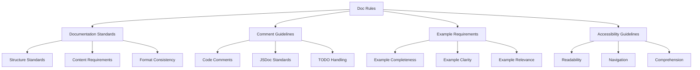

# Doc Rules

## Overview

Doc Rules define standards for documentation, ensuring comprehensive, consistent, and accessible documentation across the project. These rules cover documentation standards, comment guidelines, example requirements, and accessibility guidelines.

## Rule Categories



## Documentation Standards

### Structure Standards

```json
{
  "rule_id": "doc_structure",
  "rule_name": "Documentation Structure",
  "description": "Defines standards for documentation structure",
  "priority": "high",
  "validation_criteria": [
    "Use consistent headings hierarchy",
    "Include overview section at the beginning",
    "Organize content with clear sections",
    "Use tables for structured data",
    "Include diagrams for complex concepts"
  ],
  "examples": {
    "correct": [
      "# Component Name\n\n## Overview\n\nBrief description of the component.\n\n## Props\n\n| Prop | Type | Required | Description |\n|------|------|----------|-------------|\n| name | string | Yes | User's name |\n| age | number | No | User's age |\n\n## Usage\n\n```tsx\n<UserProfile name=\"John\" age={30} />\n```\n\n## Notes\n\nAdditional information about the component."
    ],
    "incorrect": [
      "Component Name\n\nThis component displays user profile.\n\nProps:\nname: User's name\nage: User's age\n\nUsage:\n<UserProfile name=\"John\" age={30} />"
    ]
  }
}
```

### Content Requirements

```json
{
  "rule_id": "doc_content",
  "rule_name": "Documentation Content",
  "description": "Defines requirements for documentation content",
  "priority": "high",
  "validation_criteria": [
    "Include purpose and functionality description",
    "Document all props/parameters with types and descriptions",
    "Provide usage examples",
    "Document edge cases and limitations",
    "Include performance considerations"
  ],
  "examples": {
    "correct": [
      "# UserProfile\n\n## Overview\n\nDisplays a user's profile information with optional editing capabilities.\n\n## Props\n\n| Prop | Type | Required | Description |\n|------|------|----------|-------------|\n| user | User | Yes | User object containing profile data |\n| editable | boolean | No | Whether the profile is editable (default: false) |\n| onSave | (user: User) => void | No | Callback when user saves changes |\n\n## Usage\n\n```tsx\n// Read-only profile\n<UserProfile user={userData} />\n\n// Editable profile\n<UserProfile \n  user={userData} \n  editable={true} \n  onSave={handleSave} \n/>\n```\n\n## Edge Cases\n\n- Handles missing user data gracefully\n- Validates input before saving\n- Provides error feedback for invalid inputs\n\n## Performance\n\n- Uses memoization to prevent unnecessary re-renders\n- Lazy loads edit form when needed"
    ],
    "incorrect": [
      "# UserProfile\n\nA component for user profiles.\n\n## Props\n\n- user: The user data\n- editable: Makes it editable\n- onSave: Save handler\n\n## Usage\n\n```tsx\n<UserProfile user={userData} />\n```"
    ]
  }
}
```

## Comment Guidelines

### Code Comments

```json
{
  "rule_id": "code_comments",
  "rule_name": "Code Comments",
  "description": "Defines standards for code comments",
  "priority": "high",
  "validation_criteria": [
    "Comment complex logic with explanation",
    "Avoid commenting obvious code",
    "Use // for single-line comments",
    "Use /* */ for multi-line comments",
    "Keep comments up-to-date with code changes"
  ],
  "examples": {
    "correct": [
      "// Calculate age based on birthdate and current date\nconst calculateAge = (birthdate: Date): number => {\n  const today = new Date();\n  let age = today.getFullYear() - birthdate.getFullYear();\n  \n  // Adjust age if birthday hasn't occurred yet this year\n  const hasBirthdayOccurred = (\n    today.getMonth() > birthdate.getMonth() || \n    (today.getMonth() === birthdate.getMonth() && today.getDate() >= birthdate.getDate())\n  );\n  \n  if (!hasBirthdayOccurred) {\n    age--;\n  }\n  \n  return age;\n};"
    ],
    "incorrect": [
      "// This function calculates age\nconst calculateAge = (birthdate: Date): number => {\n  // Get today's date\n  const today = new Date();\n  // Calculate the difference in years\n  let age = today.getFullYear() - birthdate.getFullYear();\n  \n  // Check if birthday has occurred\n  const m = today.getMonth() - birthdate.getMonth();\n  if (m < 0 || (m === 0 && today.getDate() < birthdate.getDate())) {\n    // Decrement age\n    age--;\n  }\n  \n  // Return the age\n  return age;\n};"
    ]
  }
}
```

### JSDoc Standards

```json
{
  "rule_id": "jsdoc_standards",
  "rule_name": "JSDoc Standards",
  "description": "Defines standards for JSDoc comments",
  "priority": "high",
  "validation_criteria": [
    "Document all functions, classes, and interfaces with JSDoc",
    "Include parameter descriptions with @param",
    "Document return values with @returns",
    "Document thrown exceptions with @throws",
    "Include examples with @example"
  ],
  "examples": {
    "correct": [
      "/**\n * Fetches user data from the API\n * \n * @param userId - The ID of the user to fetch\n * @param options - Optional configuration for the request\n * @returns Promise resolving to the user data\n * @throws {ApiError} When the API request fails\n * @example\n * ```ts\n * const user = await fetchUser('123', { includeDetails: true });\n * ```\n */\nasync function fetchUser(\n  userId: string, \n  options?: FetchOptions\n): Promise<User> {\n  // Implementation\n}"
    ],
    "incorrect": [
      "// Gets user from API\nasync function fetchUser(userId, options) {\n  // Implementation\n}"
    ]
  }
}
```

## Example Requirements

### Example Completeness

```json
{
  "rule_id": "example_completeness",
  "rule_name": "Example Completeness",
  "description": "Defines requirements for complete examples",
  "priority": "high",
  "validation_criteria": [
    "Include all required props/parameters",
    "Show typical usage patterns",
    "Demonstrate edge cases",
    "Include error handling",
    "Show integration with related components"
  ],
  "examples": {
    "correct": [
      "## UserForm Examples\n\n### Basic Usage\n\n```tsx\n<UserForm \n  initialData={userData}\n  onSubmit={handleSubmit}\n  onCancel={handleCancel}\n/>\n```\n\n### With Validation\n\n```tsx\n<UserForm \n  initialData={userData}\n  validationSchema={userSchema}\n  onSubmit={handleSubmit}\n  onCancel={handleCancel}\n  onValidationError={handleValidationError}\n/>\n```\n\n### With Custom Fields\n\n```tsx\n<UserForm \n  initialData={userData}\n  onSubmit={handleSubmit}\n  onCancel={handleCancel}\n>\n  <CustomField name=\"specialty\" label=\"Specialty\" />\n</UserForm>\n```\n\n### Error Handling\n\n```tsx\nconst handleSubmit = async (data) => {\n  try {\n    await saveUser(data);\n    showSuccess('User saved successfully');\n  } catch (error) {\n    showError('Failed to save user');\n    console.error(error);\n  }\n};\n\n<UserForm \n  initialData={userData}\n  onSubmit={handleSubmit}\n  onCancel={handleCancel}\n/>\n```"
    ],
    "incorrect": [
      "## UserForm Examples\n\n```tsx\n<UserForm data={userData} />\n```"
    ]
  }
}
```

## Accessibility Guidelines

### Readability

```json
{
  "rule_id": "doc_readability",
  "rule_name": "Documentation Readability",
  "description": "Defines standards for documentation readability",
  "priority": "high",
  "validation_criteria": [
    "Use clear, concise language",
    "Break down complex concepts into digestible sections",
    "Use consistent terminology",
    "Avoid jargon without explanation",
    "Use visual aids for complex concepts"
  ],
  "examples": {
    "correct": [
      "## State Management\n\nThis component uses React's useState and useReducer hooks to manage state.\n\n### Local State\n\nSimple values are managed with useState:\n\n```tsx\nconst [isOpen, setIsOpen] = useState(false);\n```\n\n### Complex State\n\nMore complex state is managed with useReducer:\n\n```tsx\nconst [state, dispatch] = useReducer(formReducer, initialState);\n```\n\nThe reducer handles these actions:\n\n| Action | Description |\n|--------|-------------|\n| SET_FIELD | Updates a single form field |\n| RESET_FORM | Resets the form to initial state |\n| SUBMIT | Prepares form for submission |\n\n### State Flow Diagram\n\n```mermaid\ngraph TD\n    A[User Input] --> B[Dispatch Action]\n    B --> C[Reducer]\n    C --> D[New State]\n    D --> E[Re-render]\n```"
    ],
    "incorrect": [
      "## State Management\n\nThis component utilizes React's state management paradigms through the implementation of useState and useReducer hooks to facilitate the maintenance of component state throughout its lifecycle. The useState hook is employed for simplistic state values while useReducer is utilized for more complex state management scenarios requiring sophisticated state transitions."
    ]
  }
}
```

## Implementation

### Rule Application

Doc rules are applied:

1. **During Development**: As documentation is being written
2. **In Code Reviews**: During documentation review
3. **In Documentation Generation**: When generating automated docs
4. **In Documentation Updates**: When updating existing docs

### Rule Validation

Rules are validated through:

1. **Structure Checking**: Verifying documentation structure
2. **Content Analysis**: Ensuring comprehensive content
3. **Example Verification**: Checking example completeness
4. **Accessibility Assessment**: Evaluating documentation accessibility

## Benefits

1. **Comprehensive Documentation**: Ensures thorough documentation
2. **Consistency**: Maintains consistent documentation style
3. **Accessibility**: Makes documentation accessible to all users
4. **Maintainability**: Simplifies documentation maintenance

## Example Usage

```
Task: "Document a new React component for user profile display"

Doc Rules Application:
1. Uses consistent heading structure (doc_structure rule)
2. Includes comprehensive prop documentation (doc_content rule)
3. Documents complex logic with clear comments (code_comments rule)
4. Provides complete usage examples (example_completeness rule)
5. Ensures documentation is readable and accessible (doc_readability rule)
```

## Integration Points

- **Auto-Context**: Uses context to select appropriate doc rules
- **Rule Engine**: Enforces doc rules
- **Quality System**: Uses doc rules for documentation quality assessment

## Rule Metrics

The system tracks:

1. **Documentation Coverage**: Percentage of code with proper documentation
2. **Documentation Quality**: Assessment of documentation quality
3. **Example Completeness**: Evaluation of example coverage
4. **Documentation Accessibility**: Measurement of documentation accessibility 