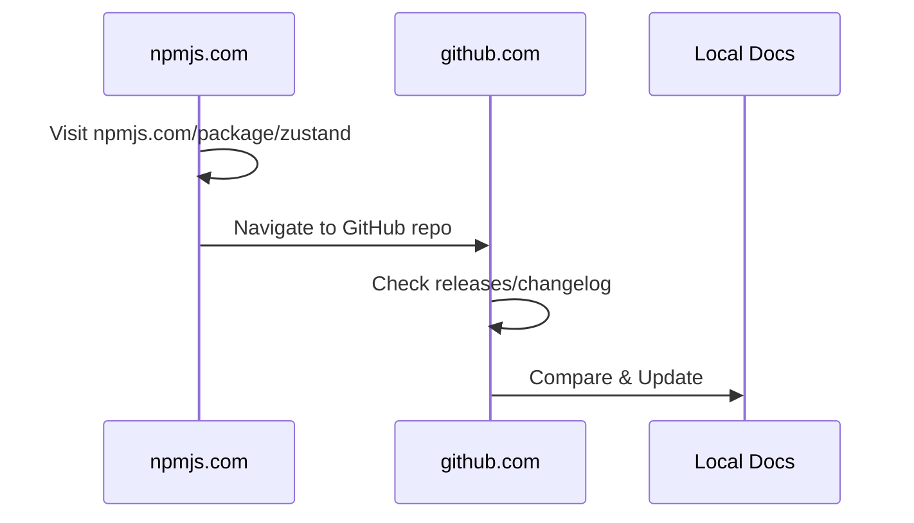

# Practical Update Example: Zustand

This example demonstrates how to follow the update workflow for the Zustand package.

## 1. Browser Setup



## 2. Step-by-Step Example

### Check Current Documentation

Current version in docs: 5.0.3
Last updated: 2025-03-11

### Visit npm Package Page

1. Open browser to: https://www.npmjs.com/package/zustand
2. Check latest version information:
   ```js
   // Example of what to look for
   latest: {
     version: "5.0.3", // or newer
     publishedAt: "2025-03-11" // or later
   }
   ```

### Check GitHub Repository

1. Visit: https://github.com/pmndrs/zustand
2. Navigate to Releases tab
3. Review recent releases for:
   - Breaking changes
   - New features
   - Bug fixes
   - Updated requirements

### Update Process Example

#### A. If No Version Change

If npm shows 5.0.3 is still latest:

1. Update `lastUpdated` if needed
2. Review docs for accuracy
3. Check for new community resources

#### B. If Minor Version Update (e.g., 5.0.4)

1. Update frontmatter:
   ```yaml
   ---
   version: 5.0.4
   lastUpdated: 2025-03-11
   ---
   ```
2. Update version history:
   ```json
   {
     "latest": "5.0.4",
     "breaking": [] // Keep existing breaking changes
   }
   ```
3. Update installation command:
   ```bash
   npm install zustand@5.0.4
   ```

#### C. If Major Version Update (e.g., 6.0.0)

1. Update frontmatter with new version
2. Document breaking changes:
   ```json
   {
     "latest": "6.0.0",
     "breaking": [
       {
         "version": "6.0.0",
         "changes": ["List breaking changes from release notes", "Include migration steps"]
       }
     ]
   }
   ```
3. Update all sections:
   - Check API changes
   - Update examples
   - Review compatibility
   - Add new features
   - Update best practices

### Browser Automation Example

Here's how you could use Puppeteer to automate the information gathering:

```typescript
// Example automation script
async function checkZustandUpdates() {
  const browser = await puppeteer.launch();
  const page = await browser.newPage();

  // Check npm
  await page.goto('https://www.npmjs.com/package/zustand');
  const version = await page.$eval('span[title="Version"]', (el) => el.textContent);

  // Check GitHub releases
  await page.goto('https://github.com/pmndrs/zustand/releases');
  const latestRelease = await page.$eval('.release-header', (el) => ({
    version: el.querySelector('.release-title').textContent,
    date: el.querySelector('relative-time').getAttribute('datetime'),
    body: el.querySelector('.markdown-body').textContent,
  }));

  return {
    npmVersion: version,
    latestRelease,
  };
}
```

### Quality Checks

✅ Version consistency check:

```javascript
const checks = {
  installation: 'npm install zustand@' + version,
  frontmatter: `version: ${version}`,
  versionHistory: `"latest": "${version}"`,
  dateFormat: 'YYYY-MM-DD', // ISO 8601
  markdownValid: true,
  jsonValid: true,
};
```

## File Update Summary

When updating zustand.md:

1. 📝 Frontmatter updates:

   - version
   - lastUpdated

2. 📚 Content sections to review:

   - Installation commands
   - API Reference (if changed)
   - Examples (ensure they work)
   - Breaking changes (if any)
   - Resources (check links)

3. 🔍 Final verification:
   - All JSON blocks valid
   - Links working
   - Code examples tested
   - Markdown formatting correct

## Tips from This Example

1. **Efficiency**

   - Keep npm and GitHub tabs open side by side
   - Use browser developer tools to quickly inspect version numbers
   - Copy release notes directly for breaking changes

2. **Validation**

   - Test code examples in a separate environment
   - Use JSON validator for metadata blocks
   - Check markdown preview for formatting

3. **Documentation**
   - Keep commit messages clear and consistent
   - Reference GitHub issues/PRs where relevant
   - Update related documentation if needed
