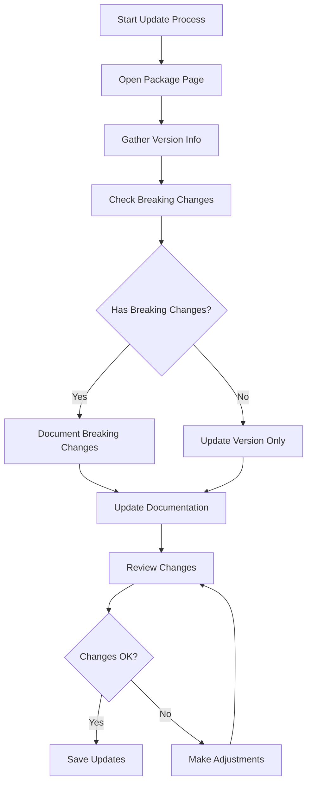

# Dependency Version Update Workflow

## Overview



## Detailed Steps

### 1. Open Package Page

- Visit one of:
  - npmjs.com/package/[package-name]
  - github.com/[org]/[package-name]
- Review the latest released version
- Note the release date

### 2. Gather Version Information

- Record:
  - Latest version number
  - Release date
  - Major changes
  - New features
  - Deprecations
  - Compatibility updates

### 3. Check Breaking Changes

- Review changelog/release notes
- Check migration guides
- Review GitHub issues related to the update
- Note dependencies that might be affected

### 4. Document Updates

1. Update frontmatter:

   ```yaml
   ---
   name: [Package Name]
   version: [New Version]
   type: runtime|dev
   category: [existing category]
   lastUpdated: [Current Date YYYY-MM-DD]
   ---
   ```

2. Update Version History section:

   ```json
   {
     "latest": "new.version.number",
     "breaking": [
       {
         "version": "major.version.0",
         "changes": ["Breaking change description", "Migration step required"]
       }
     ]
   }
   ```

3. Update relevant sections:
   - Installation commands with new version
   - API changes in API Reference
   - New features in Core Concepts
   - Updated examples in Common Usage Patterns
   - New best practices
   - Modified performance considerations

### 5. Review & Validate

- Check all code examples work with new version
- Verify all links are updated
- Ensure compatibility information is current
- Cross-reference with related dependencies
- Spell-check and format validation

### 6. Save & Commit

- Save updated documentation
- Review diff before committing
- Use descriptive commit message:

  ```
  docs(deps): update [package] to vX.Y.Z

  - Update version and lastUpdated
  - Document breaking changes
  - Update examples and best practices
  ```

## Tips for Efficient Updates

1. **Browser Setup**

   - Keep relevant tabs open:
     - Package documentation
     - GitHub releases
     - npm page
     - Your documentation file

2. **Information Gathering**

   - Use browser's split screen for comparing versions
   - Take notes of changes while reviewing
   - Screenshot important changes for reference

3. **Quality Checks**

   - Use the package in a test project if major version change
   - Cross-reference with the template
   - Validate all JSON/YAML blocks for syntax
   - Check markdown formatting

4. **Time-Saving Practices**
   - Subscribe to release notifications
   - Keep a changelog summary
   - Maintain a list of related packages
   - Document common update patterns

## Common Pitfalls to Avoid

1. **Version Documentation**

   - Don't mix release candidate versions
   - Always include migration steps for breaking changes
   - Keep deprecated features marked clearly

2. **Content Management**

   - Don't remove old version information
   - Maintain consistent formatting
   - Keep examples minimal but complete
   - Avoid duplicate information

3. **Workflow**
   - Don't update multiple packages simultaneously
   - Always verify changes in a development environment
   - Keep backups of previous versions
   - Document update decisions

## Update Checklist

- [ ] Check latest version
- [ ] Review changelog/release notes
- [ ] Update frontmatter
- [ ] Update version history
- [ ] Check for breaking changes
- [ ] Update installation commands
- [ ] Review and update code examples
- [ ] Update compatibility information
- [ ] Check related dependencies
- [ ] Validate JSON/YAML blocks
- [ ] Spell-check document
- [ ] Review formatting
- [ ] Save and commit changes
