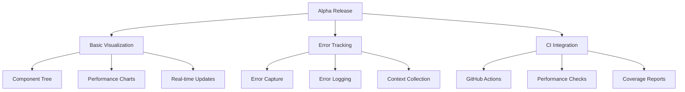

# Alpha Release Implementation Plan

## Overview

A focused implementation plan for the next alpha release of the performance monitoring system, building on the existing core functionality.



## 1. Basic Visualization Package (Days 1-3)

### Day 1: Component Tree Viewer

```typescript
interface ComponentTreeNode {
  id: string;
  name: string;
  renderCount: number;
  renderTime: number;
  children: ComponentTreeNode[];
}

interface TreeViewerProps {
  data: ComponentTreeNode;
  onNodeSelect?: (node: ComponentTreeNode) => void;
  maxDepth?: number;
  refreshRate?: number;
}

// Implementation outline
function ComponentTreeViewer({
  data,
  onNodeSelect,
  maxDepth = 3,
  refreshRate = 1000,
}: TreeViewerProps) {
  // Tree rendering logic
  // Node expansion/collapse
  // Performance metrics display
  // Real-time updates
}
```

### Day 2: Performance Charts

```typescript
interface ChartConfig {
  type: 'line' | 'bar' | 'area';
  metrics: string[];
  timeRange: number;
  updateInterval: number;
}

interface PerformanceChartProps {
  config: ChartConfig;
  data: MetricsData;
  height?: number;
  width?: number;
}

// Base chart implementation
function PerformanceChart({ config, data }: PerformanceChartProps) {
  // Chart rendering
  // Data transformation
  // Update handling
}
```

### Day 3: Real-time Updates

```typescript
interface UpdateConfig {
  interval: number;
  batchSize: number;
  maxPoints: number;
}

// Real-time data management
class RealTimeDataManager {
  private buffer: MetricsBuffer;
  private updateInterval: number;

  constructor(config: UpdateConfig) {
    // Initialize buffers
    // Setup update intervals
    // Configure data retention
  }

  // Update methods
  addDataPoint(metric: Metric): void;
  getLatestData(): MetricsData;
  clearOldData(): void;
}
```

## 2. Essential Error Tracking (Days 4-5)

### Day 4: Error Capture System

```typescript
interface ErrorData {
  message: string;
  stack?: string;
  componentName?: string;
  timestamp: number;
  context: Record<string, unknown>;
}

// Error tracking implementation
class ErrorTracker {
  private errors: ErrorData[];
  private options: ErrorTrackerOptions;

  constructor(options: ErrorTrackerOptions) {
    // Initialize error storage
    // Configure tracking options
    // Setup error handlers
  }

  // Core methods
  captureError(error: Error, context?: Record<string, unknown>): void;
  getErrors(): ErrorData[];
  clearErrors(): void;
}
```

### Day 5: Error Logging & Context

```typescript
interface ErrorContext {
  componentStack?: string;
  props?: Record<string, unknown>;
  state?: Record<string, unknown>;
  performanceMetrics?: Record<string, number>;
}

// Error context collection
class ErrorContextCollector {
  // Context gathering methods
  gatherContext(): ErrorContext;
  attachPerformanceData(context: ErrorContext): void;
  sanitizeContext(context: ErrorContext): ErrorContext;
}
```

## 3. CI Integration (Days 6-7)

### Day 6: GitHub Actions Setup

```yaml
# .github/workflows/performance.yml
name: Performance Checks

on:
  push:
    branches: [main, develop]
  pull_request:
    branches: [main]

jobs:
  performance:
    runs-on: ubuntu-latest
    steps:
      - uses: actions/checkout@v2
      - name: Setup Node.js
        uses: actions/setup-node@v2
      - name: Install dependencies
        run: npm install
      - name: Run performance tests
        run: npm run test:performance
```

### Day 7: Performance Checks & Coverage

```typescript
// performance-checks.config.ts
interface PerformanceThresholds {
  renderTime: number;
  memoryUsage: number;
  bundleSize: number;
  coverageThreshold: number;
}

const config: PerformanceThresholds = {
  renderTime: 16, // ms
  memoryUsage: 50 * 1024 * 1024, // 50MB
  bundleSize: 100 * 1024, // 100KB
  coverageThreshold: 80, // 80%
};
```

## Success Metrics

### Performance

- Component tree render time < 16ms
- Chart update latency < 100ms
- Error tracking overhead < 1ms
- CI pipeline completion < 5 minutes

### Quality

- Test coverage > 80%
- No memory leaks
- Error capture rate > 99%
- Real-time update reliability > 99%

## Testing Strategy

### Unit Tests

```typescript
describe('ComponentTreeViewer', () => {
  it('renders tree structure correctly', () => {
    // Test implementation
  });

  it('updates in real-time', async () => {
    // Test implementation
  });
});

describe('ErrorTracker', () => {
  it('captures errors with context', () => {
    // Test implementation
  });
});
```

### Performance Tests

```typescript
test('visualization performance', async () => {
  const tree = generateLargeComponentTree();
  const start = performance.now();
  render(<ComponentTreeViewer data={tree} />);
  const duration = performance.now() - start;
  expect(duration).toBeLessThan(16);
});
```

## Release Checklist

### Pre-release

- [ ] All unit tests passing
- [ ] Performance tests passing
- [ ] Coverage requirements met
- [ ] Documentation updated
- [ ] Example implementations added

### Release

- [ ] Version bumped
- [ ] Changelog updated
- [ ] Git tag created
- [ ] npm package published
- [ ] Documentation deployed

### Post-release

- [ ] Smoke tests passed
- [ ] Example projects updated
- [ ] Release announcement prepared
- [ ] Feedback channels established

## Documentation Requirements

### API Documentation

- Component tree viewer props and methods
- Performance chart configuration
- Error tracking setup and usage
- CI integration guide

### Usage Examples

- Basic tree viewer implementation
- Custom chart configurations
- Error handling setup
- CI/CD pipeline setup

### Performance Guide

- Optimization tips
- Best practices
- Troubleshooting steps
- Configuration recommendations

This plan provides a structured approach to implementing the alpha release features while maintaining focus on rapid development and essential functionality.
