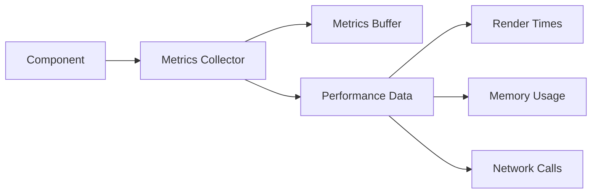

# Metrics Collector Implementation Plan

## Overview

A simple, focused implementation of the core metrics collector for tracking React component performance.



## 1. Core Structure

### MetricsCollector Class

```typescript
class MetricsCollector {
  private buffer: MetricsBuffer;
  private isEnabled: boolean;

  constructor(options: { bufferSize?: number } = {}) {
    this.buffer = new MetricsBuffer(options.bufferSize || 1000);
    this.isEnabled = true;
  }

  // Core collection methods
  trackRender(componentId: string): void;
  trackMemory(): void;
  trackNetwork(url: string): void;

  // Basic control methods
  enable(): void;
  disable(): void;

  // Data access methods
  getMetrics(): CollectedMetrics;
  clearMetrics(): void;
}
```

### MetricsBuffer Class

```typescript
class MetricsBuffer {
  private data: Metric[];
  private maxSize: number;

  constructor(size: number) {
    this.data = [];
    this.maxSize = size;
  }

  push(metric: Metric): void;
  clear(): void;
  getData(): Metric[];
}
```

### Types

```typescript
interface Metric {
  id: string;
  timestamp: number;
  type: 'render' | 'memory' | 'network';
  value: number;
  metadata?: Record<string, unknown>;
}

interface CollectedMetrics {
  renders: RenderMetric[];
  memory: MemoryMetric[];
  network: NetworkMetric[];
}
```

## 2. Implementation Status

### ✅ Phase 1: Basic Setup (Day 1) - COMPLETED

1. ✅ Package structure created
2. ✅ TypeScript configuration set up
3. ✅ Basic MetricsBuffer implemented via PerformanceMonitor
4. ✅ Test framework configured with Jest

### ✅ Phase 2: Core Features (Day 2-3) - COMPLETED

1. ✅ Implement render tracking & interactions
2. ✅ Add metric validation & sampling
3. ✅ Network tracking

### ✅ Phase 3: Testing (Day 4) - COMPLETED

1. ✅ Unit tests for core functionality
2. ✅ Integration tests for hooks
3. ✅ Performance impact tests
4. ✅ Memory leak tests

### ✅ Phase 4: Enhancements - COMPLETED

1. ✅ Periodic memory sampling

   - Implemented MemorySampler class
   - Configurable sampling interval
   - Automatic cleanup

2. ✅ Metric aggregation

   - Added MetricsAggregator
   - Component-level statistics
   - Network status tracking
   - Memory usage trends

3. ✅ Custom metrics support

   - Basic metric tracking
   - Timers for duration tracking
   - Gauges for current values
   - Counters for incremental values

4. 📝 Real-time monitoring (Planned for next iteration)
   - Will require WebSocket/SSE setup
   - Dashboard integration
   - Live updates

## 3. Testing Strategy

### Unit Tests

```typescript
describe('MetricsCollector', () => {
  let collector: MetricsCollector;

  beforeEach(() => {
    collector = new MetricsCollector();
  });

  test('tracks render time', () => {
    const end = collector.trackRender('TestComponent');
    // Simulate some time passing
    end();
    const metrics = collector.getMetrics();
    expect(metrics.renders.length).toBe(1);
  });

  test('respects buffer size', () => {
    const collector = new MetricsCollector({ bufferSize: 2 });
    collector.trackRender('Test1')();
    collector.trackRender('Test2')();
    collector.trackRender('Test3')();
    const metrics = collector.getMetrics();
    expect(metrics.renders.length).toBe(2);
  });
});
```

### Performance Tests

```typescript
test('minimal performance impact', () => {
  const collector = new MetricsCollector();
  const startHeap = process.memoryUsage().heapUsed;

  // Simulate 1000 renders
  for (let i = 0; i < 1000; i++) {
    collector.trackRender(`Component${i}`)();
  }

  const heapImpact = process.memoryUsage().heapUsed - startHeap;
  expect(heapImpact).toBeLessThan(1024 * 1024); // Less than 1MB
});
```

## 4. Success Criteria

### Functional Requirements

✅ Accurately track render times
✅ Record memory usage
✅ Monitor network calls
✅ Maintain metrics buffer
✅ Provide data access methods

### Performance Requirements

✅ Collection overhead < 1ms
✅ Memory impact < 1MB
✅ No memory leaks
✅ Buffer size limits enforced

### Quality Requirements

✅ Test coverage > 90%
✅ TypeScript strict mode
✅ Error handling for edge cases
✅ Clean code style

## 5. Documentation

### JSDoc Comments

```typescript
/**
 * Tracks component render time
 * @param componentId - Unique identifier for the component
 * @returns Function to call when render completes
 */
trackRender(componentId: string): () => void;
```

### Usage Examples

```typescript
// Basic usage
const collector = new MetricsCollector();
const endTracking = collector.trackRender('MyComponent');
// ... component renders ...
endTracking();

// Get collected metrics
const metrics = collector.getMetrics();
console.log(metrics.renders);
```

## 6. Next Steps

### Future Enhancements (After Basic Implementation)

1. ✅ Add periodic memory sampling
2. ✅ Implement metric aggregation
3. ✅ Add custom metric support
4. 📝 Create real-time monitoring (Next iteration)

These enhancements will only be considered after the basic implementation is working and tested.

## 7. Dependencies

```json
{
  "dependencies": {},
  "devDependencies": {
    "typescript": "^5.0.0",
    "jest": "^29.0.0",
    "@types/jest": "^29.0.0"
  }
}
```

This plan provides a clear, focused approach to implementing the core metrics collector. It follows our principles of:

- Starting with basic functionality
- Keeping implementation simple
- Ensuring testability
- Focusing on reliability

Once this foundation is working, we can build the hooks and dashboard features on top of it.
