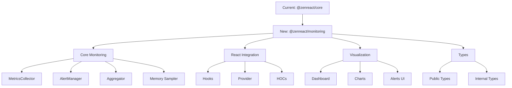

# Monitoring Package Extraction Plan

## Overview

Extract monitoring functionality from @zenreact/core into a separate @zenreact/monitoring package.



## 1. Package Structure

```
packages/
└── monitoring/
    ├── package.json
    ├── tsconfig.json
    ├── README.md
    └── src/
        ├── core/
        │   ├── metrics.ts
        │   ├── alerts.ts
        │   ├── aggregator.ts
        │   └── memory.ts
        ├── react/
        │   ├── hooks/
        │   ├── components/
        │   └── provider.tsx
        ├── dashboard/
        │   ├── components/
        │   └── charts/
        ├── types/
        │   └── index.ts
        └── index.ts
```

## 2. Implementation Steps

### Phase 1: Setup (Day 1) ✅

1. ✅ Create new package structure

   - Create `packages/monitoring`
   - Set up TypeScript configuration
   - Configure build system
   - Set up testing environment

2. Dependencies setup

```json
{
  "name": "@zenreact/monitoring",
  "version": "1.0.0",
  "dependencies": {
    "performance-now": "^2.1.0",
    "web-vitals": "^3.0.0",
    "chart.js": "^4.0.0"
  },
  "peerDependencies": {
    "react": "^18.0.0",
    "react-dom": "^18.0.0"
  }
}
```

### Phase 2: Core Migration (Day 2) ✅

1. ✅ Move core monitoring classes

   - ✅ MetricsCollector
   - ✅ AlertManager
   - ✅ PerformanceMonitor
   - ✅ Memory sampling

2. ✅ Update imports and exports

   - ✅ Create proper module boundaries
   - ✅ Set up public API

3. ✅ Type definitions
   - ✅ Extract shared types
   - ✅ Create public type exports

### Phase 3: React Integration (Day 3) ✅

1. ✅ Move React components

   - ✅ Provider component
   - ✅ Dashboard components
   - ✅ Chart components
   - ✅ Alert displays

2. ✅ Migrate hooks
   - ✅ usePerformance
   - ✅ useRenderTracking
   - ✅ useNetworkTracking
   - ✅ useMetricAlert

### Phase 4: Testing & Documentation (Day 4) 🚧

1. Test suite migration

   - Unit tests
   - Integration tests
   - React component tests

2. Documentation
   - API documentation
   - Usage examples
   - Migration guide

## 3. Migration Strategy

1. Create parallel structure

   - Keep existing code working while building new package
   - Gradually migrate components
   - Use feature flags for testing

2. Testing approach

   - Test each component in isolation
   - Integration tests for full workflows
   - Performance impact testing

3. Backwards compatibility
   - Maintain same API surface
   - Provide migration utilities
   - Document breaking changes

## 4. Public API Design

```typescript
// Main exports
export { PerformanceMonitor } from './core/monitor';
export { usePerformance } from './react/hooks';
export { PerformanceProvider } from './react/provider';
export { PerformanceDashboard } from './dashboard';

// Types
export type { MonitoringOptions, MetricData, AlertConfig, DashboardProps } from './types';
```

## 5. Success Criteria

### 1. Functional Requirements

- All existing features working in new package
- No performance regression
- Full test coverage
- Comprehensive documentation

### 2. Performance Requirements

- Package size < 10KB gzipped
- No impact on application startup time
- Minimal runtime overhead

### 3. Quality Requirements

- TypeScript strict mode compliance
- 90%+ test coverage
- Clean module boundaries
- Well-documented APIs

## 6. Integration Guide

```typescript
// Before (in @zenreact/core)
import { monitor } from '@zenreact/core';

// After (in @zenreact/monitoring)
import { monitor } from '@zenreact/monitoring';

// New features available
import { PerformanceDashboard, useCustomMetrics } from '@zenreact/monitoring';
```

## 7. Timeline

- Day 1: Package setup and configuration
- Day 2: Core monitoring migration
- Day 3: React component migration
- Day 4: Testing, documentation, and validation

## 8. Risk Mitigation

1. Performance Impact

   - Extensive performance testing before release
   - Gradual rollout with feature flags
   - Monitoring of key metrics during migration

2. Breaking Changes

   - Maintain API compatibility where possible
   - Clear migration documentation
   - Provide codemods for automated updates

3. Integration Issues
   - Comprehensive integration tests
   - Beta testing phase
   - Rollback plan if needed

## 9. Next Steps

1. Create new package structure
2. Set up build and test configuration
3. Begin core monitoring migration
4. Review and validate progress daily

The extraction will improve maintainability and allow for independent versioning while keeping the core package focused on React optimization features.
