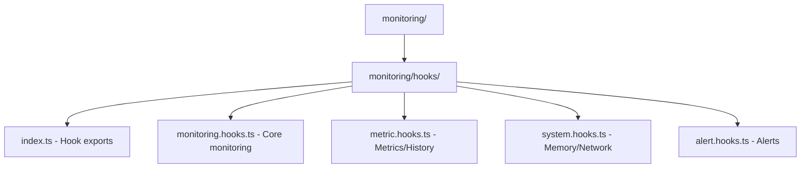

# Monitoring Rapid Restructuring Plan

## Overview

Keep monitoring in core package but reorganize for better maintainability while prioritizing rapid development.

## Directory Structure

```
packages/core/src/monitoring/
├── hooks/
│   ├── index.ts           # Re-exports all hooks
│   ├── monitoring.hooks.ts # Core monitoring functionality
│   ├── metric.hooks.ts    # Custom metrics and history
│   ├── system.hooks.ts    # Memory and network monitoring
│   └── alert.hooks.ts     # Alert system
└── index.ts              # Public API
```

## Quick Implementation Steps

### 1. Create Structure (5 mins)

- Create hooks/ directory
- Add new files with basic exports

### 2. Split Code (15 mins)

Move hooks to appropriate files:

- monitoring.hooks.ts: useMonitor
- metric.hooks.ts: useCustomMetric, useMetricHistory
- system.hooks.ts: useMemoryTracking, useNetworkTracking
- alert.hooks.ts: useMetricAlert

### 3. Update Exports (5 mins)

- Create index.ts in hooks/ directory
- Re-export all hooks
- Update main monitoring/index.ts

### 4. Update Tests (10 mins)

- Keep existing tests
- Update import paths
- Verify all tests pass

## Benefits

- Better code organization
- Easier to maintain
- No package management overhead
- Minimal risk
- Quick to implement
- Easy to validate

## Validation Steps

1. Create new structure
2. Move code
3. Update imports
4. Run tests
5. Manual testing

## Future Improvements

Can evolve gradually:

- Add more documentation
- Improve error handling
- Add performance optimizations
- Extract into separate package if needed

## Timeline

Total implementation time: ~35 minutes


