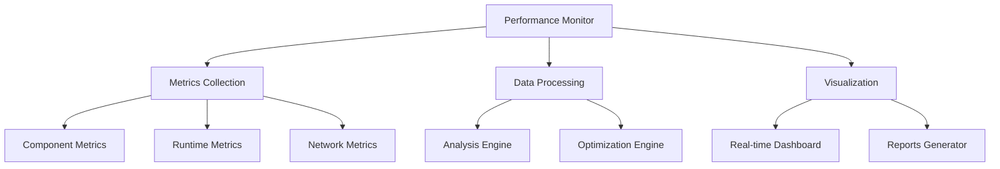

# Performance Monitoring System Technical Plan

## System Overview

A comprehensive performance monitoring system for React applications that provides real-time metrics, visualization, and optimization suggestions.



## 1. Core Architecture

### Metrics Collector

```typescript
interface MetricsCollector {
  // Core collection methods
  trackRender(componentId: string, duration: number): void;
  trackEffect(effectId: string, duration: number): void;
  trackNetwork(requestId: string, metrics: NetworkMetrics): void;

  // Aggregation methods
  getComponentMetrics(componentId: string): ComponentMetrics;
  getRuntimeMetrics(): RuntimeMetrics;
  getNetworkMetrics(): NetworkMetrics[];
}

interface ComponentMetrics {
  renderCount: number;
  averageRenderTime: number;
  lastRenderTime: number;
  reRenderPercentage: number;
  effectDurations: Record<string, number>;
}

interface RuntimeMetrics {
  fps: number;
  jankCount: number;
  memoryUsage: number;
  gcTime: number;
}

interface NetworkMetrics {
  url: string;
  duration: number;
  size: number;
  status: number;
  cached: boolean;
}
```

### Performance Provider

```typescript
interface PerformanceProviderProps {
  children: React.ReactNode;
  options?: {
    sampleRate: number;
    bufferSize: number;
    autoStart: boolean;
    reportingEndpoint?: string;
  };
}

// Implementation
function PerformanceProvider({ children, options }: PerformanceProviderProps) {
  // Initialize collectors
  // Setup context
  // Configure reporting
  return <PerformanceContext.Provider>{children}</PerformanceContext.Provider>;
}
```

## 2. Core Features Implementation

### 2.1 Metrics Collection

```typescript
// Base collector implementation
class BaseMetricsCollector implements MetricsCollector {
  private metricsBuffer: MetricsBuffer;
  private readonly options: CollectorOptions;

  constructor(options: CollectorOptions) {
    this.metricsBuffer = new MetricsBuffer(options.bufferSize);
    this.options = options;
  }

  public trackRender(componentId: string, duration: number): void {
    if (this.shouldSample()) {
      this.metricsBuffer.push({
        type: 'render',
        componentId,
        duration,
        timestamp: Date.now(),
      });
    }
  }

  private shouldSample(): boolean {
    return Math.random() < this.options.sampleRate;
  }
}
```

### 2.2 Performance Hooks

```typescript
// Main performance hook
function usePerformance(componentId?: string) {
  const context = useContext(PerformanceContext);
  const metrics = useRef<ComponentMetrics>(null);

  useEffect(() => {
    // Setup performance observers
    return () => {
      // Cleanup observers
    };
  }, [componentId]);

  return {
    metrics: metrics.current,
    startTracking: () => {},
    stopTracking: () => {},
    getReport: () => {},
  };
}

// Specialized hooks
function useRenderTracking(options?: TrackingOptions) {
  return usePerformance().trackRender;
}

function useNetworkTracking(options?: NetworkOptions) {
  return usePerformance().trackNetwork;
}
```

### 2.3 Dashboard Components

```typescript
// Main dashboard component
function PerformanceDashboard() {
  return (
    <DashboardLayout>
      <MetricsOverview />
      <ComponentPerformance />
      <NetworkActivity />
      <Recommendations />
    </DashboardLayout>
  );
}

// Real-time metrics display
function MetricsOverview() {
  const { metrics } = usePerformance();

  return (
    <MetricsGrid>
      <FPSMeter value={metrics.fps} />
      <MemoryUsage value={metrics.memoryUsage} />
      <NetworkStatus requests={metrics.networkRequests} />
      <ComponentHealth components={metrics.componentHealth} />
    </MetricsGrid>
  );
}
```

## 3. Implementation Phases

### Phase 1: Core Infrastructure (Week 1)

1. Setup Package Structure

   - Initialize @zenreact/monitor package
   - Configure build system
   - Setup testing environment

2. Implement Core Collectors

   - Component render tracking
   - Effect duration monitoring
   - Runtime metrics collection
   - Network request monitoring

3. Create Base Provider
   - Performance context
   - Metrics management
   - Configuration handling

### Phase 2: Hooks and Utilities (Week 2)

1. Develop Main Hooks

   - usePerformance hook
   - useRenderTracking hook
   - useNetworkTracking hook

2. Create Utility Functions

   - Metrics aggregation
   - Data analysis
   - Report generation

3. Add Helper Components
   - PerformanceProvider
   - MetricsCollector
   - DataProcessor

### Phase 3: Dashboard Implementation (Week 3)

1. Build Core Components

   - Dashboard layout
   - Metrics displays
   - Charts and graphs
   - Alert system

2. Implement Data Visualization

   - Real-time charts
   - Performance graphs
   - Network timelines
   - Component trees

3. Add Interactive Features
   - Filtering options
   - Time range selection
   - Detail views
   - Export capabilities

### Phase 4: Integration and Testing (Week 4)

1. Integration Testing

   - Provider integration
   - Hook usage
   - Dashboard functionality
   - Data flow verification

2. Performance Testing

   - Collector overhead
   - Memory impact
   - CPU usage
   - Network impact

3. Documentation
   - API documentation
   - Usage guides
   - Best practices
   - Example implementations

## 4. Testing Strategy

### Unit Tests

```typescript
describe('MetricsCollector', () => {
  it('should track render times accurately', () => {
    const collector = new MetricsCollector();
    // Test implementation
  });

  it('should respect sampling rate', () => {
    const collector = new MetricsCollector({ sampleRate: 0.5 });
    // Test implementation
  });
});

describe('usePerformance', () => {
  it('should provide accurate metrics', () => {
    const { result } = renderHook(() => usePerformance());
    // Test implementation
  });
});
```

### Integration Tests

```typescript
describe('PerformanceMonitoring', () => {
  it('should track component performance', async () => {
    render(
      <PerformanceProvider>
        <TestComponent />
      </PerformanceProvider>
    );
    // Test implementation
  });
});
```

## 5. API Design

### Public API

```typescript
// Main exports
export {
  PerformanceProvider,
  usePerformance,
  useRenderTracking,
  useNetworkTracking,
  PerformanceDashboard,
};

// Types
export type { PerformanceOptions, MetricsData, ComponentMetrics, NetworkMetrics };

// Constants
export const DEFAULT_OPTIONS: PerformanceOptions;
```

### Configuration Options

```typescript
interface PerformanceOptions {
  sampleRate?: number; // Default: 1
  bufferSize?: number; // Default: 1000
  autoStart?: boolean; // Default: true
  reportingEndpoint?: string; // Optional
  alertThresholds?: {
    renderTime?: number; // Default: 16ms
    memoryUsage?: number; // Default: 50MB
    networkTime?: number; // Default: 1000ms
  };
}
```

## 6. Success Metrics

### Performance Overhead

- Collector impact < 1% CPU
- Memory usage < 5MB
- Network overhead < 1KB/min

### Accuracy Targets

- Render time accuracy ±1ms
- Memory tracking accuracy ±1MB
- Network timing accuracy ±10ms

### User Experience

- Dashboard update rate: 1fps
- Alert latency < 100ms
- Interaction response < 16ms

## 7. Future Enhancements

### Phase 5: Advanced Features

1. Machine Learning Analysis

   - Pattern detection
   - Anomaly identification
   - Prediction models

2. Advanced Visualizations

   - 3D component trees
   - Time-series analysis
   - Correlation graphs

3. Integration Features
   - CI/CD integration
   - Error tracking
   - Log correlation

## 8. Dependencies

### Required

```json
{
  "dependencies": {
    "performance-now": "^2.1.0",
    "web-vitals": "^3.0.0",
    "chart.js": "^4.0.0"
  },
  "devDependencies": {
    "@testing-library/react": "^13.0.0",
    "@types/jest": "^29.0.0"
  }
}
```

## 9. Release Strategy

### 1. Alpha Release (End of Week 2)

- Core functionality
- Basic monitoring
- Initial documentation

### 2. Beta Release (End of Week 3)

- Dashboard implementation
- Extended features
- Example applications

### 3. Production Release (End of Week 4)

- Complete feature set
- Full documentation
- Production optimizations

## 10. Documentation Requirements

### 1. API Documentation

- All exports documented
- Type definitions
- Usage examples
- Best practices

### 2. Performance Guide

- Implementation strategies
- Optimization tips
- Troubleshooting guide
- Common patterns

### 3. Dashboard Guide

- Setup instructions
- Configuration options
- Custom visualization
- Data interpretation

This plan provides a comprehensive approach to implementing the performance monitoring system, ensuring both functionality and maintainability while following React best practices and performance considerations.
