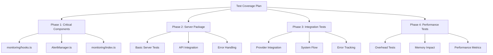

# Test Coverage Improvement Plan

## Current Status

- Overall coverage: ~65% (Target: 80%)
- Critical components with low coverage:
  - monitoring/hooks.ts: 41.96%
  - AlertManager.ts: 23.91%
  - monitoring/index.ts: 58.62%
- Server package: No tests implemented



## Implementation Plan

### Phase 1: Critical Components Coverage (Week 1)

#### 1.1 monitoring/hooks.ts

- Current: 41.96% coverage
- Target: >80% coverage
- Focus Areas:
  - Effect hooks (lines 46-47)
  - Custom hook logic (lines 75-85)
  - Context handling (lines 89-107)
  - Cleanup functions (lines 117-132)
  - Performance tracking (lines 140-172)
  - Error boundaries (lines 188-241)

```typescript
describe('monitoring/hooks.ts', () => {
  describe('Effect Hooks', () => {
    // Test effect initialization
    // Test cleanup handling
    // Test dependency updates
  });

  describe('Custom Hooks', () => {
    // Test hook state management
    // Test callback handlers
    // Test error scenarios
  });

  describe('Context Integration', () => {
    // Test context providers
    // Test context consumers
    // Test updates propagation
  });
});
```

#### 1.2 AlertManager.ts

- Current: 23.91% coverage
- Target: >80% coverage
- Focus Areas:
  - Alert creation/dispatch (lines 52-130)
  - Alert filtering (lines 144-145)
  - Threshold management (lines 156, 165)
  - Alert lifecycle (lines 175-182)

```typescript
describe('AlertManager', () => {
  describe('Alert Creation', () => {
    // Test alert construction
    // Test priority handling
    // Test alert batching
  });

  describe('Alert Lifecycle', () => {
    // Test alert dispatching
    // Test alert updates
    // Test alert resolution
  });

  describe('Threshold Management', () => {
    // Test threshold configuration
    // Test threshold violations
    // Test threshold updates
  });
});
```

#### 1.3 monitoring/index.ts

- Current: 58.62% coverage
- Target: >80% coverage
- Focus Areas:
  - Metric aggregation (lines 78-86)
  - Data processing (lines 104-141)
  - Export handling (lines 154-160)

```typescript
describe('monitoring/index.ts', () => {
  describe('Metric Aggregation', () => {
    // Test data collection
    // Test data grouping
    // Test time-series handling
  });

  describe('Data Processing', () => {
    // Test transformation logic
    // Test filtering options
    // Test data validation
  });

  describe('Export Functionality', () => {
    // Test data formatting
    // Test export options
    // Test error handling
  });
});
```

### Phase 2: Server Package Tests (Week 2)

#### 2.1 Basic Server Tests

```typescript
describe('Server Core', () => {
  describe('API Routes', () => {
    // Test endpoint validation
    // Test request handling
    // Test response formatting
  });

  describe('Data Management', () => {
    // Test data storage
    // Test data retrieval
    // Test data cleanup
  });
});
```

#### 2.2 Integration Tests

```typescript
describe('Server Integration', () => {
  describe('Client Communication', () => {
    // Test data transmission
    // Test connection handling
    // Test error scenarios
  });

  describe('Data Processing', () => {
    // Test metric processing
    // Test alert generation
    // Test report creation
  });
});
```

### Phase 3: System Integration Tests (Week 3)

#### 3.1 End-to-End Tests

```typescript
describe('System Integration', () => {
  test('complete monitoring flow', async () => {
    // Setup test environment
    // Initialize monitoring
    // Validate data flow
    // Verify visualization
  });

  test('error handling flow', async () => {
    // Trigger test errors
    // Verify error capture
    // Check alert generation
    // Validate reporting
  });
});
```

### Phase 4: Performance Tests (Week 4)

#### 4.1 Performance Validation

```typescript
describe('Performance Tests', () => {
  test('collector overhead', async () => {
    // Measure collector impact
    // Verify < 1ms overhead
    // Check memory usage
  });

  test('system impact', async () => {
    // Monitor CPU usage
    // Track memory allocation
    // Measure network impact
  });
});
```

## Success Metrics

### Coverage Targets

- Overall system: >80%
- Critical components: >85%
- Integration tests: >90%
- Server package: >80%

### Performance Targets

- Collector overhead: <1ms
- Memory impact: <1MB
- CPU usage: <1%
- Network overhead: <1KB/min

### Quality Metrics

- Test reliability: >99%
- False positives: <1%
- Test execution time: <5 minutes
- Code maintainability: A grade

## Implementation Timeline

### Week 1: Critical Components

- Day 1-2: monitoring/hooks.ts
- Day 3-4: AlertManager.ts
- Day 5: monitoring/index.ts

### Week 2: Server Package

- Day 1-2: Core server tests
- Day 3-4: API integration tests
- Day 5: Error handling tests

### Week 3: Integration Tests

- Day 1-2: Provider integration
- Day 3-4: System flow tests
- Day 5: Error tracking tests

### Week 4: Performance Tests

- Day 1-2: Overhead validation
- Day 3-4: Resource impact tests
- Day 5: Final optimization

## Review Checklist

### Pre-Implementation

- [ ] Test environment configured
- [ ] Coverage tools set up
- [ ] Testing standards documented
- [ ] CI integration prepared

### During Implementation

- [ ] Daily coverage reports
- [ ] Performance monitoring
- [ ] Code review process
- [ ] Documentation updates

### Post-Implementation

- [ ] Coverage targets met
- [ ] Performance validated
- [ ] Documentation completed
- [ ] Training materials prepared

## Moving Forward

After implementing this plan:

1. Regularly monitor and maintain test coverage
2. Update tests for new features
3. Automate coverage reporting
4. Schedule periodic test reviews
5. Train team on testing practices
6. Document testing patterns
7. Share testing knowledge
8. Plan future improvements
