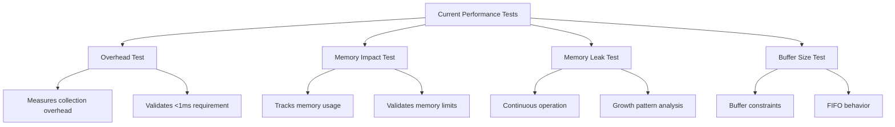
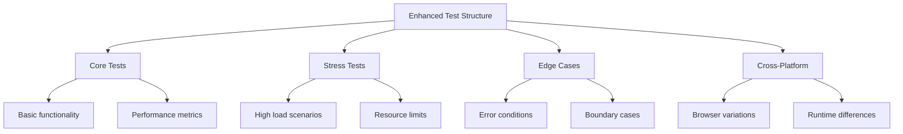

# Performance Testing Enhancement Plan

## Overview

This document outlines the strategy for enhancing the performance testing suite in ZenReact's monitoring system, focusing on rapid development while maintaining high quality and comprehensive coverage.

## Current State Analysis

## Proposed Improvements

### 1. Test Organization and Documentation

### 2. Test Categories

#### Core Performance Tests (Existing)

- Overhead measurement
- Memory impact analysis
- Leak detection
- Buffer management

#### Extended Performance Tests (New)

- High-frequency collection
- Large-scale component tracking
- Network-intensive operations
- Memory usage patterns

#### Cross-Platform Tests (New)

- Browser-specific scenarios
- React Native considerations
- JavaScript engine variations

#### Integration Tests (Enhanced)

- Real-world usage patterns
- Component interactions
- Dashboard performance

### 3. Success Metrics Validation

**Performance Targets:**

- Collector CPU impact: < 1%
- Memory usage: < 5MB
- Network overhead: < 1KB/min

**Accuracy Requirements:**

- Render time: ±1ms
- Memory tracking: ±1MB
- Network timing: ±10ms

### 4. Implementation Phases

#### Phase 1: Core Enhancement

- [ ] Refactor existing tests for clarity
- [ ] Add comprehensive documentation
- [ ] Implement missing core metrics
- [ ] Validate basic performance requirements

#### Phase 2: Extended Coverage

- [ ] Add stress test suite
- [ ] Implement edge case scenarios
- [ ] Add cross-platform test configurations
- [ ] Validate extended metrics

#### Phase 3: Integration Testing

- [ ] Add real-world scenario tests
- [ ] Implement dashboard integration tests
- [ ] Create full system test suite
- [ ] Validate end-to-end performance

#### Phase 4: Optimization

- [ ] Performance tuning
- [ ] Resource usage optimization
- [ ] Enhanced reporting
- [ ] Final validation

## Implementation Strategy

### Rapid Development Approach

1. **Iterative Implementation**

   - Start with high-impact improvements
   - Regular validation cycles
   - Continuous integration

2. **Prioritization**

   - Core functionality first
   - Critical performance metrics
   - Extended features later

3. **Validation Process**
   - Automated testing
   - Performance benchmarking
   - Regular review cycles

### Success Criteria

1. **Test Coverage**

   - All core functionality tested
   - Edge cases covered
   - Performance requirements validated

2. **Performance Metrics**

   - Meeting all target thresholds
   - Consistent results
   - Documented benchmarks

3. **Code Quality**
   - Clear documentation
   - Maintainable structure
   - Efficient implementation

## Next Steps

1. **Immediate Actions**

   - Review existing test implementation
   - Setup new test infrastructure
   - Begin Phase 1 implementation

2. **Short-term Goals**

   - Complete core enhancements
   - Validate basic metrics
   - Setup automated testing

3. **Long-term Objectives**
   - Full test suite implementation
   - Comprehensive documentation
   - Optimization completion

## Monitoring and Adjustment

- Regular progress review
- Performance metric tracking
- Adjustment based on feedback
- Continuous improvement
