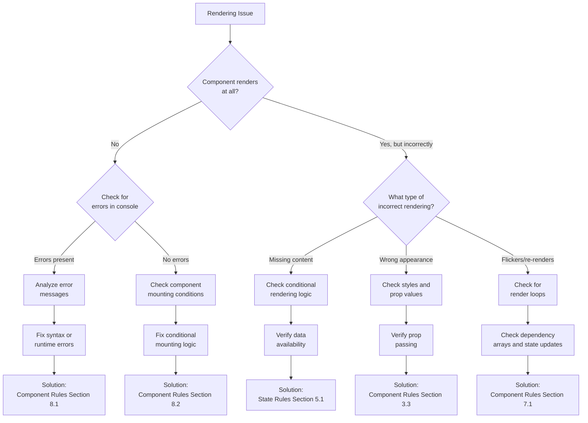
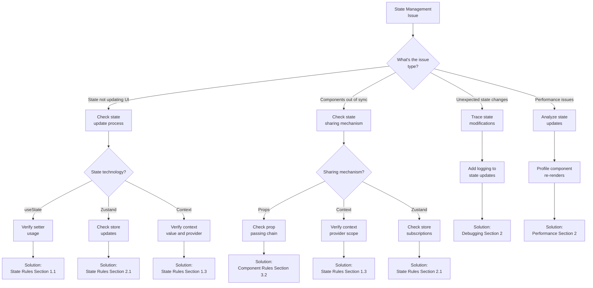
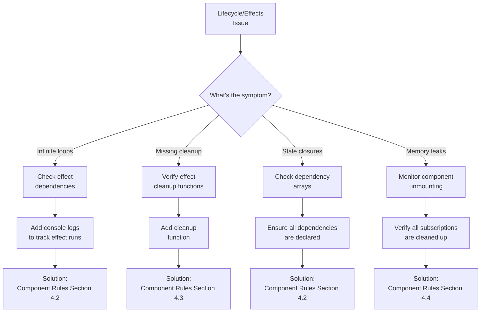
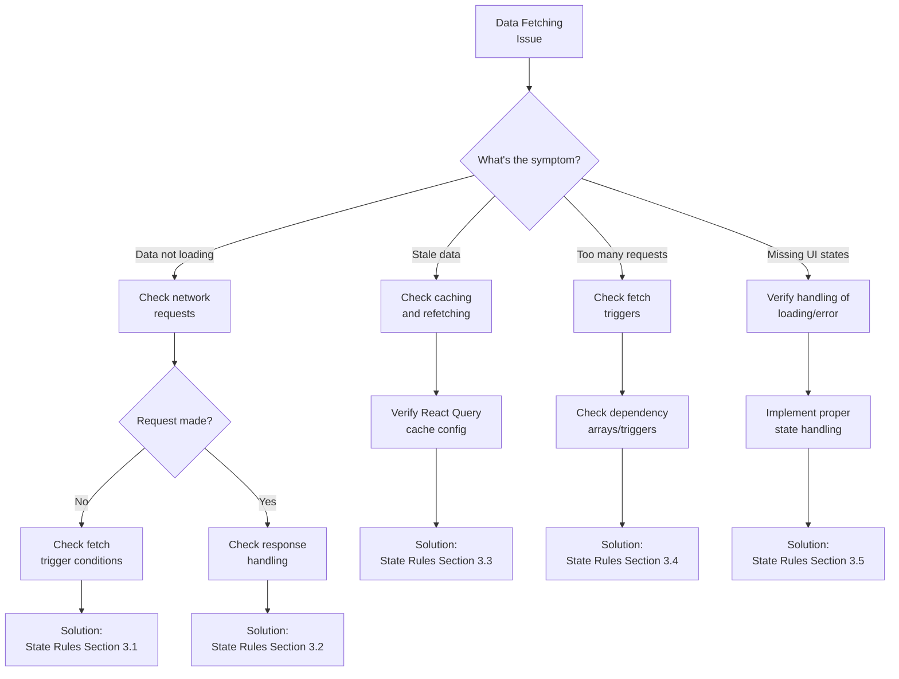
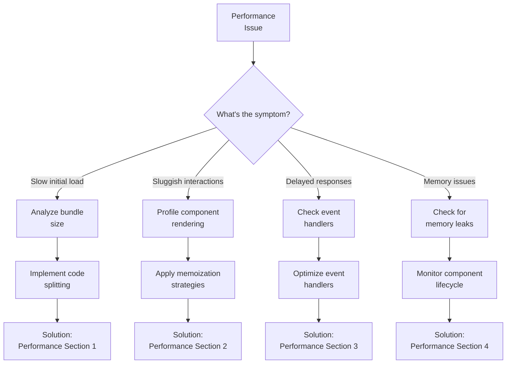
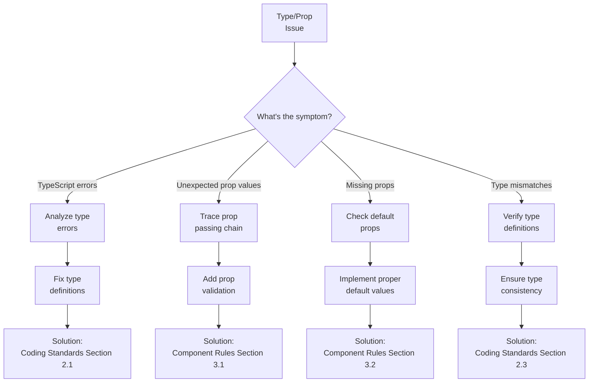

# ZenReact Debugging Guide

This document provides structured approaches to diagnosing and resolving common issues in ZenReact applications. It serves as a reference for AI assistants and developers when troubleshooting problems during development.

## Debugging Workflow

Follow this general workflow when debugging issues in ZenReact applications:

1. **Observe the Problem**: Document the exact symptoms and conditions under which the issue occurs
2. **Isolate the Issue**: Narrow down the source to specific components, state, or interactions
3. **Analyze Root Causes**: Identify potential causes based on the symptoms and location
4. **Test Hypotheses**: Apply targeted fixes to validate your understanding of the issue
5. **Implement Solution**: Apply the proper fix following ZenReact guidelines
6. **Verify Resolution**: Confirm the issue is resolved and no new issues were introduced
7. **Document Findings**: Record the issue, root cause, and solution for future reference

## Common Issue Categories

### 1. Rendering Issues

#### 1.1 Symptoms of Rendering Issues

- Component doesn't render at all
- Component renders incorrectly
- Component flickers or renders multiple times
- Content disappears unexpectedly

#### 1.2 Diagnostic Approach



#### 1.3 Common Rendering Issues and Solutions

| Issue | Possible Cause | Solution Approach |
|-------|---------------|-------------------|
| Component doesn't render | Component not included in parent's JSX | Verify component import and usage in parent |
| | Conditional rendering evaluates to false | Check conditional logic and state/prop values |
| | Error during rendering | Add error boundary and fix the error |
| Component renders multiple times | Missing dependency array in useEffect | Add proper dependency array to useEffect |
| | Unnecessary component re-renders | Apply React.memo and check props |
| | Parent component re-rendering unnecessarily | Apply memoization to parent or extract component |
| Content appears then disappears | Race condition in async data | Ensure proper loading state handling |
| | State resets on re-render | Check for accidental state resets |
| Styling issues | CSS conflicts | Use more specific selectors or CSS modules |
| | Incorrect style props | Verify style prop values and types |

### 2. State Management Issues

#### 2.1 Symptoms of State Management Issues

- State changes don't reflect in UI
- State updates unexpectedly
- Multiple components out of sync
- Stale state values
- Performance issues with state updates

#### 2.2 Diagnostic Approach



#### 2.3 Common State Management Issues and Solutions

| Issue | Possible Cause | Solution Approach |
|-------|---------------|-------------------|
| State doesn't update UI | Improper state update | Use proper setter function (setState not state =) |
| | Mutation without proper update | Ensure immutable updates (especially with objects/arrays) |
| | Referential equality issues | Use proper update patterns for objects and arrays |
| State updates unexpectedly | Side effects updating state | Check useEffect dependencies and cleanup |
| | Multiple sources of truth | Consolidate state to single source |
| | Unintended prop changes | Verify prop passing chain and memoization |
| Components out of sync | Context provider too narrow | Move provider higher in component tree |
| | Incorrect selector usage | Verify Zustand selector optimization |
| | Race conditions | Ensure proper handling of async state updates |
| Performance issues | Over-rendering | Use memoization and selectors |
| | Large state objects | Split state into smaller pieces |
| | Inefficient selectors | Optimize selector functions |

### 3. Lifecycle and Effects Issues

#### 3.1 Symptoms of Lifecycle and Effects Issues

- Infinite re-rendering loops
- Effects running too frequently
- Effects not cleaning up
- Stale closures in effects
- Memory leaks

#### 3.2 Diagnostic Approach



#### 3.3 Common Lifecycle and Effects Issues and Solutions

| Issue | Possible Cause | Solution Approach |
|-------|---------------|-------------------|
| Infinite rendering loop | Missing dependency array | Add proper dependency array to useEffect |
| | State update in effect without condition | Add condition before state update in effect |
| | Effect dependencies change on every render | Memoize dependencies with useMemo/useCallback |
| Effects not cleaning up | Missing cleanup function | Add return function to clear timers/listeners |
| | Improper cleanup logic | Ensure cleanup function releases all resources |
| Stale closures | Missing dependencies | Include all referenced variables in dependency array |
| | Outdated ref value | Use refs for values that should not trigger effect reruns |
| Memory leaks | Subscriptions not cleaned up | Ensure all subscriptions have cleanup |
| | Timers not cleared | Clear all timers in cleanup function |
| | Event listeners remaining | Remove event listeners in cleanup function |

### 4. Data Fetching Issues

#### 4.1 Symptoms of Data Fetching Issues

- Data not loading
- Stale data displayed
- Too many network requests
- Missing loading/error states
- Failed error handling

#### 4.2 Diagnostic Approach



#### 4.3 Common Data Fetching Issues and Solutions

| Issue | Possible Cause | Solution Approach |
|-------|---------------|-------------------|
| Data not loading | API endpoint incorrect | Verify API URL and parameters |
| | Request not triggered | Check conditions that trigger request |
| | Authentication issues | Verify auth tokens and headers |
| Stale data | Cache invalidation issues | Configure proper cache invalidation |
| | Missing refetch triggers | Add refetch on focus or interval as needed |
| | Manual cache updates needed | Implement proper mutation and cache updates |
| Too many requests | Missing dependency array | Add proper dependencies to query hooks |
| | Excessive refetching | Configure appropriate staleTime and cacheTime |
| | Component remounting | Fix component lifecycle issues |
| Missing UI states | Incomplete state handling | Implement loading, error, and empty states |
| | Race conditions | Handle async state properly |
| Error handling issues | Missing error catching | Implement try/catch or error handling |
| | Improper error display | Add user-friendly error messages |

### 5. Performance Issues

#### 5.1 Symptoms of Performance Issues

- Slow initial loading
- Sluggish interactions
- Delayed responses to user input
- High memory usage
- CPU spikes

#### 5.2 Diagnostic Approach



#### 5.3 Common Performance Issues and Solutions

| Issue | Possible Cause | Solution Approach |
|-------|---------------|-------------------|
| Slow initial loading | Large bundle size | Implement code splitting and lazy loading |
| | Unnecessary initial data | Prioritize critical data fetching |
| | Unoptimized images | Implement proper image optimization |
| Sluggish interactions | Excessive re-renders | Apply React.memo, useMemo, useCallback |
| | Heavy computations in render | Move computations out of render or memoize |
| | Inefficient rendering | Virtualize long lists |
| Delayed responses | Unoptimized event handlers | Debounce/throttle event handlers |
| | Blocking main thread | Move heavy work to web workers |
| | Synchronous operations | Make operations async or optimize |
| Memory issues | Memory leaks | Fix effect cleanup and subscription handling |
| | Large cached data | Implement proper cache management |
| | Unnecessary references | Clean up references appropriately |

### 6. Type and Prop Issues

#### 6.1 Symptoms of Type and Prop Issues

- TypeScript errors
- Props with unexpected values
- Missing required props
- Inconsistent prop types
- Type mismatches

#### 6.2 Diagnostic Approach



#### 6.3 Common Type and Prop Issues and Solutions

| Issue | Possible Cause | Solution Approach |
|-------|---------------|-------------------|
| TypeScript errors | Incorrect type definitions | Fix interface/type definitions |
| | Type inference issues | Explicitly type ambiguous values |
| | Missing generic types | Add proper generic type parameters |
| Unexpected prop values | Prop name typos | Verify prop names during passing |
| | Data transformation issues | Check data transformations in parent |
| | Default value issues | Verify default value handling |
| Missing props | Required prop not passed | Add required prop or make optional |
| | Prop shadowing | Check variable naming in component scope |
| | Destructuring issues | Verify destructuring syntax |
| Type mismatches | Inconsistent API types | Create consistent type definitions |
| | Type widening/narrowing issues | Use appropriate type guards |
| | Generic type issues | Properly constrain generic types |

## Debugging Techniques and Tools

### Console Debugging

```typescript
// Basic value logging
console.log('Component rendered', componentName);

// Object inspection
console.log('Props received:', props);

// Conditional logging
if (process.env.NODE_ENV !== 'production') {
  console.log('Debug info:', debugData);
}

// Grouping related logs
console.group('Render cycle');
console.log('State before:', prevState);
console.log('State after:', newState);
console.groupEnd();

// Performance measurement
console.time('operation');
// ...operation code...
console.timeEnd('operation');
```

### React DevTools

1. **Component Tree Inspection**:
   - Locate the component in the tree
   - Check rendered output
   - Verify component hierarchy

2. **Props and State Inspection**:
   - Examine current prop values
   - Monitor state changes
   - Check context values

3. **Performance Profiling**:
   - Record rendering performance
   - Identify components that render too often
   - Find unnecessary re-renders

### Custom Debugging Components

```tsx
// Debug Component Display
const DebugDisplay = ({ data, label }) => {
  if (process.env.NODE_ENV === 'development') {
    return (
      <div style={{ 
        background: '#f0f0f0', 
        padding: '10px',
        margin: '10px 0',
        border: '1px solid #ccc' 
      }}>
        <h4>{label}</h4>
        <pre>{JSON.stringify(data, null, 2)}</pre>
      </div>
    );
  }
  return null;
};

// Usage
<DebugDisplay data={state} label="Component State" />
```

### Custom Hooks for Debugging

```tsx
// Hook to track renders
const useTraceRender = (componentName) => {
  const renderCount = React.useRef(0);
  
  React.useEffect(() => {
    renderCount.current += 1;
    console.log(`${componentName} rendered ${renderCount.current} times`);
  });
};

// Hook to log state changes
const useLogStateChanges = (stateName, state) => {
  const prevState = React.useRef(state);
  
  React.useEffect(() => {
    if (prevState.current !== state) {
      console.log(`${stateName} changed:`, {
        from: prevState.current,
        to: state
      });
      prevState.current = state;
    }
  }, [state, stateName]);
};

// Usage
const MyComponent = (props) => {
  useTraceRender('MyComponent');
  const [count, setCount] = useState(0);
  useLogStateChanges('count', count);
  
  // ...component code
};
```

## Debugging Server State

### React Query DevTools

1. **Query Inspection**:
   - Monitor active queries
   - Check query status (loading, error, success)
   - Examine query data

2. **Cache Exploration**:
   - Inspect query cache
   - Verify cache invalidation
   - Check stale times

3. **Manual Interventions**:
   - Manually refetch queries
   - Reset query cache
   - Invalidate specific queries

### Network Debugging

1. **Browser DevTools Network Tab**:
   - Monitor API requests
   - Check request/response headers
   - Verify payload data
   - Examine timing information

2. **Request Interception**:
   - Mock API responses
   - Simulate slow connections
   - Test error conditions

## Preventing Common Issues

### Proactive Measures

1. **Consistent Type Definitions**:
   - Define and use TypeScript interfaces for all props
   - Use proper generic types for reusable components
   - Create shared type definitions for common data structures

2. **Standardized State Updates**:
   - Follow immutable update patterns
   - Use immer or similar for complex state updates
   - Centralize state update logic in reducers or actions

3. **Defensive Rendering**:
   - Handle null/undefined values
   - Provide fallback UI for loading/error states
   - Use default props appropriately

4. **Performance Optimizations**:
   - Memoize expensive calculations
   - Apply React.memo for pure components
   - Use virtualization for long lists

### Code Review Checklist for Bug Prevention

```
Bug Prevention Checklist:
[ ] Component properly typed with TypeScript interfaces
[ ] Props have appropriate default values where needed
[ ] Component handles all possible prop values (including edge cases)
[ ] Effects have proper dependency arrays
[ ] Effect cleanup is implemented where needed
[ ] State updates follow immutable patterns
[ ] Loading, error, and empty states are handled
[ ] Performance optimizations applied where appropriate
[ ] Error boundaries implemented for critical components
[ ] Accessibility requirements are met
```

## Debugging Workflow Examples

### Example 1: Debugging a Rendering Issue

```markdown
## Debugging Report: ProductList Rendering Issue

### Symptom
ProductList component renders initially but disappears after API data loads.

### Isolation Steps
1. Verified the issue occurs only in ProductList, not other components
2. Confirmed data is successfully fetched (visible in React Query DevTools)
3. Isolated to rendering logic after data load completes

### Root Cause Analysis
Added console logs to render function and discovered:
- Component conditionally renders based on `products.length > 0`
- API returns an object with `{ items: [] }` not a direct array
- Condition checks `products.length` which is undefined

### Solution
Updated conditional rendering check:
```jsx
// Before
{products.length > 0 && (
  // render products
)}

// After
{products?.items?.length > 0 && (
  // render products
)}
```

### Verification
- Component now correctly renders products after data load
- Added unit test to verify handling of different API response formats
```

### Example 2: Debugging a State Update Issue

```markdown
## Debugging Report: Cart Update Issue

### Symptom
Adding an item to cart doesn't update the cart count in the header.

### Isolation Steps
1. Verified the add-to-cart action is triggered (logged action call)
2. Confirmed Zustand store updates correctly (logged store state)
3. Isolated issue to the CartHeader component not re-rendering

### Root Cause Analysis
Used React DevTools to analyze the component:
- CartHeader uses a custom selector: `useCartStore(state => state.itemCount)`
- Found that itemCount was derived on the fly, not stored in state
- The selector doesn't detect changes to the items array

### Solution
Updated Zustand store to:
1. Add a computed value for itemCount that updates when items change
2. Use proper selector that will trigger re-renders

```jsx
// Before
const useCartStore = create((set) => ({
  items: [],
  addItem: (item) => set((state) => ({
    items: [...state.items, item]
  }))
}));

// After
const useCartStore = create((set, get) => ({
  items: [],
  get itemCount() {
    return get().items.length;
  },
  addItem: (item) => set((state) => ({
    items: [...state.items, item]
  }))
}));
```

### Verification
- CartHeader now properly updates when items are added
- Added unit test to verify itemCount updates correctly
```

## Conclusion

Effective debugging is a critical skill for ZenReact development. By following structured approaches to identifying, analyzing, and resolving issues, developers and AI assistants can maintain high-quality codebases. This guide serves as a reference for common issues, but the principles can be applied to novel problems as well.

Remember that debugging is not just about fixing issues but also about understanding the system better. Each debugging session is an opportunity to deepen your understanding of React, TypeScript, and the ZenReact patterns. 