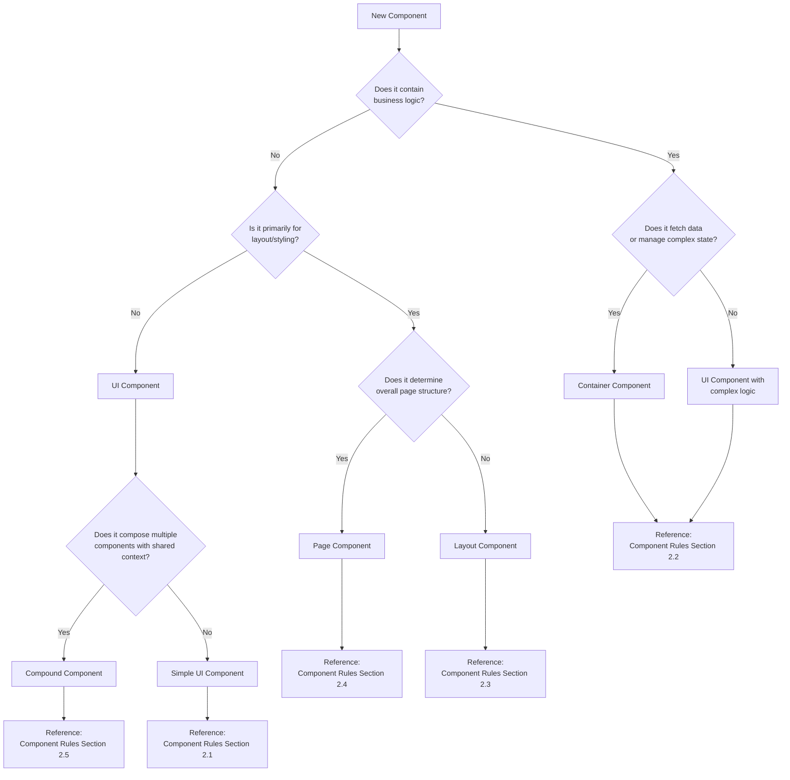
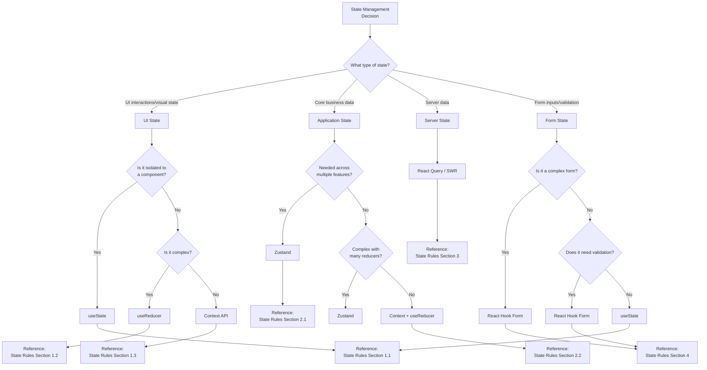
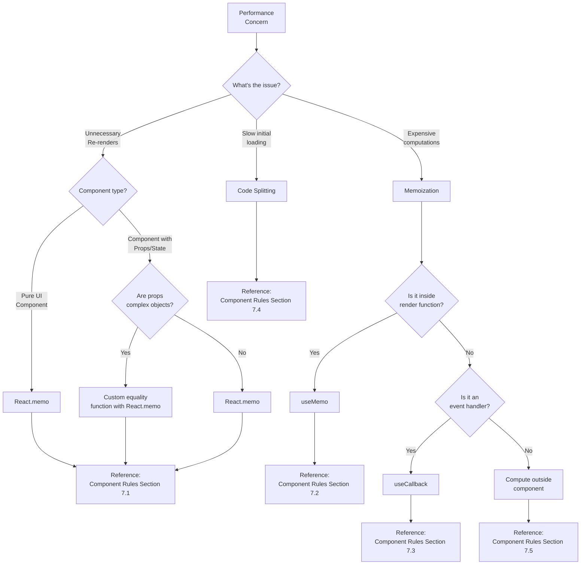
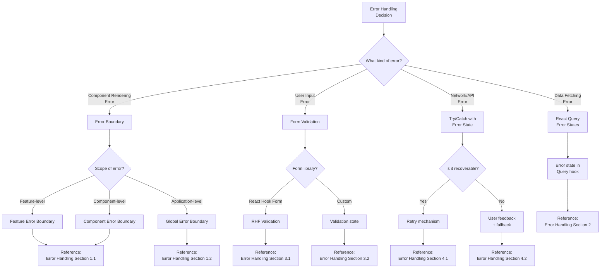
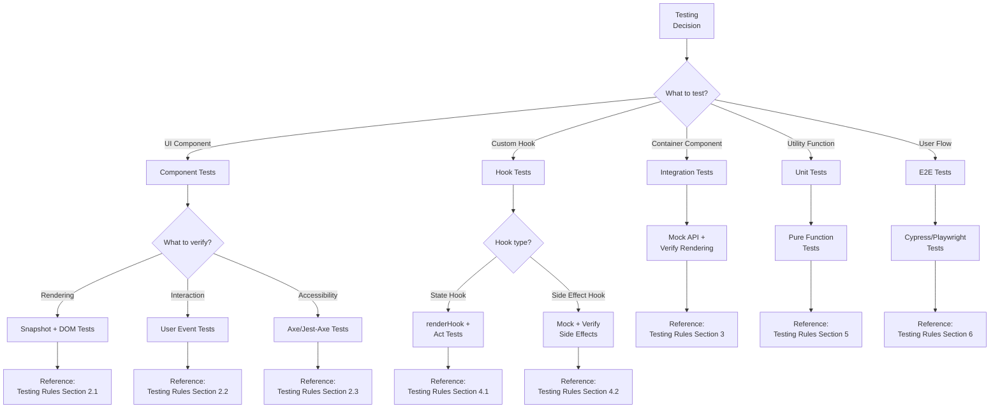
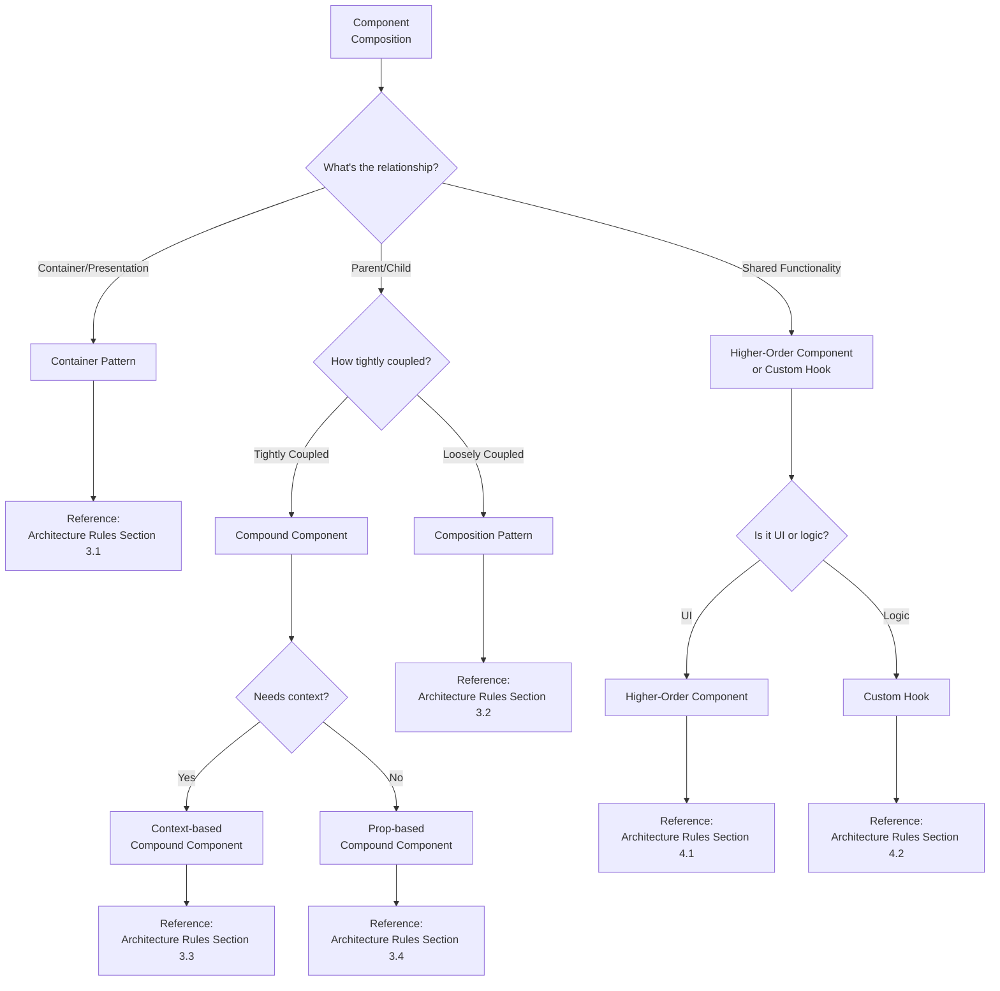
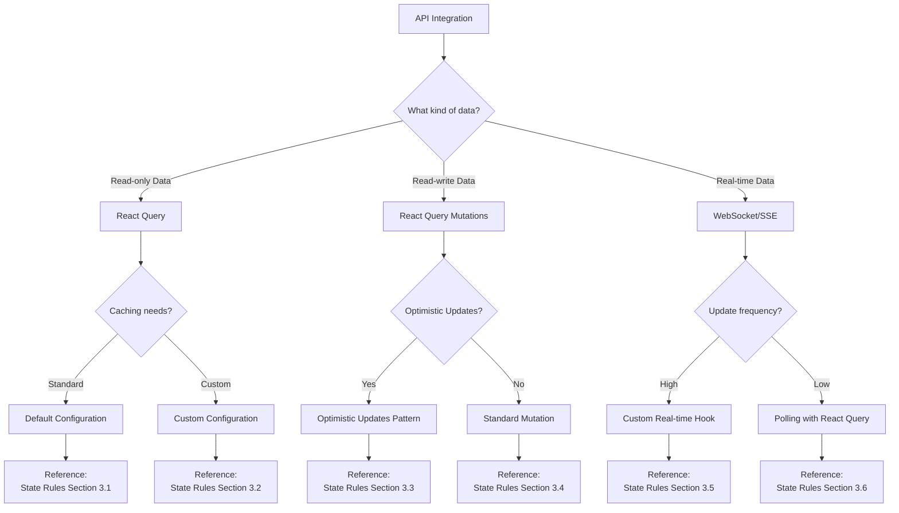
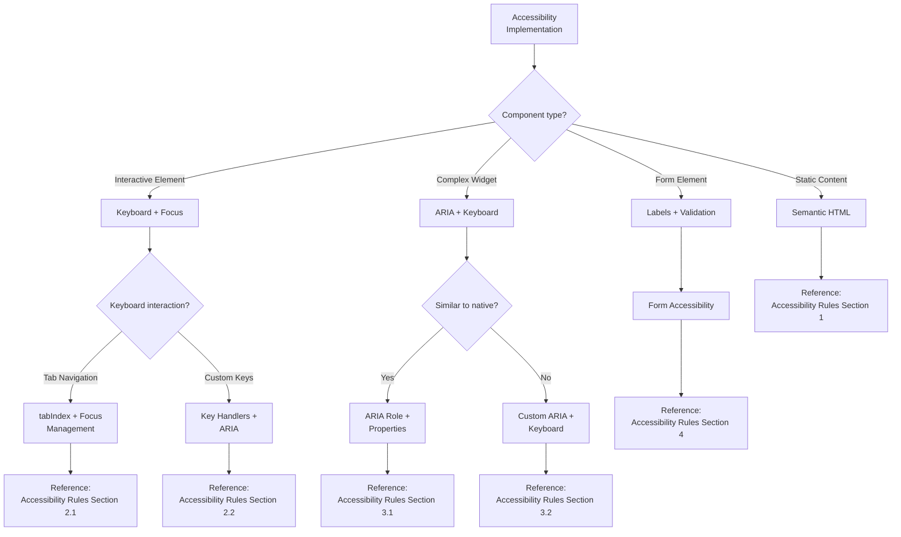
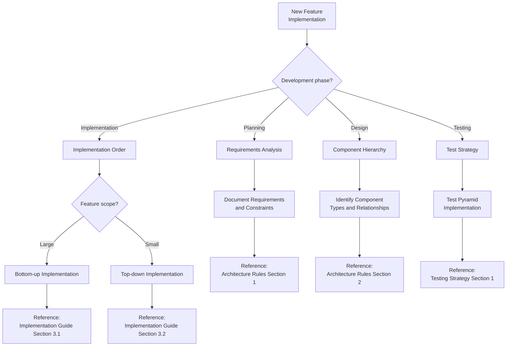

# ZenReact Decision Trees

This document provides visual decision trees to guide AI assistants and developers through common decisions in ZenReact development. These trees represent the decision-making logic embedded throughout the ZenReact documentation in an easy-to-follow format.

## How to Use Decision Trees

1. **Start at the top** of the relevant decision tree
2. **Follow the path** by answering questions about your current task
3. **Arrive at a recommendation** for your specific situation
4. **Reference the related documentation** for more detailed guidance

The trees are presented using Mermaid syntax, which can be rendered in compatible Markdown viewers.

## Component Classification Decision Tree

Use this tree to determine the appropriate component type for a new component.

## State Management Decision Tree

Use this tree to determine the appropriate state management approach.

## Performance Optimization Decision Tree

Use this tree to determine appropriate performance optimizations.

## Error Handling Decision Tree

Use this tree to determine the appropriate error handling strategy.

## Testing Strategy Decision Tree

Use this tree to determine the appropriate testing approach.

## Component Composition Decision Tree

Use this tree to determine the appropriate component composition pattern.

## API Integration Decision Tree

Use this tree to determine the appropriate API integration strategy.

## Accessibility Implementation Decision Tree

Use this tree to determine the appropriate accessibility implementation.

## Implementation Strategy Decision Tree

Use this tree to determine the overall implementation strategy for a new feature.

## Using Decision Trees with Context

Decision trees are most effective when combined with the Context Tracking system. Consider the following workflow:

1. Analyze the current context from the Context Tracking document
2. Identify the decision points relevant to the current task
3. Navigate the appropriate decision tree
4. Document the decision and rationale in the Context Tracking system
5. Apply the recommendation from the decision tree

## Extending Decision Trees

These decision trees can be extended as the ZenReact framework evolves. To add a new decision tree:

1. Identify a common decision point in ZenReact development
2. Map out the decision logic with clear questions and paths
3. Include references to relevant documentation sections
4. Add the tree to this document using Mermaid syntax

## Conclusion

Decision trees provide a structured approach to navigating the many decisions in ZenReact development. By following these visual guides, AI assistants and developers can make consistent, well-informed choices that align with ZenReact best practices. The trees serve as a complement to the detailed documentation, offering a quick reference for common decisions while encouraging deeper exploration of the relevant guidelines. 