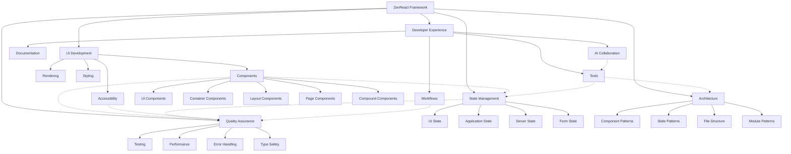

# ZenReact Knowledge Graph

This document provides a visual representation of the relationships between key concepts, rules, and tools in the ZenReact framework. The knowledge graph helps AI assistants and developers understand how different parts of the framework connect and influence each other.

## How to Use the Knowledge Graph

The knowledge graph serves several purposes:

1. **Concept Exploration**: Discover related concepts by following connections
2. **Impact Analysis**: Understand how changes in one area affect others
3. **Knowledge Navigation**: Find relevant documentation by concept
4. **Mental Modeling**: Build a comprehensive understanding of the framework

## Core Concept Relationships

```mermaid
graph TD
    %% Core Framework Concepts
    ZR[ZenReact Framework] --> CR[Component Rules]
    ZR --> SR[State Rules]
    ZR --> AR[Architecture Rules]
    ZR --> TR[Testing Rules]
    ZR --> ACR[Accessibility Rules]
    ZR --> CSR[Coding Standards Rules]
    ZR --> AICR[AI Collaboration Rules]
    
    %% Component Types
    CR --> CT[Component Types]
    CT --> UIC[UI Components]
    CT --> CC[Container Components]
    CT --> LC[Layout Components]
    CT --> PC[Page Components]
    CT --> CPC[Compound Components]
    
    %% State Categories
    SR --> SC[State Categories]
    SC --> UIS[UI State]
    SC --> AS[Application State]
    SC --> SS[Server State]
    SC --> FS[Form State]
    
    %% Technologies
    SR --> T[Technologies]
    T --> RH[React Hooks]
    T --> ZS[Zustand]
    T --> CA[Context API]
    T --> RQ[React Query]
    T --> RHF[React Hook Form]
    
    %% Component Lifecycle
    CR --> CL[Component Lifecycle]
    CL --> RE[Rendering]
    CL --> EF[Effects]
    CL --> MEM[Memoization]
    
    %% Architecture Patterns
    AR --> AP[Architecture Patterns]
    AP --> CP[Component Patterns]
    AP --> SP[State Patterns]
    AP --> FP[Feature Patterns]
    
    %% Testing Types
    TR --> TT[Testing Types]
    TT --> UT[Unit Tests]
    TT --> IT[Integration Tests]
    TT --> E2E[E2E Tests]
    
    %% Accessibility Concerns
    ACR --> AC[Accessibility Concerns]
    AC --> KN[Keyboard Navigation]
    AC --> SR2[Screen Readers]
    AC --> CO[Color Contrast]
    AC --> FM[Focus Management]
    
    %% Implementation Tools
    ZR --> IT2[Implementation Tools]
    IT2 --> CT2[Context Tracking]
    IT2 --> DT[Decision Trees]
    IT2 --> SE[Self-Evaluation]
    IT2 --> DG[Debugging Guide]
    IT2 --> TS[Training Scenarios]
    IT2 --> WO[Workflow Orchestration]
    IT2 --> KG[Knowledge Graph]

    %% Connections between concepts
    UIC --> UT
    CC --> IT
    UIS --> RH
    AS --> ZS
    SS --> RQ
    FS --> RHF
    CT2 --> WO
    DT --> WO
    SE --> DG
```

## Component Rules Relationships

```mermaid
graph TD
    %% Component Types Relationships
    CR[Component Rules] --> CL[Classification]
    CR --> ST[Structure]
    CR --> PR[Props]
    CR --> HL[Hooks/Lifecycle]
    CR --> RE[Rendering]
    CR --> PE[Performance]
    CR --> ER[Error Handling]
    CR --> DO[Documentation]
    CR --> TE[Testing]
    
    %% Classification Details
    CL --> UIC[UI Components]
    CL --> CC[Container Components]
    CL --> LC[Layout Components]
    CL --> PC[Page Components]
    CL --> CPC[Compound Components]
    
    %% Structure Details
    ST --> FS[File Structure]
    ST --> NS[Naming Standards]
    ST --> IM[Import Organization]
    ST --> EX[Export Patterns]
    
    %% Props Details
    PR --> PT[Prop Types]
    PR --> DP[Default Props]
    PR --> PV[Prop Validation]
    PR --> PD[Prop Destructuring]
    
    %% Hooks/Lifecycle Details
    HL --> HO[Hook Order]
    HL --> ED[Effect Dependencies]
    HL --> EC[Effect Cleanup]
    HL --> CH[Custom Hooks]
    
    %% Rendering Details
    RE --> CR2[Conditional Rendering]
    RE --> LR[List Rendering]
    RE --> FR[Fragment Usage]
    RE --> DR[Dynamic Rendering]
    
    %% Performance Details
    PE --> ME[Memoization]
    PE --> VR[Virtual Rendering]
    PE --> CO[Computation Optimization]
    PE --> EB[Event Binding]
    
    %% Error Handling Details
    ER --> EB2[Error Boundaries]
    ER --> FL[Fallbacks]
    ER --> LH[Loading Handling]
    ER --> EH[Error Hooks]
    
    %% Documentation Details
    DO --> JS[JSDoc]
    DO --> EX2[Examples]
    DO --> SB[Storybook]
    DO --> US[Usage Guides]
    
    %% Testing Details
    TE --> UT[Unit Testing]
    TE --> CT[Component Testing]
    TE --> AT[Accessibility Testing]
    TE --> ST2[Snapshot Testing]
    
    %% Cross-concept connections
    UIC -.-> PT
    CC -.-> CH
    PE -.-> EB
    ME -.-> SR[State Rules]
    ER -.-> AR[Architecture Rules]
```

## State Rules Relationships

```mermaid
graph TD
    %% State Rules Relationships
    SR[State Rules] --> SC[State Categories]
    SR --> SM[State Management]
    SR --> SD[State Design]
    SR --> SU[State Updates]
    SR --> SP[State Persistence]
    SR --> SI[State Integration]
    
    %% State Categories Details
    SC --> UIS[UI State]
    SC --> AS[Application State]
    SC --> SS[Server State]
    SC --> FS[Form State]
    
    %% State Management Technologies
    SM --> RH[React Hooks]
    SM --> CA[Context API]
    SM --> ZS[Zustand]
    SM --> RQ[React Query]
    SM --> RHF[React Hook Form]
    
    %% State Design Details
    SD --> NO[Normalization]
    SD --> AT[Atomic Design]
    SD --> DS[Domain Separation]
    SD --> SS2[Single Source of Truth]
    
    %% State Updates Details
    SU --> IM[Immutability]
    SU --> AC[Action Creators]
    SU --> RS[Reducers]
    SU --> OP[Optimistic Updates]
    
    %% State Persistence Details
    SP --> LC[Local Storage]
    SP --> SS3[Session Storage]
    SP --> CO[Cookies]
    SP --> IDB[IndexedDB]
    
    %% State Integration Details
    SI --> CP[Component Props]
    SI --> HO[Hooks]
    SI --> SE[Selectors]
    SI --> SB[Subscription]
    
    %% Cross-concept connections
    UIS -.-> RH
    AS -.-> ZS
    SS -.-> RQ
    FS -.-> RHF
    IM -.-> CR[Component Rules]
    SE -.-> PE[Performance]
```

## Implementation Tools Relationships

```mermaid
graph TD
    %% Implementation Tools Relationships
    IT[Implementation Tools] --> CT[Context Tracking]
    IT --> DT[Decision Trees]
    IT --> SE[Self-Evaluation]
    IT --> DG[Debugging Guide]
    IT --> TS[Training Scenarios]
    IT --> WO[Workflow Orchestration]
    IT --> KG[Knowledge Graph]
    
    %% Context Tracking Details
    CT --> PM[Project Metadata]
    CT --> DC[Development Context]
    CT --> CC[Code Context]
    CT --> IC[Implementation Context]
    CT --> DOC[Documentation Context]
    
    %% Decision Trees Details
    DT --> CP[Component Planning]
    DT --> SP[State Planning]
    DT --> AP[Architecture Planning]
    DT --> TP[Testing Planning]
    DT --> EP[Error Handling Planning]
    
    %% Self-Evaluation Details
    SE --> KA[Knowledge Assessment]
    SE --> IE[Implementation Evaluation]
    SE --> GA[Gap Analysis]
    SE --> AP2[Action Planning]
    SE --> QR[Quantitative Rubric]
    
    %% Debugging Guide Details
    DG --> RD[Rendering Debugging]
    DG --> SD[State Debugging]
    DG --> LD[Lifecycle Debugging]
    DG --> DD[Data Fetching Debugging]
    DG --> PD[Performance Debugging]
    
    %% Training Scenarios Details
    TS --> BS[Basic Scenarios]
    TS --> IS[Intermediate Scenarios]
    TS --> AS[Advanced Scenarios]
    TS --> INS[Integration Scenarios]
    TS --> PS[Project Scenarios]
    
    %% Workflow Orchestration Details
    WO --> CGP[Context Gathering Process]
    WO --> PP[Planning Process]
    WO --> IP[Implementation Process]
    WO --> VP[Validation Process]
    WO --> RP[Refinement Process]
    
    %% Knowledge Graph Details
    KG --> CR[Concept Relationships]
    KG --> RR[Rule Relationships]
    KG --> TR[Tool Relationships]
    KG --> THR[Thematic Relationships]
    
    %% Cross-tool connections
    CT -.-> WO
    DT -.-> WO
    SE -.-> TS
    DG -.-> SE
    KG -.-> TS
    WO -.-> IT
```

## Development Workflow Relationships

```mermaid
graph TD
    %% Development Workflow Relationships
    DW[Development Workflow] --> PL[Planning]
    DW --> IM[Implementation]
    DW --> VA[Validation]
    DW --> RE[Refinement]
    DW --> DO[Documentation]
    
    %% Planning Details
    PL --> RG[Requirements Gathering]
    PL --> CA[Component Architecture]
    PL --> SP[State Planning]
    PL --> TP[Technical Planning]
    
    %% Implementation Details
    IM --> CO[Component Creation]
    IM --> ST[State Implementation]
    IM --> ID[Integration Development]
    IM --> UI[UI Development]
    
    %% Validation Details
    VA --> TE[Testing]
    VA --> AC[Accessibility Checking]
    VA --> PE[Performance Evaluation]
    VA --> DE[Debugging]
    
    %% Refinement Details
    RE --> OP[Optimization]
    RE --> RE2[Refactoring]
    RE --> EP[Edge Case Handling]
    RE --> FP[Final Polishing]
    
    %% Documentation Details
    DO --> CD[Code Documentation]
    DO --> UD[Usage Documentation]
    DO --> TD[Testing Documentation]
    DO --> AD[Architecture Documentation]
    
    %% Cross-concept connections
    PL -.-> CT[Context Tracking]
    PL -.-> DT[Decision Trees]
    IM -.-> CR[Component Rules]
    IM -.-> SR[State Rules]
    VA -.-> DG[Debugging Guide]
    VA -.-> SE[Self-Evaluation]
    RE -.-> TR[Training Scenarios]
    DO -.-> KG[Knowledge Graph]
```

## Thematic Concept Map

The following diagram shows relationships between concepts across different areas of the ZenReact framework, organized by theme:

## Practical Applications of the Knowledge Graph

### Use Case 1: Navigating Documentation by Concept

When encountering a specific ZenReact concept, use the knowledge graph to:

1. Locate the concept in the appropriate graph
2. Identify connected concepts and rules
3. Follow connections to find relevant documentation
4. Understand dependencies and relationships

For example, to understand UI Component architecture:
- Find "UI Components" in the Component Rules graph
- Trace connections to Structure, Props, and Testing
- Review connections to State Rules for state management patterns
- Consider Performance connections for optimization opportunities

### Use Case 2: Impact Analysis for Changes

When making changes to a component or pattern, use the knowledge graph to:

1. Identify the primary concept being changed
2. Trace all connections to related concepts
3. Assess potential impacts across the framework
4. Update affected documentation and implementations

For example, changing a State Update pattern:
- Locate "State Updates" in the State Rules graph
- Follow connections to State Management, Component Rules, etc.
- Assess impact on Performance, Testing, and Error Handling
- Ensure consistent updates across all affected areas

### Use Case 3: Learning Path Generation

For structured learning of ZenReact concepts:

1. Start with core framework concepts
2. Follow connections to explore related concepts
3. Use decision trees to apply knowledge
4. Validate understanding with training scenarios

Recommended learning path:
1. Framework Overview → Component Rules → State Rules
2. Implementation Tools → Decision Trees → Self-Evaluation
3. Architecture Rules → Testing Rules → Performance Optimization
4. Workflow Orchestration → Practical Applications

## Concept Glossary

| Concept | Description | Related Documents |
|---------|-------------|-------------------|
| UI Components | Presentational components focused on rendering UI elements | Component Rules Section 2.1 |
| Container Components | Components that manage state and data fetching | Component Rules Section 2.2 |
| UI State | State related to visual elements and interactions | State Rules Section 1 |
| Application State | Core business data shared across components | State Rules Section 2 |
| Server State | Data fetched from external APIs | State Rules Section 3 |
| Form State | State for managing form inputs and validation | State Rules Section 4 |
| Context Tracking | System for tracking development context | Context Tracking Document |
| Decision Trees | Visual guides for implementation decisions | Decision Trees Document |
| Self-Evaluation | Framework for assessing implementation quality | Self-Evaluation Framework |
| Debugging Guide | Structured approaches to resolving issues | Debugging Guide |
| Training Scenarios | Practice scenarios for learning ZenReact | Training Scenarios |
| Workflow Orchestration | Integration of tools into cohesive workflow | Workflow Orchestration |

## Extending the Knowledge Graph

The ZenReact Knowledge Graph can be extended as the framework evolves:

1. **Adding new concepts**:
   - Identify the appropriate graph section
   - Add the new concept node
   - Connect to related existing concepts
   - Update the concept glossary

2. **Refining relationships**:
   - Review existing connections for accuracy
   - Add missing relationships between concepts
   - Clarify relationship types (dependency, influence, etc.)
   - Document significant relationship changes

3. **Creating specialized views**:
   - Develop task-specific subgraphs
   - Create role-based views (developer, designer, etc.)
   - Generate implementation-focused diagrams
   - Build learning progression paths

## Conclusion

The ZenReact Knowledge Graph provides a visual representation of the framework's concepts and their relationships. By understanding these connections, developers and AI assistants can navigate the complexity of React development more effectively, make informed decisions, and maintain consistency across implementations. This living document will continue to evolve alongside the ZenReact framework, providing an up-to-date map of its conceptual landscape. 