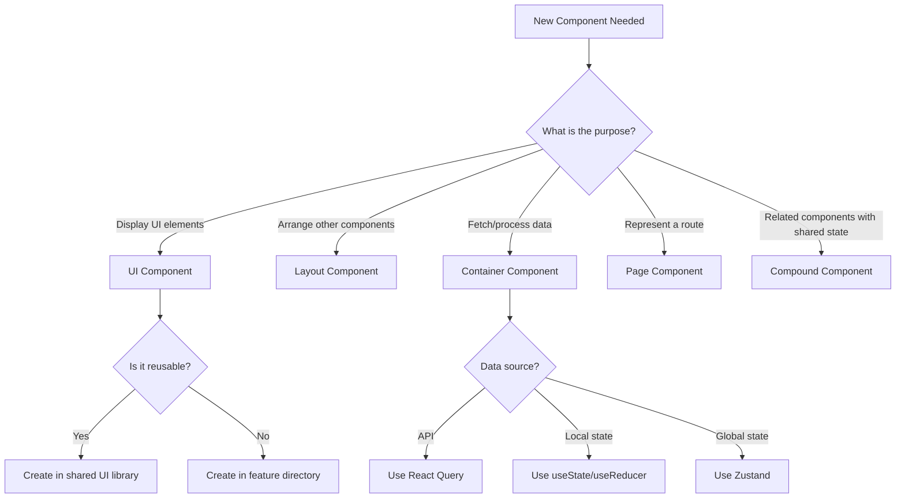
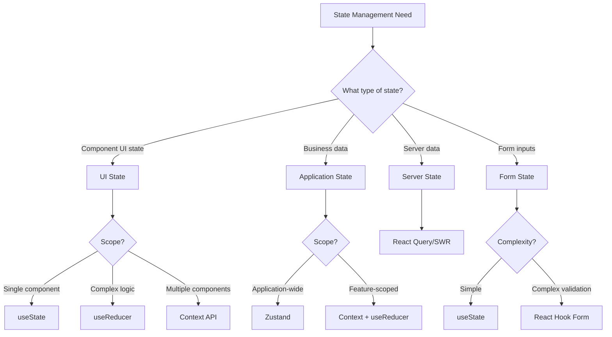
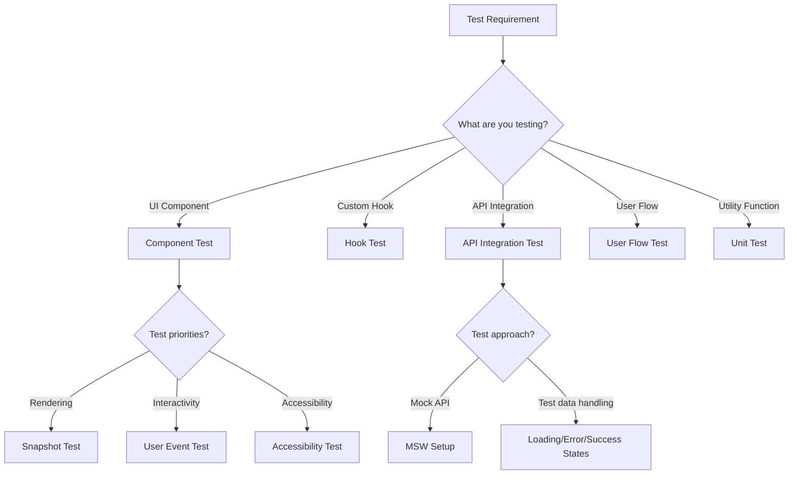
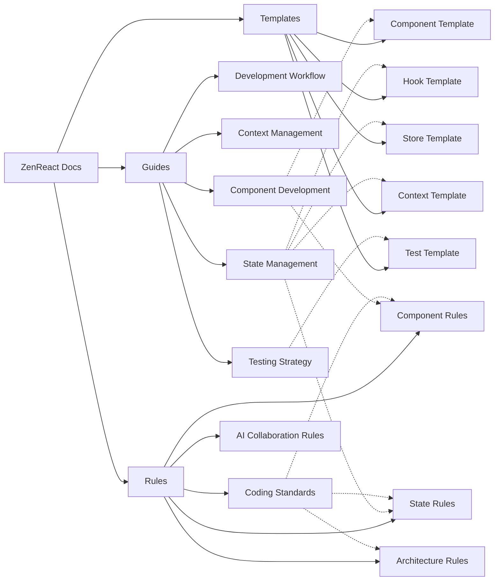
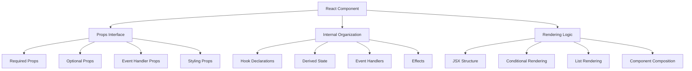
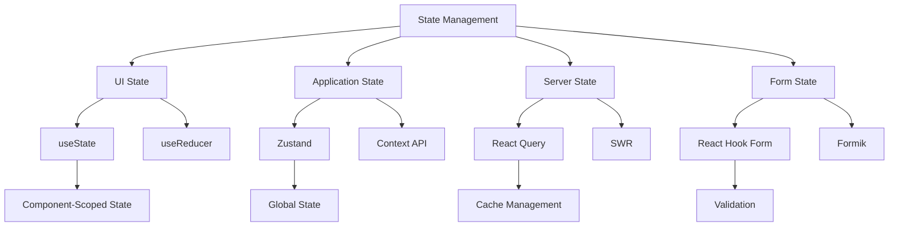
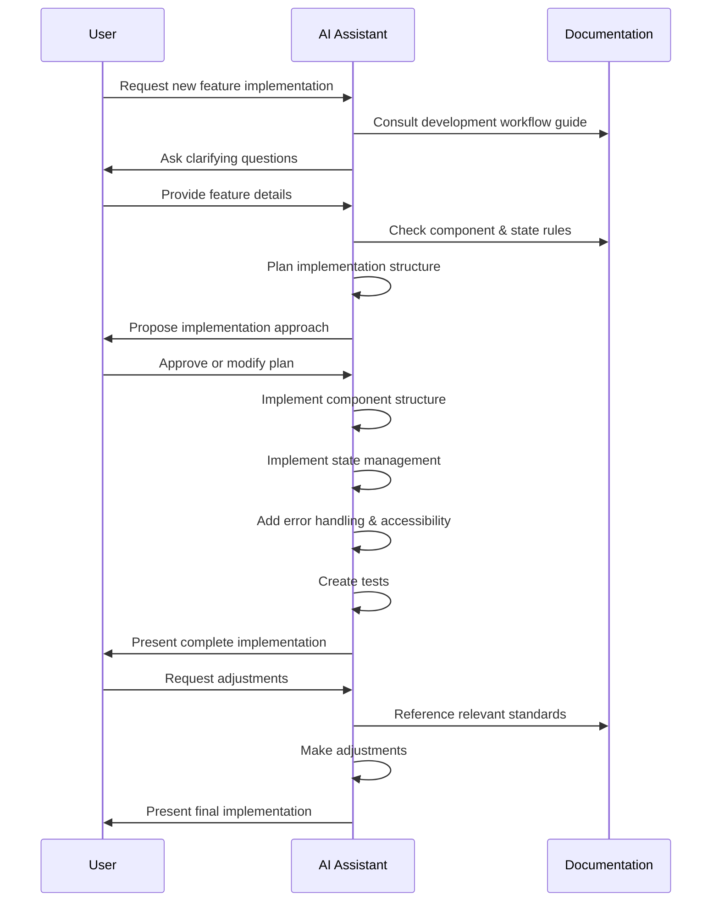
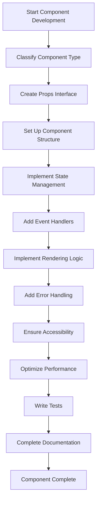
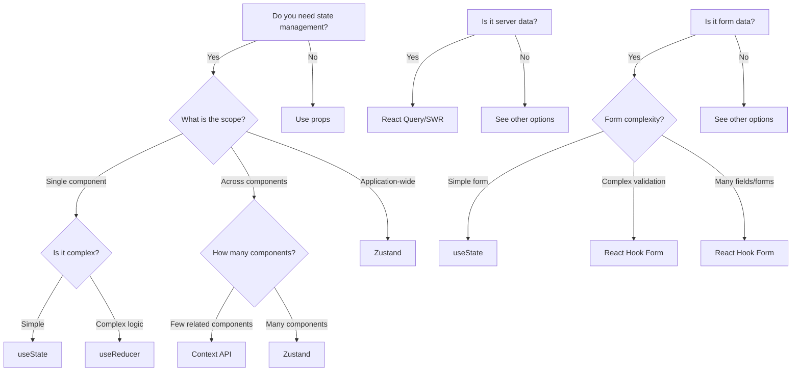

# ZenReact Visualization Guide for AI Assistants

This guide provides visual aids designed to help AI assistants navigate the ZenReact documentation effectively. These visualizations serve as quick reference tools for decision-making and understanding relationships between different aspects of the framework.

## Decision Trees

### 1. Component Selection Decision Tree

### 2. State Management Selection Tree

### 3. Testing Approach Decision Tree

## Knowledge Graphs

### 1. ZenReact Documentation Relationships

### 2. Component Structure Map

### 3. State Management Map

## Implementation Flow Diagrams

### 1. Feature Development Flow

### 2. Component Development Process

## Reference Tables

### Component Types Quick Reference

| Component Type | Primary Purpose | State Approach | Example Use Cases |
|----------------|----------------|----------------|-------------------|
| UI Component | Display UI elements | Local state only | Buttons, Cards, Inputs |
| Layout Component | Arrange other components | Minimal/layout state | Grid, Flex, Container |
| Container Component | Data fetching & processing | External state | Data listings, forms with submission |
| Page Component | Route-level component | Combines other components | Product page, settings page |
| Compound Component | Related components with shared state | Context API | Tabs, Accordion, Select |

### State Management Quick Reference

| State Type | When to Use | Recommended Technology | Key Considerations |
|------------|------------|------------------------|-------------------|
| UI State | Component appearance/behavior | useState, useReducer | Keep local, reset on unmount |
| Application State | Business data across components | Zustand | Organize by domain, normalize data |
| Server State | API data with caching | React Query, SWR | Handle loading/error states |
| Form State | User input with validation | React Hook Form | Implement validation, track dirty/touched |

### Testing Types Quick Reference

| Test Type | Primary Focus | Tools | Key Patterns |
|-----------|--------------|-------|--------------|
| Component Tests | Rendering, interactions | React Testing Library | User-centric testing, accessibility |
| Hook Tests | Custom hook behavior | React Hooks Testing Library | Initialize, act, assert pattern |
| API Tests | Data fetching, mutations | MSW | Mock responses, test states |
| Integration Tests | Component interactions | React Testing Library | User flows, state changes |
| Unit Tests | Utility functions | Jest | Input/output testing |

## Tool Selection Guide

### Choosing the Right State Management Tool

## Conclusion

These visualization tools are designed to help AI assistants navigate the ZenReact documentation more effectively. Use them as quick references when making decisions about implementation approaches, but always refer to the detailed documentation for comprehensive guidance.

Remember that these visualizations are simplifications of more complex relationships and decision processes. When in doubt, consult the relevant documentation sections for detailed guidance. 