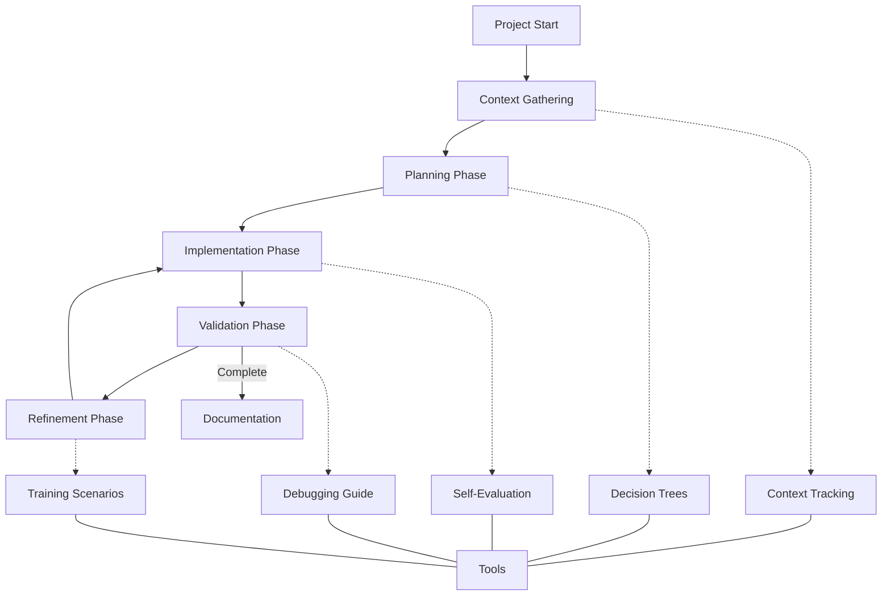
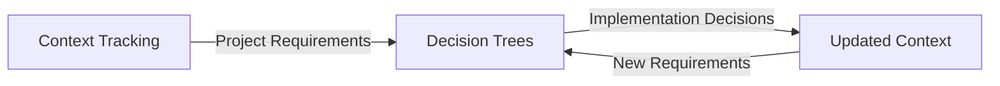
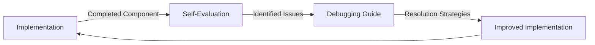
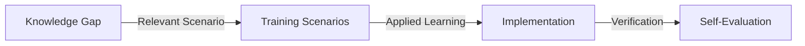

# ZenReact Workflow Orchestration

This document outlines how to effectively combine and utilize the various ZenReact tools and resources throughout the development lifecycle. It provides a structured workflow that integrates context tracking, decision trees, training scenarios, self-evaluation, and debugging techniques into a cohesive development process.

## Integrated Workflow Overview

The ZenReact workflow integrates multiple tools at different stages of development:



## 1. Project Setup and Context Gathering

### 1.1 Initial Context Acquisition

Begin by gathering essential project information using the Context Tracking System:

1. Create a new context object following the structure in [Context Tracking](./context-tracking.md)
2. Populate project metadata and tech stack information
3. Document initial requirements and constraints
4. Identify existing components and code structure (if applicable)

### 1.2 Context Storage

Store the context in a shared location that can be referenced throughout development:

```
Context Storage Options:
- JSON file in project repository
- Documentation comments in key files
- Project management system
- Conversation history in AI assistant interactions
```

### 1.3 Initial Documentation Review

Review relevant ZenReact documentation based on the project requirements:

1. Identify applicable rule sets (Component Rules, State Rules, etc.)
2. Review implementation templates for planned components
3. Study architecture guidelines for the project structure

## 2. Planning Phase

### 2.1 Component Planning

Use Decision Trees to plan component structure:

1. Access the [Component Classification Decision Tree](./decision-trees.md#component-classification-decision-tree)
2. Identify component types needed for the feature
3. Document decisions in Context Tracking system

Example workflow:

```
1. Review feature requirements from Context
2. For each UI element, follow Component Classification Tree
3. Record component classification decisions:
   {
     "decisions": [
       {
         "description": "Use Container pattern for ProductList",
         "reasoning": "Needs to fetch and manage product data",
         "rule_references": ["Component Rule 2.2"]
       }
     ]
   }
```

### 2.2 State Management Planning

Use Decision Trees to plan state management strategy:

1. Access the [State Management Decision Tree](./decision-trees.md#state-management-decision-tree)
2. Identify state categories and appropriate technologies
3. Document decisions in Context Tracking system

Example workflow:

```
1. Analyze state requirements from Context
2. For each state need, follow State Management Tree
3. Record state management decisions:
   {
     "decisions": [
       {
         "description": "Use Zustand for shopping cart state",
         "reasoning": "Application-wide state with persistence needs",
         "rule_references": ["State Rule 2.1"]
       }
     ]
   }
```

### 2.3 Architecture Planning

Plan the overall architecture using Decision Trees:

1. Access the [Implementation Strategy Decision Tree](./decision-trees.md#implementation-strategy-decision-tree)
2. Determine the implementation order and approach
3. Document architecture decisions in Context Tracking system

### 2.4 Deliverable: Implementation Plan

Create a comprehensive implementation plan that includes:

1. Component hierarchy with types and responsibilities
2. State management strategy for different state categories
3. Implementation order for components and features
4. Key architectural decisions with rationales

## 3. Implementation Phase

### 3.1 Component Implementation

Follow a structured approach for each component:

1. Review the appropriate component template based on classification
2. Implement the component following ZenReact guidelines
3. Use Self-Evaluation to verify compliance
4. Update Context Tracking with component status

Example workflow:

```
1. Select component to implement from plan
2. Use appropriate component template
3. Implement component following guidelines
4. Self-evaluate using Component checklist
5. Update context:
   {
     "active_components": [
       {
         "name": "ProductCard",
         "type": "UI",
         "status": "implementing",
         "path": "src/components/ProductCard.tsx"
       }
     ]
   }
```

### 3.2 State Implementation

Follow a structured approach for state management:

1. Use the appropriate state template based on Decision Tree guidance
2. Implement state logic following ZenReact guidelines
3. Use Self-Evaluation to verify compliance
4. Update Context Tracking with state implementation status

### 3.3 Continuous Self-Evaluation

Regularly evaluate implementation quality:

1. Use the [Self-Evaluation Framework](./self-evaluation.md) after completing components
2. Apply the appropriate checklists based on implementation type
3. Document gaps and action plans
4. Address high-priority gaps immediately

Example workflow:

```
1. Complete ProductCard component
2. Perform self-evaluation using Component checklist
3. Identify gaps:
   {
     "gap_analysis": [
       {
         "area": "Accessibility",
         "current": "Missing keyboard navigation",
         "standard": "Component Rule 6.1",
         "remediation": "Add keyboard handlers for interactive elements"
       }
     ]
   }
4. Address gaps based on priority
```

### 3.4 Iterative Development

Continue implementation in iterative cycles:

1. Implement a component or feature
2. Self-evaluate and fix issues
3. Update Context Tracking
4. Move to the next component or feature

## 4. Validation Phase

### 4.1 Comprehensive Testing

Validate the implementation against requirements:

1. Use the Testing Strategy Decision Tree to plan testing approach
2. Implement appropriate tests for different components
3. Verify that all components meet ZenReact standards
4. Document test coverage in Context Tracking

### 4.2 Issue Identification and Debugging

Address any issues discovered during validation:

1. Document observed issues in Context Tracking
2. Use the [Debugging Guide](./debugging-guide.md) to diagnose problems
3. Apply structured debugging approach based on issue category
4. Implement fixes following ZenReact guidelines

Example workflow:

```
1. Identify rendering issue in ProductList
2. Follow Rendering Issues diagnostic approach from Debugging Guide
3. Document issue:
   {
     "issues": [
       {
         "description": "ProductList disappears after data loads",
         "category": "Rendering",
         "status": "investigating"
       }
     ]
   }
4. Apply diagnostic steps to identify root cause
5. Implement fix and verify resolution
6. Update issue status in context
```

### 4.3 Performance Optimization

Optimize implementation using Decision Trees:

1. Use the Performance Optimization Decision Tree to identify opportunities
2. Apply appropriate optimizations based on component types
3. Verify performance improvements
4. Document optimization decisions in Context Tracking

### 4.4 Accessibility Validation

Ensure accessibility compliance:

1. Use the Accessibility Implementation Decision Tree
2. Verify implementation against WCAG standards
3. Fix accessibility issues
4. Document accessibility status in Context Tracking

## 5. Refinement Phase

### 5.1 Code Review and Self-Evaluation

Conduct final evaluation before completion:

1. Perform comprehensive Self-Evaluation using all relevant checklists
2. Document any remaining gaps
3. Prioritize and address critical gaps
4. Update Context Tracking with final status

### 5.2 Documentation Completion

Ensure comprehensive documentation:

1. Verify JSDoc comments for all components
2. Create usage examples for complex components
3. Update README files and documentation
4. Document key decisions and architecture

### 5.3 Knowledge Transfer

Prepare for knowledge sharing:

1. Summarize implementation decisions and rationale
2. Highlight important patterns and approaches
3. Document lessons learned
4. Create onboarding material for other developers

## 6. Cross-Cutting Concerns

### 6.1 Continuous Context Tracking

Maintain context throughout the development process:

1. Update context after significant decisions
2. Refresh context when requirements change
3. Track project status through context updates
4. Use context for reporting and communication

Example workflow:

```
After each development session:
1. Update implementation statuses
2. Record new decisions
3. Document outstanding questions
4. Provide context summary for next session
```

### 6.2 Decision Management

Maintain a record of key decisions:

1. Document major decisions using the standard format in Context Tracking
2. Include rationale and alternatives considered
3. Reference relevant ZenReact rules
4. Use decisions to inform future implementation choices

### 6.3 Collaborative Development

Support effective collaboration:

1. Share context updates with team members
2. Use context summaries for handoffs
3. Document outstanding questions and issues
4. Maintain consistent terminology and references

## Tool Integration Patterns

### Pattern 1: Context-Driven Decision Making

Integrate Context Tracking with Decision Trees:



Example workflow:

1. Extract requirements from Context Tracking
2. Apply appropriate Decision Tree to make implementation decisions
3. Document decisions back in Context Tracking
4. Use updated context to inform next decisions

### Pattern 2: Evaluation-Driven Improvement

Integrate Self-Evaluation with Debugging Guide:



Example workflow:

1. Complete component implementation
2. Perform Self-Evaluation to identify issues
3. Use Debugging Guide to diagnose and resolve issues
4. Apply fixes to implementation
5. Re-evaluate to verify resolution

### Pattern 3: Training-Based Learning

Use Training Scenarios to build understanding:



Example workflow:

1. Identify area requiring deeper understanding
2. Select relevant Training Scenario
3. Work through scenario to build knowledge
4. Apply learning to implementation
5. Verify correct application through Self-Evaluation

## Workflow Integration Examples

### Example 1: New Feature Development

```markdown
## Feature Development: Shopping Cart

### 1. Context Gathering
- Created initial context with project metadata
- Documented shopping cart requirements:
  - Add/remove items
  - Update quantities
  - Persist between sessions
  - Display in header and dedicated page

### 2. Planning
- Used Component Classification Tree to identify:
  - CartWidget (UI Component)
  - CartPage (Page Component)
  - CartManager (Container Component)
- Used State Management Tree to select:
  - Zustand for cart state (Application State)
  - localStorage for persistence

### 3. Implementation
- Created cart store following Zustand pattern
- Implemented CartWidget with Self-Evaluation (4.5/5)
- Addressed accessibility gap in CartWidget
- Implemented CartPage with Self-Evaluation (4.2/5)

### 4. Validation
- Identified issue: cart count not updating
- Used Debugging Guide (State Management Issues)
- Fixed selector implementation in CartWidget
- Verified resolution with test cases
- Applied performance optimization to CartPage

### 5. Refinement
- Conducted final Self-Evaluation (4.8/5)
- Completed documentation with examples
- Updated context with implementation details
```

### Example 2: Bug Resolution

```markdown
## Bug Resolution: Product Filtering

### 1. Context Gathering
- Updated context with bug details:
  - Product filtering not working when category changes
  - Affects ProductList component
  - High priority

### 2. Diagnosis
- Used Debugging Guide (State Management Issues)
- Traced state flow through components
- Identified issue: filter reset on category change

### 3. Resolution
- Applied fix based on State Rules Section 3.2
- Updated state management to preserve filter state
- Self-evaluated fix against state management checklist

### 4. Validation
- Verified fix with test cases
- Confirmed no regression issues
- Updated context with resolution
```

## Customizing the Workflow

The ZenReact workflow can be customized based on project needs:

1. **For small projects**:
   - Simplify context tracking to essential elements
   - Focus on key decision trees
   - Use lightweight self-evaluation

2. **For large projects**:
   - Expand context tracking with additional metadata
   - Create custom decision trees for project-specific patterns
   - Implement formal review processes with self-evaluation

3. **For team environments**:
   - Establish shared context repository
   - Create team-specific training scenarios
   - Standardize debugging practices

## Conclusion

The ZenReact Workflow Orchestration provides a cohesive framework for utilizing the various tools and resources available in the ZenReact ecosystem. By integrating Context Tracking, Decision Trees, Self-Evaluation, Debugging Guide, and Training Scenarios, developers and AI assistants can navigate the complexity of React development with confidence, consistency, and quality.

This orchestrated approach ensures that implementations adhere to ZenReact standards while providing structured processes for decision-making, implementation, validation, and improvement. By following this workflow, teams can achieve more predictable outcomes, higher quality code, and better knowledge sharing across projects. 