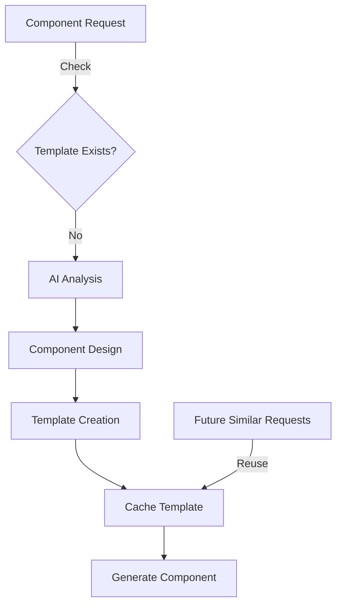

# AI Custom Component Generation

## Flow Overview



## 1. AI Component Analysis

```typescript
interface ComponentAnalysis {
  purpose: string; // Component purpose
  structure: {
    tag: string; // Base HTML element
    className: string[]; // Suggested DaisyUI classes
    children?: boolean; // Should accept children
  };
  props: PropDefinition[]; // Required props
}

// Example:
const analysis = {
  purpose: 'Display product information in a card layout',
  structure: {
    tag: 'div',
    className: ['card', 'card-compact', 'shadow-lg'],
    children: true,
  },
  props: [
    { name: 'title', type: 'string', required: true },
    { name: 'price', type: 'number', required: true },
    { name: 'image', type: 'string', required: false },
  ],
};
```

## 2. Component Generation Process

### Request Processing

```typescript
class AIComponentProcessor {
  async process(request: string): Promise<Template> {
    // 1. Analyze request
    const analysis = await this.analyzeComponent(request);

    // 2. Generate template
    const template = await this.createTemplate(analysis);

    // 3. Cache for reuse
    await this.cacheTemplate(template);

    return template;
  }

  private async analyzeComponent(request: string): Promise<ComponentAnalysis> {
    return this.ai.analyze(`
      Create a React component that:
      - Matches the description: ${request}
      - Uses DaisyUI classes
      - Has typescript props
    `);
  }
}
```

### Template Creation

```typescript
class TemplateCreator {
  createFromAnalysis(analysis: ComponentAnalysis): Template {
    return {
      id: this.generateId(analysis),
      structure: this.createStructure(analysis),
      props: analysis.props,
      styles: analysis.structure.className,
      validation: this.createValidation(analysis),
    };
  }

  private createStructure(analysis: ComponentAnalysis): string {
    return `
      export const ${this.formatName(analysis)} = ({
        ${this.generateProps(analysis.props)},
        className,
        ${analysis.structure.children ? 'children,' : ''}
        ...props
      }) => (
        <${analysis.structure.tag}
          className={\`${analysis.structure.className.join(' ')} \${className}\`}
          {...props}
        >
          ${this.generateContent(analysis)}
        </${analysis.structure.tag}>
      );
    `;
  }
}
```

## 3. Examples

### Product Card Request

```typescript
// Input: "Create a product card with image, title, price and buy button"

// Generated Component:
export const ProductCard = ({
  title,
  price,
  image,
  onBuy,
  className,
  ...props
}) => (
  <div
    className={`card card-compact shadow-lg ${className}`}
    {...props}
  >
    <figure>
      
    </figure>
    <div className="card-body">
      <h2 className="card-title">{title}</h2>
      <p className="text-xl font-bold">${price}</p>
      <div className="card-actions justify-end">
        <button
          className="btn btn-primary"
          onClick={onBuy}
        >
          Buy Now
        </button>
      </div>
    </div>
  </div>
);
```

### Alert Component Request

```typescript
// Input: "Create an alert component with different severity levels"

// Generated Component:
export const Alert = ({
  severity = 'info',
  message,
  onClose,
  className,
  ...props
}) => (
  <div
    className={`alert ${
      severity === 'error' ? 'alert-error' :
      severity === 'warning' ? 'alert-warning' :
      severity === 'success' ? 'alert-success' :
      'alert-info'
    } ${className}`}
    {...props}
  >
    <div>
      {severity === 'error' && <ErrorIcon />}
      {severity === 'warning' && <WarningIcon />}
      {severity === 'success' && <SuccessIcon />}
      {severity === 'info' && <InfoIcon />}
      <span>{message}</span>
    </div>
    {onClose && (
      <button
        className="btn btn-ghost btn-sm"
        onClick={onClose}
      >
        ×
      </button>
    )}
  </div>
);
```

## 4. Template Caching

```typescript
class TemplateCache {
  private cache: Map<string, Template> = new Map();

  async set(key: string, template: Template): Promise<void> {
    this.cache.set(this.normalizeKey(key), template);
  }

  async get(key: string): Promise<Template | null> {
    return this.cache.get(this.normalizeKey(key)) || null;
  }

  private normalizeKey(key: string): string {
    // Convert description to consistent key
    return key
      .toLowerCase()
      .replace(/\s+/g, '-')
      .replace(/[^a-z0-9-]/g, '');
  }
}
```

## 5. Reuse Strategy

```typescript
class ComponentManager {
  async getComponent(request: string): Promise<Template> {
    // 1. Try cache first
    const cached = await this.cache.get(request);
    if (cached) {
      return cached;
    }

    // 2. Generate new component
    const template = await this.aiProcessor.process(request);

    // 3. Cache for future use
    await this.cache.set(request, template);

    return template;
  }
}
```

This focused approach ensures:

- Quick generation of missing components
- Consistent styling with DaisyUI
- Type-safe props
- Template reusability
- Efficient caching
